<div align="center">
  
</div>

[](https://github.com/CyberCraftBD/power-seo/actions/workflows/production.yml)
[](https://www.npmjs.com/org/power-seo)
[](https://www.npmjs.com/package/@power-seo/core)
[](https://socket.dev/npm/package/@power-seo/core)
[](https://opensource.org/licenses/MIT)
[](https://www.typescriptlang.org/)
[](https://nodejs.org/)
[](https://pnpm.io/)

`@power-seo` is a monorepo of **17 modular, TypeScript-first SEO packages** for React and its frameworks. Each package is independently installable — use only what your project needs, from a single utility to the full toolkit. Dual ESM + CJS output, fully tree-shakeable, zero compromise on type safety.

> **17 independently published packages** — from `@power-seo/core` (zero-dep foundation) to `@power-seo/ai` (LLM-agnostic SEO prompts). Every package is a standalone `npm install`.

---

## Why @power-seo?

|                     | Without                                           | With                                                             |
| ------------------- | ------------------------------------------------- | ---------------------------------------------------------------- |
| Meta tag management | ❌ Hand-written HTML or locked to Yoast/next-seo  | ✅ Type-safe builders + Next.js App Router / Remix native        |
| Structured data     | ❌ Manual JSON, no validation                     | ✅ 23 typed builders + `validateSchema()` + 21 React components  |
| Content scoring     | ❌ WordPress-only Yoast SEO plugin                | ✅ Standalone Yoast-style engine — works anywhere in TypeScript  |
| SERP previews       | ❌ Browser tools and paid dashboards only         | ✅ Pixel-accurate server-side truncation at 580px                |
| SEO auditing        | ❌ Screaming Frog / paid SaaS tools               | ✅ Programmatic `auditPage()` + `auditSite()` with 0–100 score   |
| Image SEO           | ❌ Manual checklist, no automation                | ✅ Alt text, CWV-aware lazy loading, WebP/AVIF format analysis   |
| Link graph          | ❌ Unknown orphan pages, guessed equity           | ✅ `findOrphanPages()` + PageRank-style equity scoring           |
| Redirect engine     | ❌ Framework-specific config files per project    | ✅ Unified engine — Next.js, Remix, Express adapters             |
| Sitemap             | ❌ String-built XML, memory spikes on large sites | ✅ Stream 50,000+ URLs at constant memory usage                  |
| AI integration      | ❌ Custom LLM prompt logic per project            | ✅ LLM-agnostic prompt builders + structured response parsers    |
| GSC API             | ❌ Custom OAuth boilerplate every project         | ✅ Typed client — OAuth2 + service account + URL inspection      |
| Analytics tracking  | ❌ Copy-paste script tags, no consent management  | ✅ GA4, Clarity, PostHog, Plausible, Fathom + GDPR consent       |
| TypeScript support  | ❌ Scattered `@types/` packages or none           | ✅ Full `.d.ts` across all 17 packages — zero extra installs     |
| Bundle impact       | ❌ All-or-nothing monolithic imports              | ✅ `"sideEffects": false` on every package — tree-shake anything |

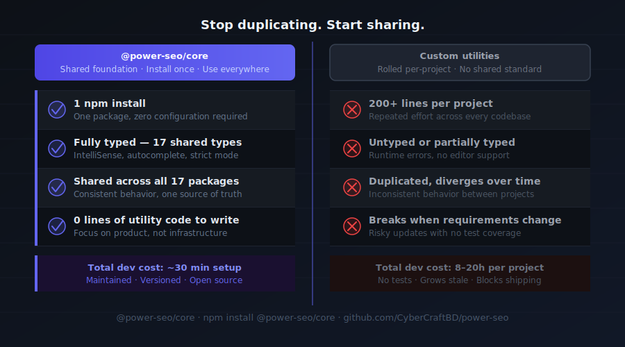

---

## Features

- **17 independent packages** — install only what you need; no monolithic bundle, no unused code
- **Next.js App Router native** — `createMetadata()` returns a proper `Metadata` object with advanced robots directives
- **Remix v2 native** — `createMetaDescriptors()` returns typed `MetaDescriptor[]` for the `meta` export
- **Robots directive builder** — full support for `noindex`, `nofollow`, `max-snippet`, `max-image-preview`, `unavailable_after`
- **JSON-LD structured data** — 23 schema.org builder functions, `schemaGraph()`, `validateSchema()`, 21 React components
- **Yoast-style content analysis** — score titles, descriptions, keyphrases, headings, word count, images, and links
- **Readability scoring** — Flesch-Kincaid, Gunning Fog, Coleman-Liau, and ARI algorithms
- **Pixel-accurate SERP previews** — Google, Facebook, and Twitter/X Card previews without a browser or canvas
- **XML sitemaps** — generate, stream, validate, and auto-split at the 50,000-URL spec limit
- **Redirect engine** — 301/302 with exact, glob, and regex matching + Next.js / Remix / Express adapters
- **Full SEO audit** — 0–100 scores across meta, content, structure, and performance categories
- **Image SEO** — alt text audit, CWV-aware lazy loading, WebP/AVIF recommendations, image sitemaps
- **Link graph analysis** — orphan page detection, link suggestions, PageRank-style equity scoring
- **AI-assisted SEO** — LLM-agnostic prompt builders for meta descriptions, titles, and content suggestions
- **Google Search Console API** — OAuth2 + service account auth, analytics queries, URL inspection, sitemap management
- **Semrush + Ahrefs clients** — domain overview, keyword data, backlinks, difficulty scores with rate limiting
- **Analytics tracking** — GA4, Clarity, PostHog, Plausible, Fathom with GDPR consent management
- **TypeScript-first** — full `.d.ts` declarations across all 17 packages; no `@types/` needed
- **Tree-shakeable** — `"sideEffects": false` on every package; import only what you use
- **Dual ESM + CJS** — every package ships both formats via tsup for any bundler or `require()` usage
- **Edge runtime safe** — no Node.js-specific APIs in core packages; runs in Cloudflare Workers, Vercel Edge, Deno


---

## Packages

All 17 packages are independently installable — use only what you need.

| Package                                                      | Version                                                                                                                       | Description                                                             |
| ------------------------------------------------------------ | ----------------------------------------------------------------------------------------------------------------------------- | ----------------------------------------------------------------------- |
| [`@power-seo/core`](./packages/core)                         | [](https://www.npmjs.com/package/@power-seo/core)                         | Framework-agnostic utilities, types, validators, and constants          |
| [`@power-seo/react`](./packages/react)                       | [](https://www.npmjs.com/package/@power-seo/react)                       | React SEO components — meta, Open Graph, Twitter Card, breadcrumbs      |
| [`@power-seo/meta`](./packages/meta)                         | [](https://www.npmjs.com/package/@power-seo/meta)                         | SSR meta helpers for Next.js App Router, Remix v2, and generic SSR      |
| [`@power-seo/schema`](./packages/schema)                     | [](https://www.npmjs.com/package/@power-seo/schema)                     | Type-safe JSON-LD structured data — 23 builders + 21 React components   |
| [`@power-seo/content-analysis`](./packages/content-analysis) | [](https://www.npmjs.com/package/@power-seo/content-analysis) | Yoast-style SEO content scoring engine with React components            |
| [`@power-seo/readability`](./packages/readability)           | [](https://www.npmjs.com/package/@power-seo/readability)           | Readability scoring — Flesch-Kincaid, Gunning Fog, Coleman-Liau, ARI    |
| [`@power-seo/preview`](./packages/preview)                   | [](https://www.npmjs.com/package/@power-seo/preview)                   | SERP, Open Graph, and Twitter/X Card preview generators                 |
| [`@power-seo/sitemap`](./packages/sitemap)                   | [](https://www.npmjs.com/package/@power-seo/sitemap)                   | XML sitemap generation, streaming, index splitting, and validation      |
| [`@power-seo/redirects`](./packages/redirects)               | [](https://www.npmjs.com/package/@power-seo/redirects)               | Redirect engine with Next.js, Remix, and Express adapters               |
| [`@power-seo/links`](./packages/links)                       | [](https://www.npmjs.com/package/@power-seo/links)                       | Link graph analysis — orphan detection, suggestions, equity scoring     |
| [`@power-seo/audit`](./packages/audit)                       | [](https://www.npmjs.com/package/@power-seo/audit)                       | Full SEO audit engine — meta, content, structure, performance rules     |
| [`@power-seo/images`](./packages/images)                     | [](https://www.npmjs.com/package/@power-seo/images)                     | Image SEO — alt text, lazy loading, format analysis, image sitemaps     |
| [`@power-seo/ai`](./packages/ai)                             | [](https://www.npmjs.com/package/@power-seo/ai)                             | LLM-agnostic AI prompt templates and parsers for SEO tasks              |
| [`@power-seo/analytics`](./packages/analytics)               | [](https://www.npmjs.com/package/@power-seo/analytics)               | Merge GSC + audit data, trend analysis, ranking insights, dashboard     |
| [`@power-seo/search-console`](./packages/search-console)     | [](https://www.npmjs.com/package/@power-seo/search-console)     | Google Search Console API — OAuth2, service account, URL inspection     |
| [`@power-seo/integrations`](./packages/integrations)         | [](https://www.npmjs.com/package/@power-seo/integrations)         | Semrush and Ahrefs API clients with rate limiting and pagination        |
| [`@power-seo/tracking`](./packages/tracking)                 | [](https://www.npmjs.com/package/@power-seo/tracking)                 | GA4, Clarity, PostHog, Plausible, Fathom — scripts + consent management |


---

## Quick Start

### Next.js App Router

```bash
npm install @power-seo/meta @power-seo/schema
```

```ts
// app/blog/[slug]/page.tsx
import { createMetadata } from '@power-seo/meta';
import { article, toJsonLdString } from '@power-seo/schema';

export function generateMetadata({ params }: { params: { slug: string } }) {
  return createMetadata({
    title: 'My Blog Post',
    description: 'A great article about SEO.',
    canonical: `https://example.com/blog/${params.slug}`,
    openGraph: {
      type: 'article',
      images: [{ url: 'https://example.com/og.jpg', width: 1200, height: 630 }],
    },
    robots: { index: true, follow: true, maxSnippet: 150, maxImagePreview: 'large' },
  });
}

export default function Page() {
  const jsonLd = article({
    headline: 'My Blog Post',
    datePublished: '2026-01-15',
    author: { name: 'Jane Doe', url: 'https://example.com/authors/jane-doe' },
  });
  return (
    <>
      <script type="application/ld+json" dangerouslySetInnerHTML={{ __html: toJsonLdString(jsonLd) }} />
      <article>{/* page content */}</article>
    </>
  );
}
```

### Remix v2

```bash
npm install @power-seo/meta
```

```ts
// app/routes/blog.$slug.tsx
import { createMetaDescriptors } from '@power-seo/meta';

export const meta = () =>
  createMetaDescriptors({
    title: 'My Blog Post',
    description: 'A great article about SEO.',
    canonical: 'https://example.com/blog/my-post',
    openGraph: { type: 'article', images: [{ url: 'https://example.com/og.jpg' }] },
  });
```

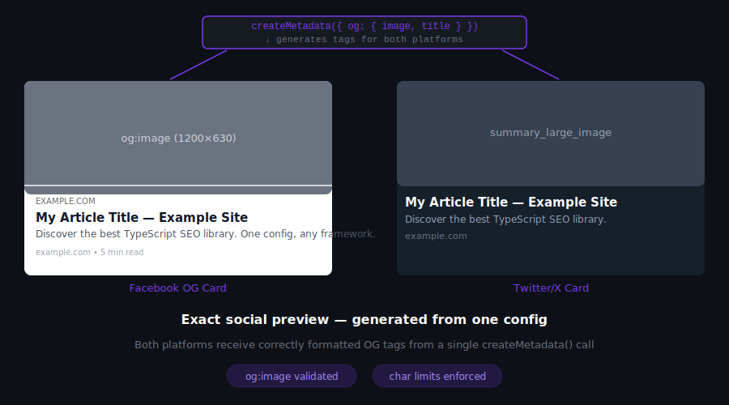

### React SPA / Vite / Gatsby

```bash
npm install @power-seo/react @power-seo/core
```

```tsx
import { DefaultSEO, SEO, Breadcrumb, Hreflang } from '@power-seo/react';

function App() {
  return (
    <DefaultSEO
      titleTemplate="%s | My Site"
      defaultTitle="My Site"
      openGraph={{ type: 'website', siteName: 'My Site' }}
      twitter={{ site: '@mysite', cardType: 'summary_large_image' }}
    >
      <Router>
        <Routes />
      </Router>
    </DefaultSEO>
  );
}

function BlogPage({ post }) {
  return (
    <>
      <SEO
        title={post.title}
        description={post.excerpt}
        canonical={`https://example.com/blog/${post.slug}`}
        openGraph={{
          type: 'article',
          images: [{ url: post.coverImage, width: 1200, height: 630 }],
        }}
      />
      <Hreflang
        alternates={[
          { hrefLang: 'en', href: `https://example.com/blog/${post.slug}` },
          { hrefLang: 'fr', href: `https://fr.example.com/blog/${post.slug}` },
        ]}
      />
      <Breadcrumb
        items={[
          { name: 'Home', url: 'https://example.com' },
          { name: 'Blog', url: 'https://example.com/blog' },
          { name: post.title },
        ]}
      />
      <article>{/* content */}</article>
    </>
  );
}
```

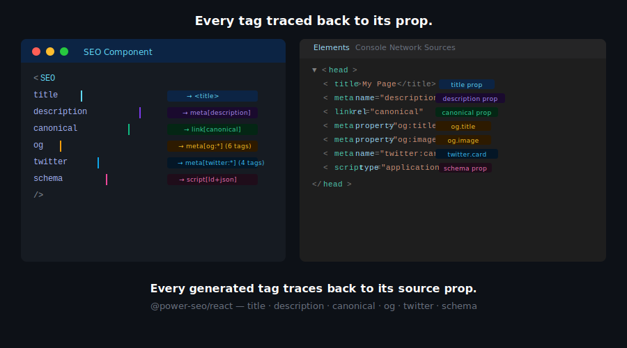

### JSON-LD Structured Data

```bash
npm install @power-seo/schema
```

```ts
import {
  article,
  faqPage,
  breadcrumbList,
  schemaGraph,
  toJsonLdString,
  validateSchema,
} from '@power-seo/schema';

// Combine multiple schemas into a single @graph document
const graph = schemaGraph([
  article({
    headline: 'My Blog Post',
    datePublished: '2026-01-15',
    author: { name: 'Jane Doe', url: 'https://example.com/authors/jane-doe' },
    image: { url: 'https://example.com/og.jpg', width: 1200, height: 630 },
  }),
  faqPage([
    { question: 'What is SEO?', answer: 'Search engine optimization.' },
    { question: 'Does Next.js support JSON-LD?', answer: 'Yes, via script tags.' },
  ]),
  breadcrumbList([
    { name: 'Home', url: 'https://example.com' },
    { name: 'Blog', url: 'https://example.com/blog' },
    { name: 'My Blog Post' },
  ]),
]);

const html = toJsonLdString(graph);
// Validate before publishing
const { valid, issues } = validateSchema(graph);
```

```tsx
// React — renders <script type="application/ld+json"> in one line
import { ArticleJsonLd, FAQJsonLd, BreadcrumbJsonLd } from '@power-seo/schema/react';

<ArticleJsonLd
  headline="My Blog Post"
  datePublished="2026-01-15"
  author={{ name: 'Jane Doe', url: 'https://example.com/authors/jane-doe' }}
  image={{ url: 'https://example.com/og.jpg', width: 1200, height: 630 }}
/>
<FAQJsonLd questions={[{ question: 'What is SEO?', answer: 'Search engine optimization.' }]} />
```


### Content Analysis (Yoast-style)

```bash
npm install @power-seo/content-analysis
```

```ts
import { analyzeContent } from '@power-seo/content-analysis';

const output = analyzeContent({
  title: 'Best Coffee Shops in NYC',
  metaDescription: 'Discover the top coffee shops in New York City.',
  content: '<h1>Best Coffee Shops</h1><p>Your article HTML here...</p>',
  focusKeyphrase: 'coffee shops nyc',
  images: [{ src: '/hero.jpg', alt: 'Best coffee shops NYC' }],
  internalLinks: ['/blog', '/about'],
  externalLinks: ['https://maps.google.com'],
});

console.log(output.score); // e.g. 38
console.log(output.maxScore); // e.g. 55
console.log(output.results); // AnalysisResult[] — per-check breakdown
console.log(output.recommendations); // string[] of actionable suggestions
```

```tsx
// Real-time editor feedback
import { ContentAnalyzer } from '@power-seo/content-analysis/react';

<ContentAnalyzer input={editorInput} />;
```

### Readability Analysis

```bash
npm install @power-seo/readability
```

```ts
import { analyzeReadability } from '@power-seo/readability';

const result = analyzeReadability({
  content: '<h1>My Article</h1><p>Your article HTML content here.</p>',
});

console.log(result.status); // 'good' | 'ok' | 'poor'
console.log(result.scores.fleschReadingEase); // 0–100 (higher = easier to read)
console.log(result.scores.fleschKincaidGrade); // US grade level (lower = simpler)
console.log(result.scores.gunningFog); // Years of education needed
console.log(result.recommendations); // ['Shorten long sentences...']
```


### SERP & Social Previews

```bash
npm install @power-seo/preview
```

```ts
import { generateSerpPreview, generateOgPreview, generateTwitterPreview } from '@power-seo/preview';

const serp = generateSerpPreview({
  title: 'How to Add SEO to Next.js Apps',
  description: 'A complete guide to meta tags, Open Graph, and JSON-LD in Next.js.',
  url: 'https://example.com/blog/nextjs-seo',
  siteTitle: 'My Blog',
});

console.log(serp.title); // 'How to Add SEO to Next.js Apps - My Blog'
console.log(serp.displayUrl); // 'example.com › blog › nextjs-seo'
console.log(serp.titleTruncated); // false (under 580px)

const og = generateOgPreview({
  title: 'Next.js SEO Guide',
  description: 'Everything you need for Next.js SEO.',
  url: 'https://example.com/blog/nextjs-seo',
  image: { url: 'https://example.com/og.jpg', width: 1200, height: 630 },
});

console.log(og.image?.valid); // true
console.log(og.image?.message); // undefined (dimensions are correct)
```

```tsx
// All-in-one tabbed preview panel (Google / Facebook / Twitter)
import { PreviewPanel } from '@power-seo/preview/react';

<PreviewPanel
  title="How to Add SEO to Next.js Apps"
  description="A complete guide to meta tags, Open Graph, and JSON-LD."
  url="https://example.com/blog/nextjs-seo"
  siteTitle="My Blog"
  image={{ url: 'https://example.com/og.jpg', width: 1200, height: 630 }}
  twitterSite="@myblog"
  twitterCardType="summary_large_image"
/>;
```


### Sitemap Generation

```bash
npm install @power-seo/sitemap
```

```ts
import {
  generateSitemap,
  streamSitemap,
  splitSitemap,
  validateSitemapUrl,
} from '@power-seo/sitemap';

// Basic sitemap
const xml = generateSitemap({
  hostname: 'https://example.com',
  urls: [
    { loc: '/', changefreq: 'daily', priority: 1.0 },
    { loc: '/blog/my-post', lastmod: '2026-01-15', priority: 0.7 },
    {
      loc: '/product/headphones',
      images: [{ loc: 'https://example.com/headphones.jpg', caption: 'Wireless Headphones' }],
    },
  ],
});

// Streaming — constant memory for 50,000+ URL catalogs
export async function GET() {
  const urls = await fetchAllProductUrls();
  const chunks = [...streamSitemap('https://example.com', urls)];
  return new Response(chunks.join(''), { headers: { 'Content-Type': 'application/xml' } });
}

// Auto-split into index + child sitemaps
const { index, sitemaps } = splitSitemap({ hostname: 'https://example.com', urls: allUrls });
```

```ts
// Next.js App Router — app/sitemap.ts
import { toNextSitemap } from '@power-seo/sitemap/next';

export default async function sitemap() {
  const urls = await fetchAllUrls();
  return toNextSitemap(urls);
}
```

### Redirect Engine

```bash
npm install @power-seo/redirects
```

```ts
import { createRedirectEngine, toNextRedirects } from '@power-seo/redirects';

const engine = createRedirectEngine({
  rules: [
    { source: '/old-page', destination: '/new-page', statusCode: 301 },
    { source: '/blog/:slug', destination: '/articles/:slug', statusCode: 301 },
    { source: '/products/*', destination: '/shop/*', statusCode: 302 },
  ],
});

// Runtime matching (any framework)
const match = engine.match('/blog/my-post');
// { destination: '/articles/my-post', statusCode: 301 }

// Next.js next.config.js
async redirects() {
  return toNextRedirects(rules);
}
```


### SEO Audit

```bash
npm install @power-seo/audit
```

```ts
import { auditPage, auditSite } from '@power-seo/audit';

// Single page audit
const result = auditPage({
  url: 'https://example.com/my-page',
  title: 'My Page Title',
  metaDescription: 'A page about something interesting.',
  headings: ['h1:My Page Title', 'h2:Section One', 'h2:Section Two'],
  focusKeyphrase: 'my keyword',
  wordCount: 850,
  internalLinks: ['/about', '/contact', '/blog'],
  externalLinks: ['https://example.org'],
});

console.log(result.score); // 0–100 weighted score
console.log(result.categories); // { meta, content, structure, performance }
console.log(result.rules); // AuditRule[] — pass/warning/error per rule
console.log(result.recommendations); // string[] of actionable fixes

// Whole-site audit
const siteResult = auditSite([page1Input, page2Input, page3Input]);
console.log(siteResult.score); // aggregate score
console.log(siteResult.topIssues); // most common issues across all pages
console.log(siteResult.summary); // { totalPages, avgScore, ... }
```

### Image SEO

```bash
npm install @power-seo/images
```

```ts
import {
  analyzeAltText,
  auditLazyLoading,
  analyzeImageFormats,
  generateImageSitemap,
} from '@power-seo/images';

const images = [
  { src: '/hero.jpg', alt: '', loading: 'eager', isAboveFold: true, size: 280_000 },
  {
    src: '/product.jpg',
    alt: 'Wireless headphones',
    loading: 'lazy',
    isAboveFold: false,
    size: 520_000,
  },
];

const altResult = analyzeAltText({ images });
// { score, missingAlt: ['/hero.jpg'], recommendations: ['Add alt text to /hero.jpg'] }

const lazyResult = auditLazyLoading({ images });
// { score, issues: [{ src: '/hero.jpg', issue: 'above-fold image should not lazy load' }] }

const formatResult = analyzeImageFormats({ images });
// { score, oversized: [{ src: '/product.jpg', size: 520000, recommendation: 'Convert to WebP' }] }

const sitemapXml = generateImageSitemap({
  hostname: 'https://example.com',
  images: [{ loc: '/product.jpg', caption: 'Wireless Headphones' }],
});
```

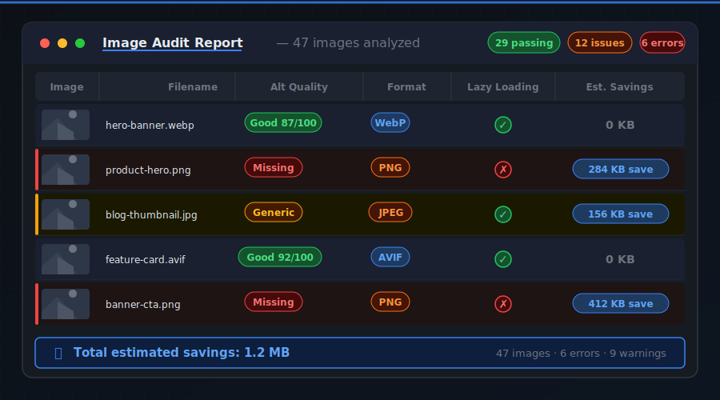

### Link Graph Analysis

```bash
npm install @power-seo/links
```

```ts
import { buildLinkGraph, findOrphanPages, suggestLinks, analyzeLinkEquity } from '@power-seo/links';

const graph = buildLinkGraph([
  { url: '/home', links: ['/about', '/blog', '/products'] },
  { url: '/about', links: ['/home', '/contact'] },
  { url: '/blog', links: ['/home'] },
  { url: '/hidden', links: [] }, // orphan — no inbound links
  { url: '/old-sdk', links: [] }, // orphan — unreachable
]);

const orphans = findOrphanPages(graph);
// [{ url: '/hidden', inboundCount: 0 }, { url: '/old-sdk', inboundCount: 0 }]

const suggestions = suggestLinks(graph);
// [{ from: '/blog', to: '/hidden', reason: 'orphan page needs inbound links' }]

const equity = analyzeLinkEquity(graph);
// [{ url: '/home', score: 1.0 }, { url: '/about', score: 0.45 }, ...]
```

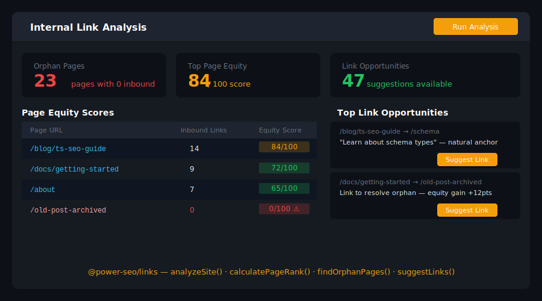

### AI-Assisted SEO

```bash
npm install @power-seo/ai
```

```ts
import {
  buildMetaDescriptionPrompt,
  buildTitlePrompt,
  buildContentSuggestionsPrompt,
  parseMetaDescriptionResponse,
  parseTitleResponse,
} from '@power-seo/ai';

// Works with any LLM — OpenAI, Anthropic, Gemini, or any other
const prompt = buildMetaDescriptionPrompt({
  title: 'Best Coffee Shops in NYC',
  content: articleHtml,
  keyphrase: 'coffee shops nyc',
});

const response = await openai.chat.completions.create({
  model: 'gpt-4o',
  messages: [{ role: 'user', content: prompt.user }],
});

const result = parseMetaDescriptionResponse(response.choices[0].message.content);
console.log(result.descriptions[0].text); // 'Discover the best coffee shops in NYC...'
console.log(result.descriptions[0].length); // 142

// Title generation
const titlePrompt = buildTitlePrompt({ content: articleHtml, keyphrase: 'coffee shops nyc' });
const titleResult = parseTitleResponse(await llm(titlePrompt));
console.log(titleResult.titles[0].text); // 'Best Coffee Shops in NYC: 2026 Guide'
```


### Google Search Console

```bash
npm install @power-seo/search-console
```

```ts
import {
  createGSCClient,
  createTokenManager,
  querySearchAnalytics,
  inspectUrl,
  listSitemaps,
} from '@power-seo/search-console';

const client = createGSCClient({
  siteUrl: 'https://example.com',
  tokenManager: createTokenManager({
    type: 'service_account',
    credentials: JSON.parse(process.env.GOOGLE_SERVICE_ACCOUNT_KEY!),
  }),
});

// Fetch search analytics (clicks, impressions, CTR, position)
const rows = await querySearchAnalytics(client, {
  startDate: '2026-01-01',
  endDate: '2026-01-31',
  dimensions: ['query', 'page'],
  rowLimit: 1000,
});

// URL inspection — get indexing status and coverage
const inspection = await inspectUrl(client, 'https://example.com/blog/my-post');
console.log(inspection.indexStatusResult.coverageState); // 'Submitted and indexed'

// List all submitted sitemaps
const sitemaps = await listSitemaps(client);
```


### Analytics — GSC + Audit Data Merge

```bash
npm install @power-seo/analytics
```

```ts
import {
  mergeGscWithAudit,
  analyzeQueryRankings,
  trackPositionChanges,
  buildDashboardData,
} from '@power-seo/analytics';

// Merge GSC data with audit results for combined insights
const insights = mergeGscWithAudit({
  gscPages: currentGscRows,
  auditResults: latestAuditResults,
});
// insights[0] → { url, clicks, impressions, position, auditScore, topIssues }

// Track position changes week over week
const changes = trackPositionChanges(previousRows, currentRows);
// [{ query: 'coffee shops nyc', previousPosition: 8, currentPosition: 4, delta: +4 }]

// Build a complete dashboard data structure
const dashboard = buildDashboardData({
  gscPages: currentRows,
  gscQueries: queryRows,
  auditResults: latestAudit,
});
```

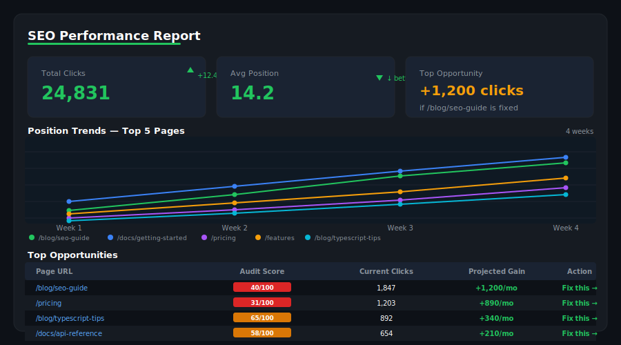

### Third-Party Integrations — Semrush & Ahrefs

```bash
npm install @power-seo/integrations
```

```ts
import { createSemrushClient, createAhrefsClient } from '@power-seo/integrations';

// Semrush
const semrush = createSemrushClient({ apiKey: process.env.SEMRUSH_API_KEY! });

const overview = await semrush.getDomainOverview({ domain: 'example.com' });
// { organicKeywords, organicTraffic, domainRank, backlinks }

const keywords = await semrush.getKeywordData({ keyword: 'coffee shops nyc' });
// { volume, difficulty, cpc, trend }

// Ahrefs
const ahrefs = createAhrefsClient({ apiKey: process.env.AHREFS_API_KEY! });

const siteOverview = await ahrefs.getSiteOverview({ target: 'example.com' });
// { domainRating, urlRating, backlinks, refDomains, organicTraffic }

const backlinks = await ahrefs.getBacklinks({ target: 'example.com', limit: 100 });
```

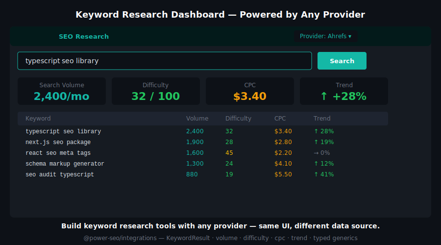

### Analytics Tracking & GDPR Consent

```bash
npm install @power-seo/tracking
```

```ts
import {
  buildGA4Script,
  buildClarityScript,
  buildPostHogScript,
  buildPlausibleScript,
  createConsentManager,
} from '@power-seo/tracking';

// GDPR consent management
const manager = createConsentManager({ necessary: true, analytics: false, marketing: false });
manager.grant('analytics');

// Conditional script loading — only fires when consent is granted
const ga4Scripts = buildGA4Script({ measurementId: 'G-XXXXXXXXXX' });
const clarityScripts = buildClarityScript({ projectId: 'abcde12345' });

const toLoad = ga4Scripts.filter((s) => s.shouldLoad(manager.getState()));
```

```tsx
import { AnalyticsScript, ConsentBanner } from '@power-seo/tracking/react';

function App() {
  return (
    <>
      <ConsentBanner manager={manager} privacyPolicyUrl="/privacy" />
      <AnalyticsScript scripts={ga4Scripts} consent={manager.getState()} />
      <AnalyticsScript scripts={clarityScripts} consent={manager.getState()} />
    </>
  );
}
```


### Core Utilities

```bash
npm install @power-seo/core
```

```ts
import {
  buildMetaTags,
  buildLinkTags,
  validateTitle,
  validateMetaDescription,
  toSlug,
  resolveCanonical,
  getTextStatistics,
  calculateKeywordDensity,
  buildRobotsContent,
  parseRobotsContent,
  createTitleTemplate,
} from '@power-seo/core';

// Pixel-accurate SERP validation
const title = validateTitle('Best Running Shoes for Beginners — 2026 Guide');
// { valid: true, severity: 'info', charCount: 46, pixelWidth: 316 }

const meta = validateMetaDescription('Discover expert-reviewed running shoes for beginners.');
// { valid: true, severity: 'warning', charCount: 52 } → suggest expanding to 120–160 chars

// URL utilities
toSlug('My Blog Post Title! — 2026'); // → 'my-blog-post-title-2026'
resolveCanonical('https://example.com', '/blog/post'); // → 'https://example.com/blog/post'

// Text statistics from HTML
const stats = getTextStatistics('<h1>Hello</h1><p>This is a test sentence. And another one.</p>');
// { wordCount: 9, sentenceCount: 2, paragraphCount: 1, syllableCount: 11 }

// Keyword density
const density = calculateKeywordDensity('react seo', bodyHtml);
// { keyword: 'react seo', count: 4, density: 1.8, totalWords: 450 }

// Robots directives
buildRobotsContent({ index: false, follow: true, maxSnippet: 150 });
// → 'noindex, follow, max-snippet:150'

// Site-wide title template
const makeTitle = createTitleTemplate({ siteName: 'My Site', separator: '—' });
makeTitle('About Us'); // → 'About Us — My Site'
makeTitle('Blog'); // → 'Blog — My Site'
```


---

## Use Cases

### Headless CMS / Blog Platform

Install `@power-seo/content-analysis` + `@power-seo/readability` + `@power-seo/schema` + `@power-seo/preview` to build a Yoast-style SEO sidebar directly in your CMS editor — no WordPress required.

```ts
import { analyzeContent } from '@power-seo/content-analysis';
import { analyzeReadability } from '@power-seo/readability';
import { generateSerpPreview } from '@power-seo/preview';
import { article, validateSchema } from '@power-seo/schema';

// Run all checks in parallel before publishing
const [contentScore, readability, serpPreview] = await Promise.all([
  analyzeContent({ title, metaDescription, content, focusKeyphrase }),
  analyzeReadability({ content }),
  generateSerpPreview({ title, description: metaDescription, url, siteTitle }),
]);

if (contentScore.score / contentScore.maxScore < 0.7) {
  console.warn('SEO score below 70% — review recommendations before publishing');
}
if (serpPreview.titleTruncated) {
  console.warn('Title will be cut off in Google results');
}
```

### eCommerce at Scale

Install `@power-seo/schema` + `@power-seo/images` + `@power-seo/sitemap` + `@power-seo/audit` to automate SEO quality across thousands of product pages.

```ts
import { product, validateSchema } from '@power-seo/schema';
import { analyzeAltText, analyzeImageFormats } from '@power-seo/images';
import { generateSitemap } from '@power-seo/sitemap';

for (const p of products) {
  const schema = product({
    name: p.name,
    description: p.description,
    image: { url: p.imageUrl },
    offers: { price: p.price, priceCurrency: 'USD', availability: 'InStock' },
    aggregateRating: { ratingValue: p.rating, reviewCount: p.reviewCount },
  });

  const { valid, issues } = validateSchema(schema);
  if (!valid) console.error(`Product ${p.id}: ${issues.map((i) => i.message).join(', ')}`);
}

const xml = generateSitemap({ hostname: 'https://shop.example.com', urls: productUrls });
```

### CI/CD SEO Quality Gate

Block deploys when SEO checks fail. Install `@power-seo/audit` + `@power-seo/content-analysis` + `@power-seo/readability`.

```ts
import { auditPage } from '@power-seo/audit';
import { analyzeContent } from '@power-seo/content-analysis';
import { analyzeReadability } from '@power-seo/readability';

// Run in CI — exit 1 if quality thresholds not met
const audit = auditPage({ url, title, metaDescription, headings, wordCount, focusKeyphrase });
const content = analyzeContent({ title, metaDescription, content, focusKeyphrase });
const readability = analyzeReadability({ content: bodyHtml });

const errors: string[] = [];
if (audit.score < 70) errors.push(`Audit score too low: ${audit.score}/100`);
if (content.score / content.maxScore < 0.6) errors.push('Content SEO score below 60%');
if (readability.status === 'poor') errors.push('Readability is poor — simplify content');

if (errors.length) {
  errors.forEach((e) => console.error('✗', e));
  process.exit(1);
}
console.log('✓ All SEO checks passed');
```

### SEO Dashboard & Reporting

Install `@power-seo/search-console` + `@power-seo/analytics` + `@power-seo/integrations` to build a fully automated SEO reporting pipeline.

```ts
import {
  createGSCClient,
  createTokenManager,
  querySearchAnalytics,
} from '@power-seo/search-console';
import { mergeGscWithAudit, buildDashboardData, trackPositionChanges } from '@power-seo/analytics';
import { createSemrushClient } from '@power-seo/integrations';

const gscClient = createGSCClient({ siteUrl: 'https://example.com', tokenManager });
const semrush = createSemrushClient({ apiKey: process.env.SEMRUSH_API_KEY! });

const [gscData, semrushData] = await Promise.all([
  querySearchAnalytics(gscClient, { startDate, endDate, dimensions: ['query', 'page'] }),
  semrush.getDomainOverview({ domain: 'example.com' }),
]);

const dashboard = buildDashboardData({ gscPages: gscData, gscQueries: gscData, auditResults });
const changes = trackPositionChanges(lastWeekGsc, gscData);
// Email or Slack the weekly SEO report
```

### Multi-Language & International Sites

Install `@power-seo/react` + `@power-seo/sitemap` + `@power-seo/redirects` for full hreflang, sitemap, and redirect support across all locales.

```tsx
import { SEO, Hreflang } from '@power-seo/react';
import { generateSitemap } from '@power-seo/sitemap';
import { createRedirectEngine } from '@power-seo/redirects';

// Per-page hreflang tags
<SEO title={post.title} description={post.excerpt} />
<Hreflang
  alternates={[
    { hrefLang: 'en', href: 'https://example.com/en/blog/post' },
    { hrefLang: 'fr', href: 'https://example.com/fr/blog/post' },
    { hrefLang: 'de', href: 'https://example.com/de/blog/post' },
  ]}
  xDefault="https://example.com/en/blog/post"
/>

// Locale-aware redirect engine
const engine = createRedirectEngine({
  rules: [
    { source: '/blog/:slug', destination: '/en/blog/:slug', statusCode: 301 },
    { source: '/fr/blog/:slug', destination: '/fr/articles/:slug', statusCode: 301 },
  ],
});

// Per-locale sitemap
const enSitemap = generateSitemap({ hostname: 'https://example.com', urls: enUrls });
const frSitemap = generateSitemap({ hostname: 'https://example.com', urls: frUrls });
```

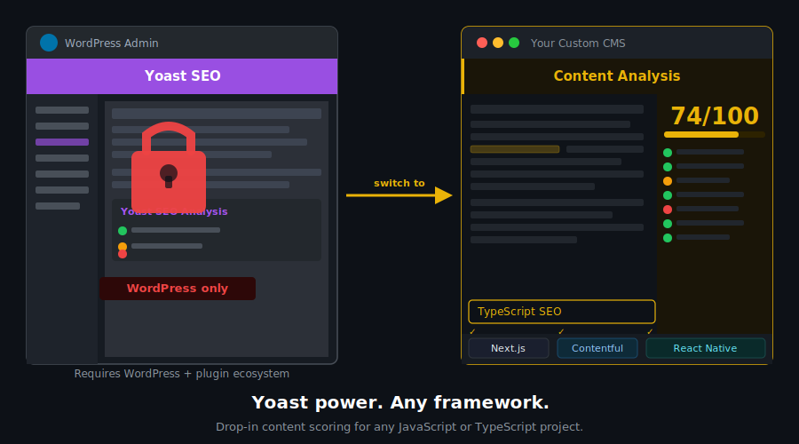

---

## Framework Compatibility

| Framework                            | Recommended Packages                                                                               |
| ------------------------------------ | -------------------------------------------------------------------------------------------------- |
| **Next.js 14+ (App Router)**         | All 17 packages                                                                                    |
| **Next.js 13 (Pages Router)**        | `@power-seo/react`, `@power-seo/schema`, `@power-seo/core`                                         |
| **Remix v2**                         | `@power-seo/meta`, `@power-seo/schema`, `@power-seo/redirects`                                     |
| **Vite + React (SPA)**               | `@power-seo/react`, `@power-seo/schema`, `@power-seo/content-analysis`                             |
| **Gatsby**                           | `@power-seo/react`, `@power-seo/schema`, `@power-seo/sitemap`                                      |
| **Node.js / Express / Fastify**      | `@power-seo/core`, `@power-seo/sitemap`, `@power-seo/audit`, `@power-seo/redirects`                |
| **Cloudflare Workers / Vercel Edge** | `@power-seo/core`, `@power-seo/sitemap`, `@power-seo/redirects`, `@power-seo/schema`               |
| **Headless CMS (any)**               | `@power-seo/content-analysis`, `@power-seo/readability`, `@power-seo/preview`, `@power-seo/schema` |

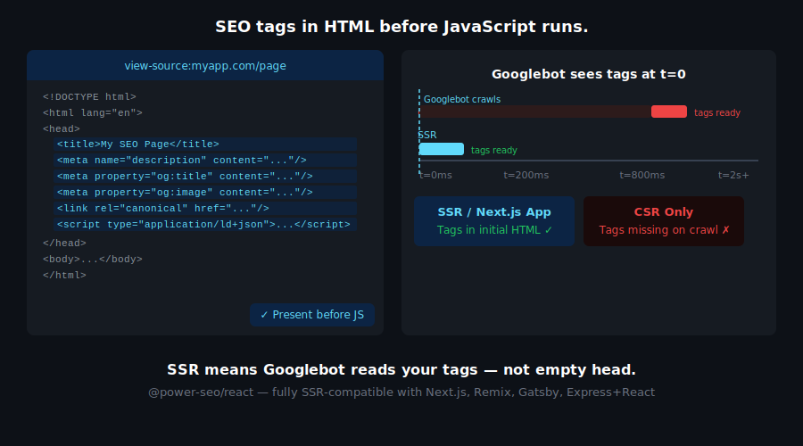

---

## Architecture Overview

```
@power-seo/ (Turborepo monorepo)
├── packages/                     # 17 independently published npm packages
│   ├── core/                     # Zero-dependency foundation — types, utils, constants
│   ├── react/                    # React components (peerDep: react >=18)
│   ├── meta/                     # SSR meta helpers (Next.js / Remix / generic)
│   ├── schema/                   # JSON-LD builders + React components
│   ├── content-analysis/         # Yoast-style scoring engine
│   ├── readability/              # Text readability algorithms
│   ├── preview/                  # SERP / OG / Twitter Card preview generators
│   ├── sitemap/                  # XML sitemap generation + streaming
│   ├── redirects/                # Redirect engine + Next.js / Remix / Express adapters
│   ├── links/                    # Link graph analysis
│   ├── audit/                    # Full SEO audit engine
│   ├── images/                   # Image SEO analysis
│   ├── ai/                       # LLM prompt templates + response parsers
│   ├── analytics/                # Analytics + GSC data merging + dashboard builder
│   ├── search-console/           # Google Search Console API client
│   ├── integrations/             # Semrush + Ahrefs API clients
│   └── tracking/                 # Analytics script builders + consent management
├── turbo.json                    # Turborepo pipeline config
└── pnpm-workspace.yaml           # pnpm workspace definition
```

**Design principles:**

- **Modular by design** — install only what you need; zero coupling between packages
- **Framework-agnostic core** — `@power-seo/core` has zero runtime dependencies and runs in any JS environment
- **Dual ESM + CJS** — all packages ship both formats via tsup for any bundler or `require()` usage
- **Tree-shakeable** — `"sideEffects": false` on every package; import exactly what you use
- **TypeScript-first** — full `.d.ts` declarations across all 17 packages; no separate `@types/` install
- **React optional** — packages with React components declare `react` as `peerDependency` only; builder functions always work without React
- **Edge runtime safe** — no Node.js-specific APIs (`fs`, `path`, `crypto`) in any core package
- **Provenance-signed releases** — every npm publish is signed via Sigstore/GitHub Actions

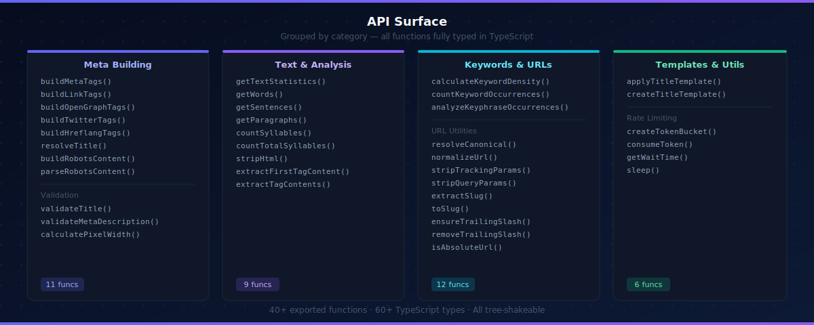

---

## Supply Chain Security

- No install scripts (`postinstall`, `preinstall`) across any of the 17 packages
- No runtime network access — all packages are pure computation; no telemetry, no beacons
- No `eval` or dynamic code execution anywhere in the codebase
- npm provenance enabled — every release is cryptographically signed via Sigstore through GitHub Actions
- CI-signed builds — all releases published via the verified `github.com/CyberCraftBD/power-seo` workflow
- Socket.dev security monitoring on every package — supply chain attack detection
- Automated Dependabot security updates on every dependency
- CodeQL static analysis scanning on every pull request

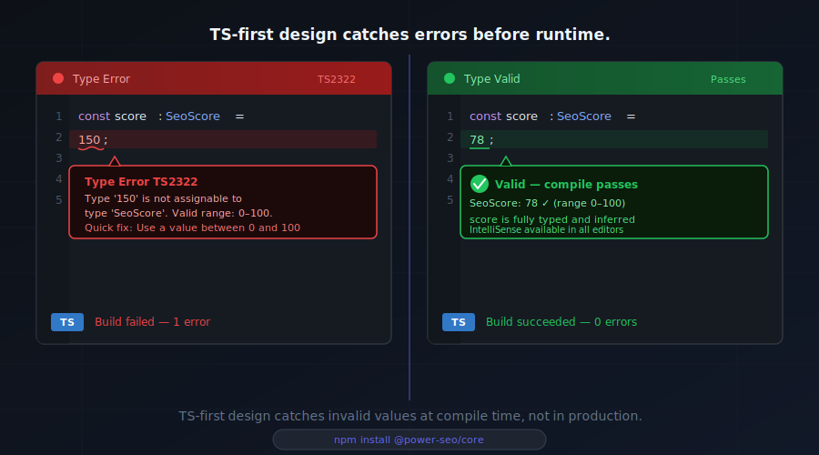

---

## Development

### Prerequisites

- [Node.js](https://nodejs.org/) >= 18.0.0
- [pnpm](https://pnpm.io/) >= 9.0.0

### Setup

```bash
git clone https://github.com/CyberCraftBD/power-seo.git
cd power-seo
pnpm install
pnpm build
```

### Commands

| Command          | Description                           |
| ---------------- | ------------------------------------- |
| `pnpm build`     | Build all packages (Turborepo cached) |
| `pnpm dev`       | Watch mode for all packages           |
| `pnpm test`      | Run all tests with Vitest             |
| `pnpm lint`      | Lint all packages (ESLint v9)         |
| `pnpm typecheck` | Type-check all packages               |
| `pnpm format`    | Format with Prettier                  |
| `pnpm clean`     | Remove all build artifacts            |

```bash
# Scope any command to a single package
pnpm --filter @power-seo/schema build
pnpm --filter @power-seo/schema test
pnpm --filter @power-seo/schema typecheck

# Add a dependency to a specific package
pnpm --filter @power-seo/core add some-package
```

---

## Keywords

power-seo · typescript seo · react seo · nextjs seo · remix seo · json-ld typescript · seo audit npm · content analysis seo · keyword density · sitemap generator typescript · redirect engine npm · seo structured data · open graph typescript · twitter card builder · serp preview typescript · readability scoring npm · image seo analysis · link graph analysis · orphan page detection · google search console api typescript · semrush api typescript · ahrefs api typescript · ga4 typescript · seo monorepo · tree-shakeable seo library · seo tooling typescript · nextjs app router seo · yoast alternative typescript · programmatic seo · seo npm packages · nextjs metadata · remix meta · react helmet alternative · json-ld react · schema.org typescript

---

## About [CyberCraft Bangladesh](https://ccbd.dev)

**[CyberCraft Bangladesh](https://ccbd.dev)** is a Bangladesh-based enterprise-grade software development and Full Stack SEO service provider company specializing in ERP system development, AI-powered SaaS and business applications, full-stack SEO services, custom website development, and scalable eCommerce platforms. We design and develop intelligent, automation-driven SaaS and enterprise solutions that help startups, SMEs, NGOs, educational institutes, and large organizations streamline operations, enhance digital visibility, and accelerate growth through modern cloud-native technologies.

[](https://ccbd.dev)
[](https://github.com/cybercraftbd)
[](https://www.npmjs.com/org/power-seo)
[](mailto:info@ccbd.dev)

© 2026 [CyberCraft Bangladesh](https://ccbd.dev) · Released under the [MIT License](./LICENSE)
