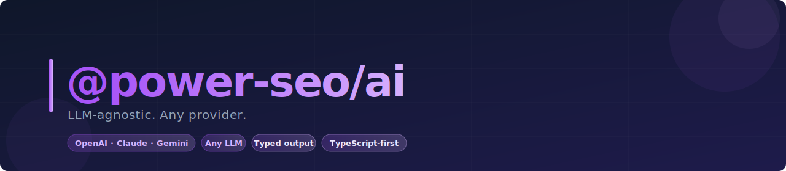
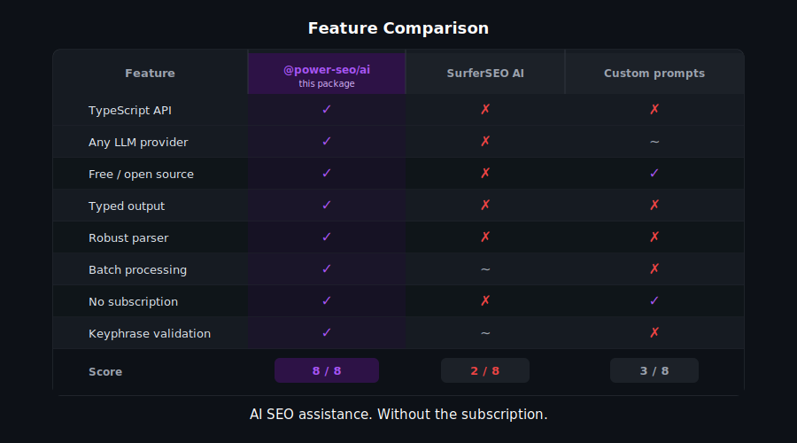
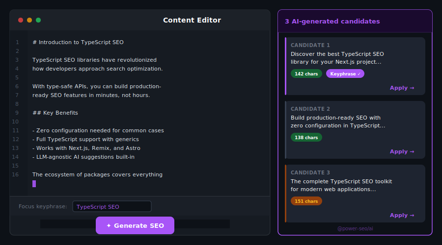
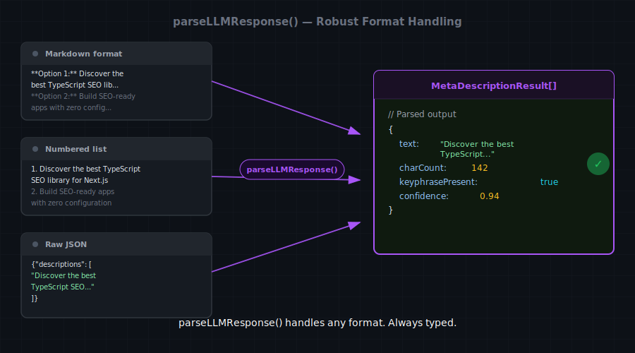
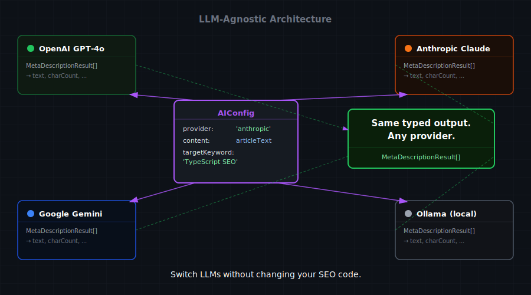

# @power-seo/ai



LLM-agnostic SEO prompt builders and structured response parsers — works with OpenAI, Anthropic Claude, Google Gemini, Mistral, and any other provider.

[](https://www.npmjs.com/package/@power-seo/ai)
[](https://www.npmjs.com/package/@power-seo/ai)
[](https://socket.dev/npm/package/@power-seo/ai)
[](https://github.com/CyberCraftBD/power-seo/actions)
[](https://opensource.org/licenses/MIT)
[](https://www.typescriptlang.org/)
[](https://bundlephobia.com/package/@power-seo/ai)

`@power-seo/ai` bridges the gap between large language models and SEO workflows. Every major LLM provider has its own SDK, authentication pattern, and API shape — but the actual prompting logic for SEO tasks is the same regardless of which model you use. This package extracts that logic into reusable, testable, provider-agnostic building blocks.

Prompt builders return a plain `{ system, user, maxTokens }` object that you pass directly to whatever LLM client you already have — OpenAI, Anthropic Claude, Google Gemini, Mistral, local Ollama models, or any other provider. Parsers accept the raw text string that comes back from the model and extract structured data: `MetaDescriptionResult`, `TitleResult`, `ContentSuggestion[]`, or `SerpFeaturePrediction`. There is no LLM SDK bundled, no API keys managed, and no network calls made by this package.

The `analyzeSerpEligibility` function is the exception: it is a fully deterministic, rule-based analysis of SERP feature eligibility that requires no LLM at all. It inspects your page's schema markup and content structure to determine whether it qualifies for FAQ, HowTo, Product, and Article rich results.

> **Zero runtime dependencies** — no LLM SDK bundled; bring your own provider client.

---

## Why @power-seo/ai?

| | Without | With |
|---|---|---|
| Meta descriptions | ❌ Write manually | ✅ LLM-generated, SEO-optimized candidates |
| Title optimization | ❌ Guesswork | ✅ Keyphrase-focused, branded title variants |
| Content gaps | ❌ Manually identified | ✅ Structured AI-powered improvement suggestions |
| SERP eligibility | ❌ Unknown | ✅ Rule-based + LLM prediction with confidence scores |
| Provider flexibility | ❌ Vendor-locked | ✅ Works with any LLM: OpenAI, Claude, Gemini... |
| Structured output | ❌ Raw text parsing | ✅ Typed results with char count + pixel width |
| CI integration | ❌ Manual review | ✅ Deterministic SERP eligibility in pipelines |



---

## Features

- **LLM-agnostic design** — no bundled SDK; prompt builders return `{ system, user, maxTokens }`, parsers accept raw text strings
- **Works with any provider** — OpenAI GPT-4o, Anthropic Claude, Google Gemini, Mistral, Cohere, local Ollama models, or any HTTP-based LLM
- **Meta description generation** — `buildMetaDescriptionPrompt` produces prompts targeting 120–158 character descriptions that include the focus keyphrase and a compelling call-to-action; `parseMetaDescriptionResponse` extracts multiple candidates with character count and estimated pixel width
- **SEO title generation** — `buildTitlePrompt` produces prompts for optimized title tags with keyphrase placement and brand suffix guidance; `parseTitleResponse` returns ranked title candidates with character counts
- **Content improvement suggestions** — `buildContentSuggestionsPrompt` analyzes existing content for gaps; `parseContentSuggestionsResponse` returns typed suggestions including missing sections, internal link opportunities, keyphrase density issues, and FAQ additions
- **SERP feature prediction** — `buildSerpPredictionPrompt` and `parseSerpPredictionResponse` predict which SERP features (Featured Snippet, FAQ, HowTo, Knowledge Panel, Product) a page is likely to appear in, with confidence scores
- **Rule-based SERP eligibility** — `analyzeSerpEligibility(input)` is fully deterministic: no LLM required, no cost, instant execution; checks FAQ schema presence, HowTo step structure, Product schema completeness, and Article metadata
- **Structured output parsing** — all parsers handle common LLM output variations (markdown code blocks, numbered lists, JSON) robustly
- **`ContentSuggestionType` union** — type-safe suggestion categories: `missing-section`, `internal-link`, `keyphrase-gap`, `faq-addition`, `schema-addition`, `readability`
- **`SerpFeature` union** — type-safe SERP feature identifiers: `featured-snippet`, `faq`, `how-to`, `knowledge-panel`, `product`, `article`
- **Character and pixel width metadata** — response objects include `charCount` and `pixelWidth` for each generated variant
- **Type-safe throughout** — comprehensive TypeScript types for all inputs, outputs, and intermediate structures
- **Zero runtime dependencies** — no external packages required



---

## Comparison

| Feature | @power-seo/ai | LangChain | Vercel AI SDK | Custom prompts |
| --- | :---: | :---: | :---: | :---: |
| Provider-agnostic prompt builders | ✅ | Partial | ❌ | ❌ |
| SEO-specific prompt templates | ✅ | ❌ | ❌ | Manual |
| Structured response parsers | ✅ | Partial | Partial | Manual |
| Rule-based SERP eligibility | ✅ | ❌ | ❌ | ❌ |
| Char + pixel width metadata | ✅ | ❌ | ❌ | ❌ |
| Zero SDK dependencies | ✅ | ❌ | ❌ | ✅ |
| TypeScript-first | ✅ | Partial | ✅ | — |
| Tree-shakeable | ✅ | ❌ | Partial | — |
| CI / Node.js usage | ✅ | ✅ | ✅ | ✅ |



---

## Installation

```bash
npm install @power-seo/ai
```

```bash
yarn add @power-seo/ai
```

```bash
pnpm add @power-seo/ai
```

---

## Quick Start

```ts
import { buildMetaDescriptionPrompt, parseMetaDescriptionResponse } from '@power-seo/ai';

// 1. Build the prompt
const prompt = buildMetaDescriptionPrompt({
  title: 'Best Coffee Shops in New York City',
  content: 'Explore the top 15 coffee shops in NYC, from specialty espresso bars in Brooklyn...',
  keyphrase: 'coffee shops nyc',
  count: 3,
});

// 2. Send to your LLM of choice (example uses OpenAI)
import OpenAI from 'openai';
const openai = new OpenAI({ apiKey: process.env.OPENAI_API_KEY });

const response = await openai.chat.completions.create({
  model: 'gpt-4o',
  messages: [
    { role: 'system', content: prompt.system },
    { role: 'user', content: prompt.user },
  ],
  max_tokens: prompt.maxTokens,
});

// 3. Parse the raw text response
const result = parseMetaDescriptionResponse(response.choices[0].message.content ?? '');
result.descriptions.forEach(({ text, charCount, pixelWidth }) => {
  console.log(`"${text}" — ${charCount} chars, ~${pixelWidth}px`);
});
```



---

## Usage

### Meta Description Generation

```ts
import { buildMetaDescriptionPrompt, parseMetaDescriptionResponse } from '@power-seo/ai';
import type { MetaDescriptionInput, MetaDescriptionResult } from '@power-seo/ai';

const input: MetaDescriptionInput = {
  title: 'How to Optimize React Apps for SEO',
  content: 'Full article HTML or plain text about React SEO strategies...',
  keyphrase: 'react seo optimization',
  count: 3,
};

const prompt = buildMetaDescriptionPrompt(input);
// { system: 'You are an expert SEO copywriter...', user: 'Write 3 meta descriptions...', maxTokens: 300 }

const rawResponse = await yourLLM.complete(prompt.system, prompt.user, prompt.maxTokens);
const result: MetaDescriptionResult = parseMetaDescriptionResponse(rawResponse);

result.descriptions.forEach(({ text, charCount, pixelWidth }, i) => {
  console.log(`Option ${i + 1}: "${text}"`);
  console.log(`  ${charCount} characters, ~${pixelWidth}px`);
  const status = charCount >= 120 && charCount <= 158 ? 'GOOD' : 'ADJUST';
  console.log(`  Status: ${status}`);
});
```

### SEO Title Generation

```ts
import { buildTitlePrompt, parseTitleResponse } from '@power-seo/ai';
import type { TitleInput, TitleResult } from '@power-seo/ai';

const input: TitleInput = {
  content: 'Article about the best tools for keyword research in 2026...',
  keyphrase: 'keyword research tools',
  brand: 'PowerSEO',
  count: 5,
};

const prompt = buildTitlePrompt(input);
const rawResponse = await yourLLM.complete(prompt.system, prompt.user, prompt.maxTokens);

const result: TitleResult = parseTitleResponse(rawResponse);
result.titles.forEach(({ text, charCount, pixelWidth }, i) => {
  const status = charCount <= 60 ? 'OK' : 'TOO LONG';
  console.log(`${i + 1}. "${text}" — ${charCount} chars [${status}]`);
});
```

### Content Improvement Suggestions

```ts
import { buildContentSuggestionsPrompt, parseContentSuggestionsResponse } from '@power-seo/ai';
import type { ContentSuggestionInput, ContentSuggestion } from '@power-seo/ai';

const input: ContentSuggestionInput = {
  title: 'React SEO Best Practices',
  content: '<h1>React SEO</h1><p>React is a JavaScript library...</p>',
  keyphrase: 'react seo best practices',
  wordCount: 450,
  currentScore: 58,
};

const prompt = buildContentSuggestionsPrompt(input);
const rawResponse = await yourLLM.complete(prompt.system, prompt.user, prompt.maxTokens);

const suggestions: ContentSuggestion[] = parseContentSuggestionsResponse(rawResponse);
suggestions.forEach(({ type, suggestion, priority }) => {
  console.log(`[${priority.toUpperCase()}] ${type}: ${suggestion}`);
});

// Example output:
// [HIGH] missing-section: Add a section covering server-side rendering with Next.js
// [HIGH] keyphrase-gap: 'react seo best practices' appears only once — aim for 2-3 uses
// [MEDIUM] faq-addition: Add an FAQ section answering "Does React hurt SEO?"
// [LOW] schema-addition: Add Article schema markup for rich result eligibility
```

**Suggestion types:**

| Type              | Description                                                      |
| ----------------- | ---------------------------------------------------------------- |
| `missing-section` | Topics or sections the content should cover but does not         |
| `internal-link`   | Opportunities to link to related pages on the same site          |
| `keyphrase-gap`   | Keyphrase density or placement issues                            |
| `faq-addition`    | Questions to add as an FAQ section                               |
| `schema-addition` | Structured data markup recommendations                           |
| `readability`     | Sentence structure, paragraph length, or vocabulary improvements |

### SERP Feature Prediction

Use the LLM-powered prediction for nuanced, content-aware eligibility assessment.

```ts
import { buildSerpPredictionPrompt, parseSerpPredictionResponse } from '@power-seo/ai';
import type { SerpFeatureInput, SerpFeaturePrediction } from '@power-seo/ai';

const input: SerpFeatureInput = {
  title: 'How to Make Cold Brew Coffee at Home',
  content: '<h1>Cold Brew Coffee</h1><h2>Step 1: Grind the Coffee</h2><p>...</p>',
  url: 'https://example.com/guides/cold-brew-coffee',
  schema: { '@type': 'HowTo', name: 'How to Make Cold Brew Coffee' },
};

const prompt = buildSerpPredictionPrompt(input);
const rawResponse = await yourLLM.complete(prompt.system, prompt.user, prompt.maxTokens);

const predictions: SerpFeaturePrediction[] = parseSerpPredictionResponse(rawResponse);
predictions.forEach(({ feature, eligible, confidence, recommendation }) => {
  console.log(`${feature}: eligible=${eligible}, confidence=${confidence}`);
  if (recommendation) console.log(`  → ${recommendation}`);
});
```

### Rule-Based SERP Eligibility

`analyzeSerpEligibility` is entirely deterministic — no LLM, no API call, no cost.

```ts
import { analyzeSerpEligibility } from '@power-seo/ai';

// HowTo — detected by step-structured headings and HowTo schema
const result = analyzeSerpEligibility({
  title: 'How to Install Node.js on Ubuntu',
  content: '<h2>Step 1: Update apt</h2><p>...</p><h2>Step 2: Install nvm</h2><p>...</p>',
  schema: {
    '@type': 'HowTo',
    step: [{ '@type': 'HowToStep' }, { '@type': 'HowToStep' }],
  },
});
// { 'how-to': { eligible: true, reason: 'HowTo schema present with 2 steps' }, ... }

// FAQ — detected by FAQPage schema
const faqResult = analyzeSerpEligibility({
  title: 'React SEO FAQ',
  content: '...',
  schema: {
    '@type': 'FAQPage',
    mainEntity: [
      { '@type': 'Question', name: 'Does React hurt SEO?' },
      { '@type': 'Question', name: 'How do I add meta tags in React?' },
    ],
  },
});
// { 'faq': { eligible: true, reason: 'FAQPage schema with 2 questions detected' }, ... }
```

### Provider Integration Examples

```ts
// OpenAI
import OpenAI from 'openai';
import { buildMetaDescriptionPrompt, parseMetaDescriptionResponse } from '@power-seo/ai';

const openai = new OpenAI({ apiKey: process.env.OPENAI_API_KEY });
const prompt = buildMetaDescriptionPrompt({
  title: 'My Article',
  content: '...',
  keyphrase: 'my topic',
});

const openaiResponse = await openai.chat.completions.create({
  model: 'gpt-4o',
  messages: [
    { role: 'system', content: prompt.system },
    { role: 'user', content: prompt.user },
  ],
  max_tokens: prompt.maxTokens,
});
const result = parseMetaDescriptionResponse(openaiResponse.choices[0].message.content ?? '');

// Anthropic Claude
import Anthropic from '@anthropic-ai/sdk';
const anthropic = new Anthropic({ apiKey: process.env.ANTHROPIC_API_KEY });

const claudeResponse = await anthropic.messages.create({
  model: 'claude-opus-4-6',
  system: prompt.system,
  messages: [{ role: 'user', content: prompt.user }],
  max_tokens: prompt.maxTokens,
});
const result2 = parseMetaDescriptionResponse(
  claudeResponse.content[0].type === 'text' ? claudeResponse.content[0].text : '',
);

// Google Gemini
import { GoogleGenerativeAI } from '@google/generative-ai';
const genai = new GoogleGenerativeAI(process.env.GEMINI_API_KEY!);
const model = genai.getGenerativeModel({ model: 'gemini-1.5-pro' });
const geminiResponse = await model.generateContent(`${prompt.system}\n\n${prompt.user}`);
const result3 = parseMetaDescriptionResponse(geminiResponse.response.text());
```

---

## API Reference

### `buildMetaDescriptionPrompt(input)` / `parseMetaDescriptionResponse(text)`

| Parameter         | Type     | Default          | Description                                  |
| ----------------- | -------- | ---------------- | -------------------------------------------- |
| `input.title`     | `string` | required         | Page title for context                       |
| `input.content`   | `string` | required         | Page content (HTML or plain text)            |
| `input.keyphrase` | `string` | `''`             | Focus keyphrase to include in descriptions   |
| `input.count`     | `number` | `3`              | Number of description variations to generate |
| `input.minLength` | `number` | `120`            | Minimum character length                     |
| `input.maxLength` | `number` | `158`            | Maximum character length                     |
| `input.tone`      | `string` | `'professional'` | Tone hint for the LLM                        |

`buildMetaDescriptionPrompt` returns `PromptTemplate`: `{ system: string; user: string; maxTokens: number }`.

`parseMetaDescriptionResponse(text: string)` returns `MetaDescriptionResult`: `{ descriptions: Array<{ text, charCount, pixelWidth }> }`.

---

### `buildTitlePrompt(input)` / `parseTitleResponse(text)`

| Parameter         | Type     | Default  | Description                            |
| ----------------- | -------- | -------- | -------------------------------------- |
| `input.content`   | `string` | required | Page content for context               |
| `input.keyphrase` | `string` | `''`     | Focus keyphrase for the title          |
| `input.brand`     | `string` | `''`     | Brand name for suffix                  |
| `input.count`     | `number` | `3`      | Number of title variations to generate |
| `input.maxLength` | `number` | `60`     | Maximum title character length         |

`buildTitlePrompt` returns `PromptTemplate`.

`parseTitleResponse(text: string)` returns `TitleResult`: `{ titles: Array<{ text, charCount, pixelWidth }> }`.

---

### `buildContentSuggestionsPrompt(input)` / `parseContentSuggestionsResponse(text)`

| Parameter            | Type     | Default     | Description                                 |
| -------------------- | -------- | ----------- | ------------------------------------------- |
| `input.title`        | `string` | required    | Page title                                  |
| `input.content`      | `string` | required    | Page HTML or plain text content             |
| `input.keyphrase`    | `string` | `''`        | Focus keyphrase                             |
| `input.wordCount`    | `number` | `0`         | Total word count for thin content detection |
| `input.currentScore` | `number` | `undefined` | Current SEO score for context               |

`buildContentSuggestionsPrompt` returns `PromptTemplate`.

`parseContentSuggestionsResponse(text: string)` returns `ContentSuggestion[]`: `Array<{ type: ContentSuggestionType; suggestion: string; priority: 'high' | 'medium' | 'low' }>`.

---

### `buildSerpPredictionPrompt(input)` / `parseSerpPredictionResponse(text)`

| Parameter       | Type     | Default     | Description                               |
| --------------- | -------- | ----------- | ----------------------------------------- |
| `input.title`   | `string` | required    | Page title                                |
| `input.content` | `string` | required    | Page content                              |
| `input.url`     | `string` | `''`        | Page URL for additional context           |
| `input.schema`  | `object` | `undefined` | JSON-LD schema object present on the page |

`buildSerpPredictionPrompt` returns `PromptTemplate`.

`parseSerpPredictionResponse(text: string)` returns `SerpFeaturePrediction[]`: `Array<{ feature: SerpFeature; eligible: boolean; confidence: number; recommendation?: string }>`.

---

### `analyzeSerpEligibility(input)`

| Parameter       | Type     | Default     | Description                      |
| --------------- | -------- | ----------- | -------------------------------- |
| `input.title`   | `string` | required    | Page title                       |
| `input.content` | `string` | required    | Page HTML content                |
| `input.schema`  | `object` | `undefined` | JSON-LD schema object to inspect |

Returns `Record<SerpFeature, { eligible: boolean; reason: string }>`. Fully deterministic — no LLM required.

---

### Types

```ts
import type {
  PromptTemplate, // { system: string; user: string; maxTokens: number }
  MetaDescriptionInput, // { title, content, keyphrase?, count?, minLength?, maxLength?, tone? }
  MetaDescriptionResult, // { descriptions: Array<{ text, charCount, pixelWidth }> }
  ContentSuggestionInput, // { title, content, keyphrase?, wordCount?, currentScore? }
  ContentSuggestionType, // 'missing-section' | 'internal-link' | 'keyphrase-gap' | 'faq-addition' | 'schema-addition' | 'readability'
  ContentSuggestion, // { type: ContentSuggestionType; suggestion: string; priority: 'high' | 'medium' | 'low' }
  SerpFeature, // 'featured-snippet' | 'faq' | 'how-to' | 'knowledge-panel' | 'product' | 'article'
  SerpFeatureInput, // { title, content, url?, schema? }
  SerpFeaturePrediction, // { feature: SerpFeature; eligible: boolean; confidence: number; recommendation?: string }
  TitleInput, // { content, keyphrase?, brand?, count?, maxLength? }
  TitleResult, // { titles: Array<{ text, charCount, pixelWidth }> }
} from '@power-seo/ai';
```

---

## Use Cases

- **Headless CMS editors** — generate meta description and title candidates at publish time; present LLM options to authors before going live
- **SaaS content pipelines** — automate meta generation for thousands of programmatically generated pages without manual copywriting
- **Content quality dashboards** — surface AI-powered improvement suggestions for low-scoring pages from `@power-seo/content-analysis`
- **SERP feature optimization** — run `analyzeSerpEligibility` in CI to ensure schema markup remains eligible for rich results after every deploy
- **Multi-LLM A/B testing** — compare output quality across OpenAI, Claude, and Gemini using identical prompt builders and measure SERP impact

---

## Architecture Overview

- **Pure TypeScript** — no compiled binary, no native modules
- **Provider-agnostic design** — prompt builders return `{ system, user, maxTokens }`; parsers accept raw strings
- **Zero runtime dependencies** — no LLM SDK bundled; works with any LLM client you bring
- **Framework-agnostic** — works in Next.js, Remix, Vite, Node.js, Edge, or any JS runtime
- **SSR compatible** — no browser-specific APIs; safe for server-side use
- **Edge runtime safe** — no Node.js-specific APIs; runs in Cloudflare Workers, Vercel Edge, Deno
- **Tree-shakeable** — `"sideEffects": false` with named exports per function
- **Dual ESM + CJS** — ships both formats via tsup for any bundler or `require()` usage

---

## Supply Chain Security

- No install scripts (`postinstall`, `preinstall`)
- No runtime network access
- No `eval` or dynamic code execution
- npm provenance enabled — every release is signed via Sigstore through GitHub Actions
- CI-signed builds — all releases published via verified `github.com/CyberCraftBD/power-seo` workflow
- Safe for SSR, Edge, and server environments

---

## The [@power-seo](https://www.npmjs.com/org/power-seo) Ecosystem

All 17 packages are independently installable — use only what you need.

| Package                                                                                    | Install                             | Description                                                             |
| ------------------------------------------------------------------------------------------ | ----------------------------------- | ----------------------------------------------------------------------- |
| [`@power-seo/core`](https://www.npmjs.com/package/@power-seo/core)                         | `npm i @power-seo/core`             | Framework-agnostic utilities, types, validators, and constants          |
| [`@power-seo/react`](https://www.npmjs.com/package/@power-seo/react)                       | `npm i @power-seo/react`            | React SEO components — meta, Open Graph, Twitter Card, breadcrumbs      |
| [`@power-seo/meta`](https://www.npmjs.com/package/@power-seo/meta)                         | `npm i @power-seo/meta`             | SSR meta helpers for Next.js App Router, Remix v2, and generic SSR      |
| [`@power-seo/schema`](https://www.npmjs.com/package/@power-seo/schema)                     | `npm i @power-seo/schema`           | Type-safe JSON-LD structured data — 23 builders + 21 React components   |
| [`@power-seo/content-analysis`](https://www.npmjs.com/package/@power-seo/content-analysis) | `npm i @power-seo/content-analysis` | Yoast-style SEO content scoring engine with React components            |
| [`@power-seo/readability`](https://www.npmjs.com/package/@power-seo/readability)           | `npm i @power-seo/readability`      | Readability scoring — Flesch-Kincaid, Gunning Fog, Coleman-Liau, ARI    |
| [`@power-seo/preview`](https://www.npmjs.com/package/@power-seo/preview)                   | `npm i @power-seo/preview`          | SERP, Open Graph, and Twitter/X Card preview generators                 |
| [`@power-seo/sitemap`](https://www.npmjs.com/package/@power-seo/sitemap)                   | `npm i @power-seo/sitemap`          | XML sitemap generation, streaming, index splitting, and validation      |
| [`@power-seo/redirects`](https://www.npmjs.com/package/@power-seo/redirects)               | `npm i @power-seo/redirects`        | Redirect engine with Next.js, Remix, and Express adapters               |
| [`@power-seo/links`](https://www.npmjs.com/package/@power-seo/links)                       | `npm i @power-seo/links`            | Link graph analysis — orphan detection, suggestions, equity scoring     |
| [`@power-seo/audit`](https://www.npmjs.com/package/@power-seo/audit)                       | `npm i @power-seo/audit`            | Full SEO audit engine — meta, content, structure, performance rules     |
| [`@power-seo/images`](https://www.npmjs.com/package/@power-seo/images)                     | `npm i @power-seo/images`           | Image SEO — alt text, lazy loading, format analysis, image sitemaps     |
| [`@power-seo/ai`](https://www.npmjs.com/package/@power-seo/ai)                             | `npm i @power-seo/ai`               | LLM-agnostic AI prompt templates and parsers for SEO tasks              |
| [`@power-seo/analytics`](https://www.npmjs.com/package/@power-seo/analytics)               | `npm i @power-seo/analytics`        | Merge GSC + audit data, trend analysis, ranking insights, dashboard     |
| [`@power-seo/search-console`](https://www.npmjs.com/package/@power-seo/search-console)     | `npm i @power-seo/search-console`   | Google Search Console API — OAuth2, service account, URL inspection     |
| [`@power-seo/integrations`](https://www.npmjs.com/package/@power-seo/integrations)         | `npm i @power-seo/integrations`     | Semrush and Ahrefs API clients with rate limiting and pagination        |
| [`@power-seo/tracking`](https://www.npmjs.com/package/@power-seo/tracking)                 | `npm i @power-seo/tracking`         | GA4, Clarity, PostHog, Plausible, Fathom — scripts + consent management |

---

## Keywords

seo · ai · llm · openai · anthropic · gemini · ai seo · prompts · meta description · content suggestions · title generator · ai content · seo automation · nextjs · edge runtime · keyphrase · ai prompt · typescript · provider agnostic · serp optimization

---

## About [CyberCraft Bangladesh](https://ccbd.dev)

**[CyberCraft Bangladesh](https://ccbd.dev)** is a Bangladesh-based enterprise-grade software development and Full Stack SEO service provider company specializing in ERP system development, AI-powered SaaS and business applications, full-stack SEO services, custom website development, and scalable eCommerce platforms. We design and develop intelligent, automation-driven SaaS and enterprise solutions that help startups, SMEs, NGOs, educational institutes, and large organizations streamline operations, enhance digital visibility, and accelerate growth through modern cloud-native technologies.

[](https://ccbd.dev)
[](https://github.com/cybercraftbd)
[](https://www.npmjs.com/org/power-seo)
[](mailto:info@ccbd.dev)

© 2026 [CyberCraft Bangladesh](https://ccbd.dev) · Released under the [MIT License](../../LICENSE)
