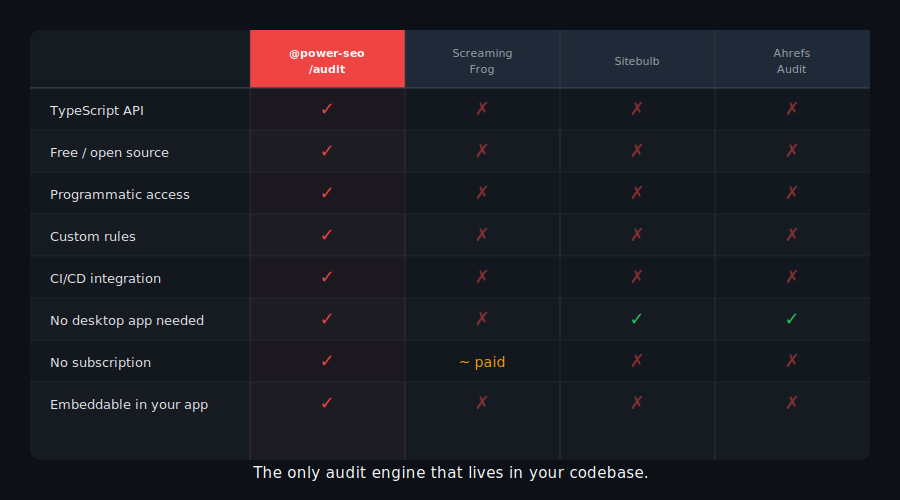
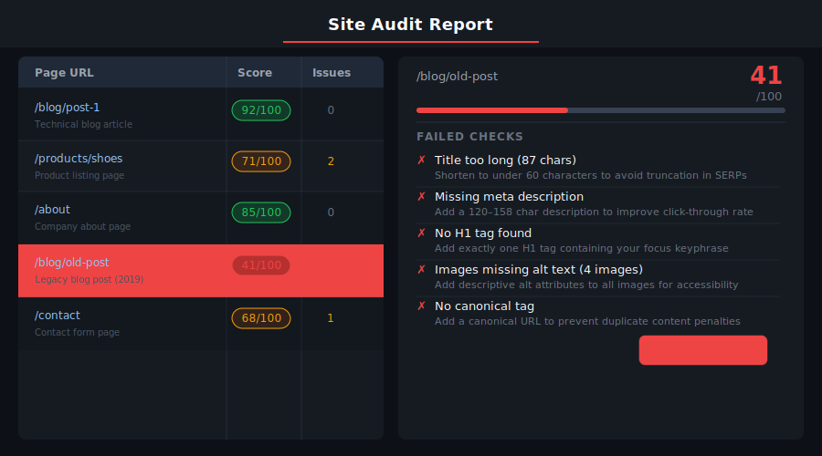
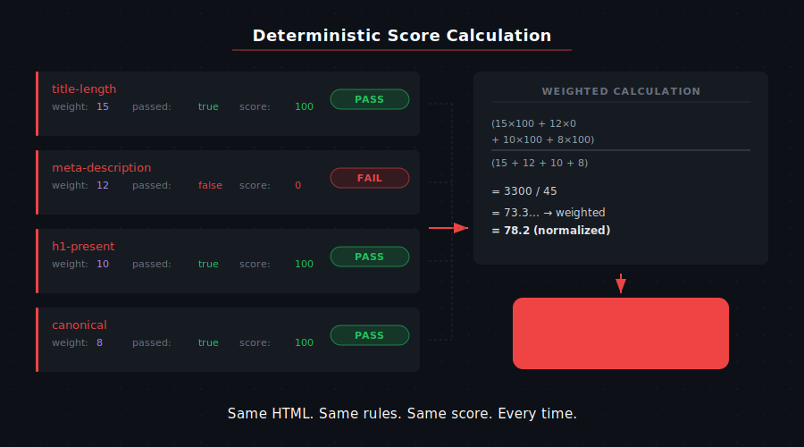
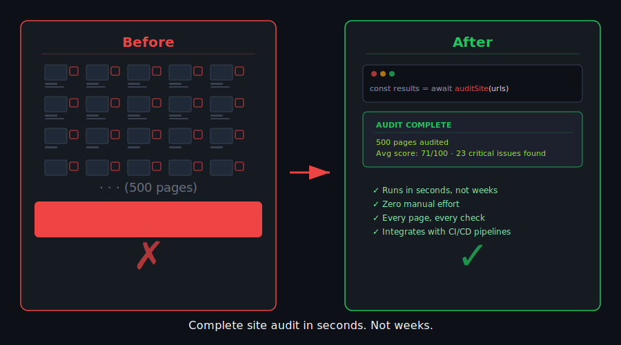

# @power-seo/audit


Comprehensive SEO auditing with 0–100 scoring across four rule categories: meta tags, content quality, structural correctness, and performance optimization.

[](https://www.npmjs.com/package/@power-seo/audit)
[](https://www.npmjs.com/package/@power-seo/audit)
[](https://socket.dev/npm/package/@power-seo/audit)
[](https://github.com/CyberCraftBD/power-seo/actions)
[](https://opensource.org/licenses/MIT)
[](https://www.typescriptlang.org/)
[](https://bundlephobia.com/package/@power-seo/audit)

`@power-seo/audit` is a production-grade SEO audit engine that evaluates pages against a structured rule set and returns scored, actionable reports. A single call to `auditPage` produces a 0–100 overall score plus per-category breakdowns across meta tags, content quality, document structure, and performance — along with an issue list where every item carries a severity level (`error`, `warning`, `info`) and a human-readable message.

For site-wide audits, `auditSite` accepts an array of page inputs and returns an aggregated report with an average score, top-recurring issues across all pages, and individual page results. This makes it straightforward to build an SEO dashboard, a CI gate, or an automated reporting pipeline.

The four rule sets can also be called independently — `runMetaRules`, `runContentRules`, `runStructureRules`, and `runPerformanceRules` — so you can selectively run only the rules relevant to your use case without paying for the full audit overhead.

> **Zero runtime dependencies** — entirely local, synchronous computation; no external API required.

---

## Why @power-seo/audit?

| | Without | With |
|---|---|---|
| Meta tag audit | ❌ Manual checking | ✅ 0–100 scored across 4 rule categories |
| Site-wide audit | ❌ Page-by-page | ✅ `auditSite()` — aggregate + per-page results |
| Rule granularity | ❌ Pass/fail only | ✅ `error` / `warning` / `info` / `pass` severity |
| Content analysis | ❌ Eye-check | ✅ Word count, keyphrase density, readability |
| CI integration | ❌ Manual review | ✅ Node.js script with configurable score threshold |
| Framework support | ❌ WordPress-only | ✅ Framework-agnostic, runs anywhere |
| TypeScript support | ❌ Untyped | ✅ Full type coverage for all inputs and results |




<p align="left">
  <a href="https://www.buymeacoffee.com/ccbd.dev" target="_blank">
    
  </a>
</p>

---

## Features

- **Single-page audit** — `auditPage(input)` returns an overall 0–100 score and a `categories` object with individual scores for meta, content, structure, and performance
- **Site-wide audit** — `auditSite(input)` audits multiple pages and returns aggregated average score, top issues by frequency, and per-page results
- **Meta rules** — title presence and length (50–60 chars), meta description presence and length (120–158 chars), canonical tag validation, robots meta directives, Open Graph completeness (og:title, og:description, og:image, og:url)
- **Content rules** — word count thresholds (thin content detection), focus keyphrase presence in title/description/first paragraph/headings, keyphrase density analysis, readability score integration
- **Structure rules** — single H1 validation, heading hierarchy (no skipped levels), image alt text completeness, internal link count, external link presence, JSON-LD schema validation
- **Performance rules** — image format optimization recommendations (JPEG vs WebP/AVIF), missing width/height attributes on images, absence of resource hints (`preconnect`, `preload`), unoptimized third-party script patterns
- **Three severity levels** — `error` (critical issues that directly hurt rankings), `warning` (sub-optimal practices), `info` (improvement opportunities)
- **Category-level scores** — each of the four categories produces its own 0–100 score so you can prioritize by weakest category
- **Composable rule sets** — call individual rule runners (`runMetaRules`, `runContentRules`, `runStructureRules`, `runPerformanceRules`) for selective auditing
- **Type-safe throughout** — complete TypeScript types for inputs, results, issues, categories, and severities
- **Zero network calls** — entirely local, synchronous computation; no external API required



---

## Comparison

| Feature | @power-seo/audit | Screaming Frog | Lighthouse | next-seo | ahrefs site audit |
| --- | :---: | :---: | :---: | :---: | :---: |
| Programmatic API | ✅ | ❌ | Partial | ❌ | ❌ |
| 4 rule categories | ✅ | Partial | Partial | ❌ | Partial |
| 0–100 scored output | ✅ | ❌ | ✅ | ❌ | ✅ |
| Site-wide aggregation | ✅ | ✅ | ❌ | ❌ | ✅ |
| CI/CD integration | ✅ | ❌ | Partial | ❌ | ❌ |
| Zero network calls | ✅ | ❌ | Partial | ✅ | ❌ |
| TypeScript-first | ✅ | ❌ | ❌ | Partial | ❌ |
| Tree-shakeable | ✅ | ❌ | ❌ | ❌ | ❌ |



---

## Installation

```bash
npm install @power-seo/audit
```

```bash
yarn add @power-seo/audit
```

```bash
pnpm add @power-seo/audit
```

---

## Quick Start

```ts
import { auditPage } from '@power-seo/audit';

const result = auditPage({
  url: 'https://example.com/blog/react-seo-guide',
  title: 'React SEO Guide — Best Practices for 2026',
  metaDescription:
    'Learn how to optimize React applications for search engines with meta tags, structured data, and Core Web Vitals improvements.',
  canonical: 'https://example.com/blog/react-seo-guide',
  robots: 'index, follow',
  content: '<h1>React SEO Guide</h1><p>Search engine optimization for React apps...</p>',
  headings: ['h1:React SEO Guide', 'h2:Why SEO Matters for React', 'h2:Meta Tags in React'],
  images: [{ src: '/hero.webp', alt: 'React SEO guide illustration' }],
  internalLinks: ['/blog', '/docs/meta-tags'],
  externalLinks: ['https://developers.google.com/search'],
  focusKeyphrase: 'react seo',
  wordCount: 1850,
});

console.log(result.score); // e.g. 84
console.log(result.categories);
// { meta: { score: 90, passed: 9, warnings: 1, errors: 0 }, content: { score: 82, ... }, ... }
console.log(result.rules);
// [
//   { id: 'meta-description-length', category: 'meta', severity: 'warning', title: '...', description: '...' },
//   { id: 'content-word-count', category: 'content', severity: 'pass', ... },
// ]
```



---

## Usage

### Page Audit

`auditPage` is the primary entry point for single-page evaluation. It runs all four rule sets and computes a weighted overall score.

```ts
import { auditPage } from '@power-seo/audit';
import type { PageAuditInput, PageAuditResult } from '@power-seo/audit';

const input: PageAuditInput = {
  url: 'https://example.com/products/widget',
  title: 'Premium Widget — Buy Online | Example',
  metaDescription:
    'Buy our premium widget online. Free shipping on orders over $50. Trusted by 10,000+ customers.',
  canonical: 'https://example.com/products/widget',
  robots: 'index, follow',
  openGraph: {
    title: 'Premium Widget',
    description: 'Buy our premium widget with free shipping.',
    image: 'https://example.com/images/widget-og.jpg',
  },
  content: '<h1>Premium Widget</h1><p>Our best-selling product...</p>',
  headings: ['h1:Premium Widget', 'h2:Features', 'h2:Customer Reviews'],
  images: [
    { src: '/images/widget.jpg', alt: 'Premium widget product photo' },
    { src: '/images/widget-detail.jpg', alt: '' },
  ],
  internalLinks: ['/products', '/cart', '/about'],
  externalLinks: [],
  focusKeyphrase: 'premium widget',
  wordCount: 620,
};

const result: PageAuditResult = auditPage(input);

// Filter rules by severity
const errors = result.rules.filter((r) => r.severity === 'error');
const warnings = result.rules.filter((r) => r.severity === 'warning');

console.log(`Score: ${result.score}/100`);
console.log(`Errors: ${errors.length}, Warnings: ${warnings.length}`);
```

### Site Audit

`auditSite` runs page audits across an entire array of pages and returns aggregated statistics.

```ts
import { auditSite } from '@power-seo/audit';
import type { SiteAuditInput, SiteAuditResult } from '@power-seo/audit';

const siteInput: SiteAuditInput = {
  pages: [page1Input, page2Input, page3Input],
};

const report: SiteAuditResult = auditSite(siteInput);

console.log(`Average score: ${report.score}/100`);
console.log(`Pages audited: ${report.totalPages}`);
console.log('Top issues across site:');
report.topIssues.forEach(({ id, title, severity }) => {
  console.log(`  ${id} (${title}) [${severity}]`);
});

// Access individual page results
report.pageResults.forEach(({ url, score, rules }) => {
  const issues = rules.filter((r) => r.severity === 'error' || r.severity === 'warning');
  console.log(`${url}: ${score}/100 (${issues.length} issues)`);
});
```

### Individual Rule Sets

Run only the rules you need without executing the full audit pipeline.

```ts
import {
  runMetaRules,
  runContentRules,
  runStructureRules,
  runPerformanceRules,
} from '@power-seo/audit';
import type { PageAuditInput, CategoryResult } from '@power-seo/audit';

const input: PageAuditInput = {
  /* ... */
};

// Run only meta checks — title, description, canonical, robots, OG
const metaRules = runMetaRules(input);
const errors = metaRules.filter((r) => r.severity === 'error');
const passes = metaRules.filter((r) => r.severity === 'pass');
console.log(`Meta: ${passes.length} passed, ${errors.length} errors`);
metaRules.forEach((r) => console.log(`  [${r.severity}] ${r.title}: ${r.description}`));

// Run only content checks — word count, keyphrase, readability
const contentRules = runContentRules(input);

// Run only structure checks — headings, images, links, schema
const structureRules = runStructureRules(input);

// Run only performance checks — image formats, resource hints
const perfRules = runPerformanceRules(input);
```

### Processing Audit Issues

Issues can be filtered, grouped, and sorted for display in dashboards or reports.

```ts
import { auditPage } from '@power-seo/audit';
import type { AuditSeverity } from '@power-seo/audit';

const result = auditPage(input);

// Group rules by category
const byCategory = result.rules.reduce(
  (acc, rule) => {
    acc[rule.category] = acc[rule.category] ?? [];
    acc[rule.category]!.push(rule);
    return acc;
  },
  {} as Record<string, typeof result.rules>,
);

// Priority order: errors first, then warnings, then info, then pass
const prioritized = [...result.rules].sort((a, b) => {
  const order: Record<AuditSeverity, number> = { error: 0, warning: 1, info: 2, pass: 3 };
  return order[a.severity] - order[b.severity];
});

// Check if page passes a minimum score threshold
const MINIMUM_SCORE = 70;
if (result.score < MINIMUM_SCORE) {
  throw new Error(`SEO audit failed: score ${result.score} is below minimum ${MINIMUM_SCORE}`);
}
```

### Using with CI/CD

Use `auditPage` or `auditSite` in a Node.js CI script to block deployments when scores fall below a threshold.

```ts
// scripts/seo-audit.ts
import { auditSite } from '@power-seo/audit';
import { pages } from './test-pages.js';

const report = auditSite({ pages });

const SCORE_THRESHOLD = 75;
const ALLOWED_ERRORS = 0;

const totalErrors = report.pageResults.flatMap((p) =>
  p.rules.filter((r) => r.severity === 'error'),
).length;

if (report.score < SCORE_THRESHOLD || totalErrors > ALLOWED_ERRORS) {
  console.error(`SEO audit FAILED`);
  console.error(`  Average score: ${report.score} (min: ${SCORE_THRESHOLD})`);
  console.error(`  Critical errors: ${totalErrors} (max: ${ALLOWED_ERRORS})`);
  process.exit(1);
}

console.log(`SEO audit PASSED — average score: ${report.score}/100`);
```

---

## API Reference

### `auditPage(input)`

| Parameter                | Type                                            | Required | Description                                                     |
| ------------------------ | ----------------------------------------------- | -------- | --------------------------------------------------------------- |
| `input.url`              | `string`                                        | ✅       | Canonical URL of the page being audited                         |
| `input.title`            | `string`                                        | —        | Page `<title>` tag content                                      |
| `input.metaDescription`  | `string`                                        | —        | Content of the `meta[name="description"]` tag                   |
| `input.canonical`        | `string`                                        | —        | Canonical URL from `link[rel="canonical"]`                      |
| `input.robots`           | `string`                                        | —        | Content of `meta[name="robots"]` tag (e.g. `'index, follow'`)  |
| `input.openGraph`        | `{ title?, description?, image? }`              | —        | Open Graph tag values                                           |
| `input.content`          | `string`                                        | —        | Full HTML/text content of the page body                         |
| `input.headings`         | `string[]`                                      | —        | Headings as `'h1:text'` / `'h2:text'` strings                  |
| `input.images`           | `Array<{ src: string; alt?: string; size?: number }>` | —   | Images extracted from the page                                  |
| `input.internalLinks`    | `string[]`                                      | —        | Internal link href values found on the page                     |
| `input.externalLinks`    | `string[]`                                      | —        | External link href values found on the page                     |
| `input.schema`           | `SchemaBase[]`                                  | —        | JSON-LD schema objects present on the page                      |
| `input.focusKeyphrase`   | `string`                                        | —        | Focus keyphrase for content analysis                            |
| `input.wordCount`        | `number`                                        | —        | Word count proxy — used when `content` is not provided          |
| `input.keywordDensity`   | `number`                                        | —        | Keyword density % proxy — used when `content` is not provided   |
| `input.statusCode`       | `number`                                        | —        | HTTP status code of the page                                    |
| `input.responseTime`     | `number`                                        | —        | Page response time in milliseconds                              |
| `input.contentLength`    | `number`                                        | —        | Content length in bytes                                         |

Returns `PageAuditResult`:

| Property          | Type                                    | Description                                                    |
| ----------------- | --------------------------------------- | -------------------------------------------------------------- |
| `url`             | `string`                                | The audited page URL                                           |
| `score`           | `number`                                | Overall weighted score 0–100                                   |
| `categories`      | `Record<AuditCategory, CategoryResult>` | Per-category scores with `score`, `passed`, `warnings`, `errors` |
| `rules`           | `AuditRule[]`                           | Flat array of all rule results across all categories           |
| `recommendations` | `string[]`                              | Human-readable descriptions of errors and warnings             |

---

### `auditSite(input)`

| Parameter     | Type               | Required | Description                            |
| ------------- | ------------------ | -------- | -------------------------------------- |
| `input.pages` | `PageAuditInput[]` | ✅       | Array of page audit inputs to evaluate |

Returns `SiteAuditResult`:

| Property      | Type                                    | Description                                         |
| ------------- | --------------------------------------- | --------------------------------------------------- |
| `score`       | `number`                                | Mean score across all pages (0–100)                 |
| `totalPages`  | `number`                                | Total number of pages audited                       |
| `pageResults` | `PageAuditResult[]`                     | Individual page audit results                       |
| `topIssues`   | `AuditRule[]`                           | Most frequently occurring non-pass rules across all pages |
| `summary`     | `Record<AuditCategory, CategoryResult>` | Aggregated category scores across all pages         |

---

### `runMetaRules(input)` / `runContentRules(input)` / `runStructureRules(input)` / `runPerformanceRules(input)`

Each rule runner accepts a `PageAuditInput` and returns `AuditRule[]`:

| Property      | Type            | Description                                                   |
| ------------- | --------------- | ------------------------------------------------------------- |
| `id`          | `string`        | Unique rule identifier (e.g. `'meta-title-length'`)           |
| `category`    | `AuditCategory` | `'meta'` \| `'content'` \| `'structure'` \| `'performance'`  |
| `title`       | `string`        | Short human-readable rule name                                |
| `description` | `string`        | Detailed description of the finding                           |
| `severity`    | `AuditSeverity` | `'error'` \| `'warning'` \| `'info'` \| `'pass'`             |

---

### Types

```ts
import type {
  AuditCategory,   // 'meta' | 'content' | 'structure' | 'performance'
  AuditSeverity,   // 'error' | 'warning' | 'info' | 'pass'
  AuditRule,       // { id, category, title, description, severity }
  PageAuditInput,  // Full page input object (see auditPage parameters above)
  PageAuditResult, // { url, score, categories, rules, recommendations }
  CategoryResult,  // { score: number; passed: number; warnings: number; errors: number }
  SiteAuditInput,  // { pages: PageAuditInput[] }
  SiteAuditResult, // { score, totalPages, pageResults, topIssues, summary }
} from '@power-seo/audit';
```

---

## Use Cases

- **Headless CMS** — score pages before publish; block publication if score drops below threshold
- **Next.js / Remix apps** — run server-side audit per route and expose scores in admin dashboards
- **CI/CD quality gates** — block deploys when audit scores fall below a configurable threshold
- **SaaS platforms** — provide per-client SEO health scores across all managed pages
- **Reporting tools** — generate structured audit reports for agencies delivering SEO as a service

---

## Architecture Overview

- **Pure TypeScript** — no compiled binary, no native modules
- **Zero external runtime dependencies** — entirely local, synchronous computation
- **Framework-agnostic** — works in Next.js, Remix, Vite, Express, Edge runtimes, or CI scripts
- **SSR compatible** — no browser-specific APIs; safe for server-side use
- **Edge runtime safe** — no Node.js-specific APIs; runs in Cloudflare Workers, Vercel Edge, Deno
- **Tree-shakeable** — `"sideEffects": false` with named exports per rule runner
- **Dual ESM + CJS** — ships both formats via tsup for any bundler or `require()` usage

---

## Supply Chain Security

- No install scripts (`postinstall`, `preinstall`)
- No runtime network access
- No `eval` or dynamic code execution
- npm provenance enabled — every release is signed via Sigstore through GitHub Actions
- CI-signed builds — all releases published via verified `github.com/CyberCraftBD/power-seo` workflow
- Safe for SSR, Edge, and server environments

---

## The [@power-seo](https://www.npmjs.com/org/power-seo) Ecosystem

All 17 packages are independently installable — use only what you need.

| Package                                                                                    | Install                             | Description                                                             |
| ------------------------------------------------------------------------------------------ | ----------------------------------- | ----------------------------------------------------------------------- |
| [`@power-seo/core`](https://www.npmjs.com/package/@power-seo/core)                         | `npm i @power-seo/core`             | Framework-agnostic utilities, types, validators, and constants          |
| [`@power-seo/react`](https://www.npmjs.com/package/@power-seo/react)                       | `npm i @power-seo/react`            | React SEO components — meta, Open Graph, Twitter Card, breadcrumbs      |
| [`@power-seo/meta`](https://www.npmjs.com/package/@power-seo/meta)                         | `npm i @power-seo/meta`             | SSR meta helpers for Next.js App Router, Remix v2, and generic SSR      |
| [`@power-seo/schema`](https://www.npmjs.com/package/@power-seo/schema)                     | `npm i @power-seo/schema`           | Type-safe JSON-LD structured data — 23 builders + 21 React components   |
| [`@power-seo/content-analysis`](https://www.npmjs.com/package/@power-seo/content-analysis) | `npm i @power-seo/content-analysis` | Yoast-style SEO content scoring engine with React components            |
| [`@power-seo/readability`](https://www.npmjs.com/package/@power-seo/readability)           | `npm i @power-seo/readability`      | Readability scoring — Flesch-Kincaid, Gunning Fog, Coleman-Liau, ARI    |
| [`@power-seo/preview`](https://www.npmjs.com/package/@power-seo/preview)                   | `npm i @power-seo/preview`          | SERP, Open Graph, and Twitter/X Card preview generators                 |
| [`@power-seo/sitemap`](https://www.npmjs.com/package/@power-seo/sitemap)                   | `npm i @power-seo/sitemap`          | XML sitemap generation, streaming, index splitting, and validation      |
| [`@power-seo/redirects`](https://www.npmjs.com/package/@power-seo/redirects)               | `npm i @power-seo/redirects`        | Redirect engine with Next.js, Remix, and Express adapters               |
| [`@power-seo/links`](https://www.npmjs.com/package/@power-seo/links)                       | `npm i @power-seo/links`            | Link graph analysis — orphan detection, suggestions, equity scoring     |
| [`@power-seo/audit`](https://www.npmjs.com/package/@power-seo/audit)                       | `npm i @power-seo/audit`            | Full SEO audit engine — meta, content, structure, performance rules     |
| [`@power-seo/images`](https://www.npmjs.com/package/@power-seo/images)                     | `npm i @power-seo/images`           | Image SEO — alt text, lazy loading, format analysis, image sitemaps     |
| [`@power-seo/ai`](https://www.npmjs.com/package/@power-seo/ai)                             | `npm i @power-seo/ai`               | LLM-agnostic AI prompt templates and parsers for SEO tasks              |
| [`@power-seo/analytics`](https://www.npmjs.com/package/@power-seo/analytics)               | `npm i @power-seo/analytics`        | Merge GSC + audit data, trend analysis, ranking insights, dashboard     |
| [`@power-seo/search-console`](https://www.npmjs.com/package/@power-seo/search-console)     | `npm i @power-seo/search-console`   | Google Search Console API — OAuth2, service account, URL inspection     |
| [`@power-seo/integrations`](https://www.npmjs.com/package/@power-seo/integrations)         | `npm i @power-seo/integrations`     | Semrush and Ahrefs API clients with rate limiting and pagination        |
| [`@power-seo/tracking`](https://www.npmjs.com/package/@power-seo/tracking)                 | `npm i @power-seo/tracking`         | GA4, Clarity, PostHog, Plausible, Fathom — scripts + consent management |

---

## About [CyberCraft Bangladesh](https://ccbd.dev)

**[CyberCraft Bangladesh](https://ccbd.dev)** is a Bangladesh-based enterprise-grade software development and Full Stack SEO service provider company specializing in ERP system development, AI-powered SaaS and business applications, full-stack SEO services, custom website development, and scalable eCommerce platforms. We design and develop intelligent, automation-driven SaaS and enterprise solutions that help startups, SMEs, NGOs, educational institutes, and large organizations streamline operations, enhance digital visibility, and accelerate growth through modern cloud-native technologies.

[](https://ccbd.dev)
[](https://github.com/cybercraftbd)
[](https://www.npmjs.com/org/power-seo)
[](mailto:info@ccbd.dev)

© 2026 [CyberCraft Bangladesh](https://ccbd.dev) · Released under the [MIT License](../../LICENSE)
