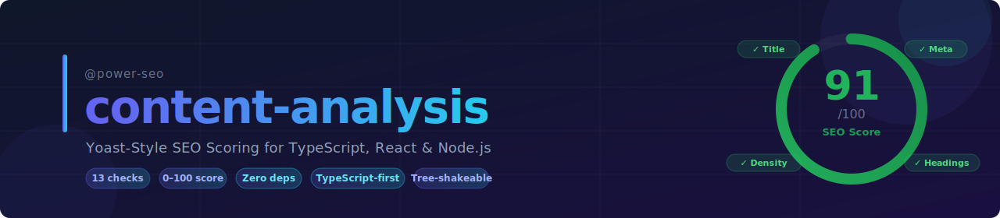
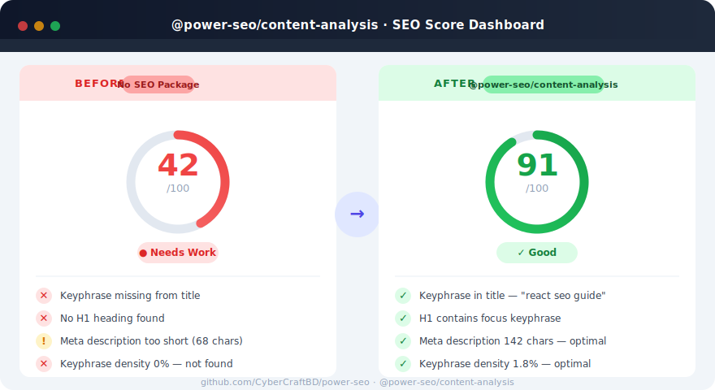
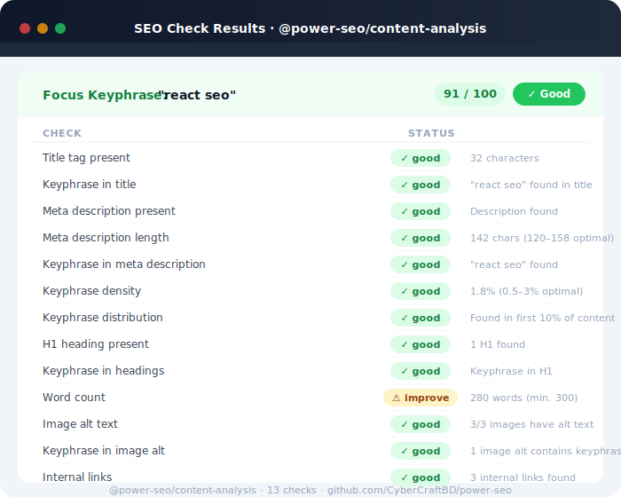
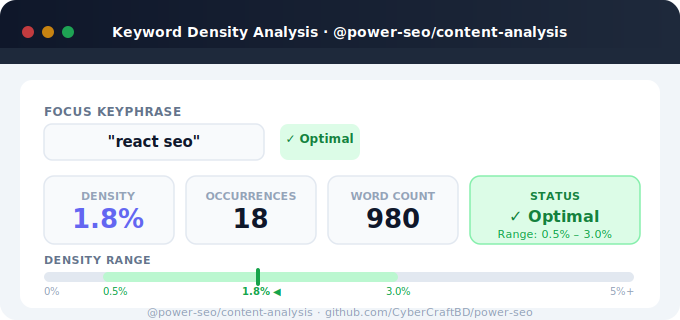
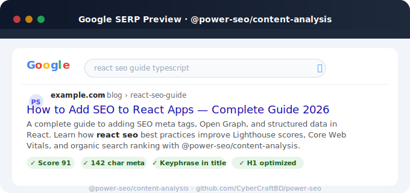

# @power-seo/content-analysis



Yoast-Style SEO Content Scoring for TypeScript, React & Node.js — Real-Time Keyword Analysis, Readability Checks, and Actionable Feedback Without WordPress.

[](https://www.npmjs.com/package/@power-seo/content-analysis)
[](https://www.npmjs.com/package/@power-seo/content-analysis)
[](https://socket.dev/npm/package/@power-seo/content-analysis)
[](https://github.com/CyberCraftBD/power-seo/actions)
[](https://opensource.org/licenses/MIT)
[](https://www.typescriptlang.org/)
[](https://bundlephobia.com/package/@power-seo/content-analysis)

`@power-seo/content-analysis` gives you a complete Yoast-style SEO scoring pipeline for any text content. Feed it a page's title, meta description, body HTML, focus keyphrase, images, and links — get back structured `good` / `improvement` / `error` results for every SEO factor. Run it server-side in a CMS, client-side in a React editor, or inside a CI content quality gate. All 13 checks are individually configurable and tree-shakeable.

> **Zero runtime dependencies** — only `@power-seo/core` as a peer.

---

## Why @power-seo/content-analysis?

| | Without | With |
|---|---|---|
| Keyphrase check | ❌ Manual grep | ✅ Density + distribution scoring |
| Title validation | ❌ Eye-check only | ✅ Presence, length, keyphrase match |
| Meta description | ❌ Unchecked | ✅ Length (120–158 chars) + keyphrase |
| Heading structure | ❌ Missed H1s | ✅ H1 existence + keyphrase in headings |
| Image alt text | ❌ Skipped | ✅ Alt presence + keyphrase in alt |
| Link analysis | ❌ Unknown | ✅ Internal + external link presence |
| SEO score | ❌ Guesswork | ✅ 0–100 aggregate with per-check breakdown |
| Framework support | ❌ WordPress-only | ✅ Next.js, Remix, Vite, Node.js, Edge |



---

## Installation

```bash
npm install @power-seo/content-analysis
```

```bash
yarn add @power-seo/content-analysis
```

```bash
pnpm add @power-seo/content-analysis
```

---

## Quick Start

```ts
import { analyzeContent } from '@power-seo/content-analysis';

const result = await analyzeContent({
  keyphrase: 'react seo',
  title: 'How to Add SEO to React Apps',
  metaDescription:
    'A complete guide to adding SEO meta tags, Open Graph, and structured data in React.',
  bodyHtml: '<h1>React SEO Guide</h1><p>Search engine optimization for React...</p>',
  images: [{ src: '/hero.jpg', alt: 'React SEO diagram' }],
  links: {
    internal: ['https://example.com/blog'],
    external: ['https://developers.google.com/search'],
  },
});

console.log(result.score);   // e.g. 82
console.log(result.status);  // "good" | "improvement" | "error"
console.log(result.results); // [{ id, status, message }, ...]
```



**Score thresholds:**
- `good` — ≥ 70
- `improvement` — ≥ 40
- `error` — < 40

---

## Usage

### Running All Checks at Once

`analyzeContent()` runs all 13 built-in checks and returns an aggregated score (0–100) along with per-check results.

```ts
import { analyzeContent } from '@power-seo/content-analysis';

const output = await analyzeContent({
  keyphrase: 'next.js seo',
  title: 'Next.js SEO Best Practices',
  metaDescription:
    'Learn how to optimize your Next.js app for search engines with meta tags and structured data.',
  bodyHtml: htmlString,
  wordCount: 1250,
  images: imageList,
  links: { internal: internalLinks, external: externalLinks },
});

// output.score     → number 0–100
// output.results   → AnalysisResult[]
// output.status    → 'good' | 'improvement' | 'error'
```

### Running Individual Checks

Each check is exported as a standalone function — useful when you want to run only a subset of the analysis.

```ts
import {
  checkTitle,
  checkMetaDescription,
  checkKeyphraseUsage,
  checkHeadings,
  checkWordCount,
  checkImages,
  checkLinks,
} from '@power-seo/content-analysis';

const titleResult = checkTitle({ keyphrase: 'react seo', title: 'React SEO Guide' });
// { id: 'title-keyphrase', status: 'good', message: 'Focus keyphrase found in title.' }

const wc = checkWordCount({ wordCount: 250 });
// { id: 'word-count', status: 'improvement', message: 'Word count is below 300 words.' }
```



### Disabling Specific Checks

Pass `config.disabledChecks` to skip checks that don't apply to your content type (e.g. skip image checks on text-only pages):

```ts
import { analyzeContent } from '@power-seo/content-analysis';

const output = await analyzeContent(input, {
  disabledChecks: ['image-alt', 'image-keyphrase', 'external-links'],
});
```

### Using in a React Editor

Integrate live scoring into a content editor — re-run analysis on every keystroke or debounced change:

```tsx
import { useState, useEffect } from 'react';
import { analyzeContent } from '@power-seo/content-analysis';
import type { ContentAnalysisOutput } from '@power-seo/content-analysis';

function SeoScorePanel({ content }: { content: EditorContent }) {
  const [analysis, setAnalysis] = useState<ContentAnalysisOutput | null>(null);

  useEffect(() => {
    analyzeContent({
      keyphrase: content.keyphrase,
      title: content.title,
      metaDescription: content.description,
      bodyHtml: content.html,
    }).then(setAnalysis);
  }, [content]);

  if (!analysis) return null;

  return (
    <div>
      <p>SEO Score: {analysis.score}/100</p>
      {analysis.results.map((r) => (
        <div key={r.id} className={`check-${r.status}`}>
          {r.message}
        </div>
      ))}
    </div>
  );
}
```

### Inside a CI Content Quality Gate

Block deploys when SEO score drops below a threshold:

```ts
import { analyzeContent } from '@power-seo/content-analysis';

const output = await analyzeContent({ keyphrase, title, metaDescription, bodyHtml });

if (output.score < 70) {
  console.error('SEO score too low:', output.score);
  output.results
    .filter((r) => r.status === 'error')
    .forEach((r) => console.error(' ✗', r.message));
  process.exit(1);
}
```

---

## API Reference

### `analyzeContent()`

```ts
function analyzeContent(
  input: ContentAnalysisInput,
  config?: AnalysisConfig,
): Promise<ContentAnalysisOutput>;
```

#### `ContentAnalysisInput`

| Prop              | Type                                       | Required | Description                                                                  |
| ----------------- | ------------------------------------------ | -------- | ---------------------------------------------------------------------------- |
| `keyphrase`       | `string`                                   | ✅       | Focus keyphrase to analyze against                                           |
| `title`           | `string`                                   | ✅       | Page `<title>` content                                                       |
| `metaDescription` | `string`                                   | ✅       | Meta description content                                                     |
| `bodyHtml`        | `string`                                   | ✅       | Full body HTML string                                                        |
| `wordCount`       | `number`                                   | —        | Pre-computed word count (auto-detected from `bodyHtml` if omitted)           |
| `images`          | `Array<{ src: string; alt?: string }>`     | —        | Images found on the page                                                     |
| `links`           | `{ internal: string[]; external: string[] }` | —      | Internal and external link URLs                                              |

#### `ContentAnalysisOutput`

| Field     | Type               | Description                                                  |
| --------- | ------------------ | ------------------------------------------------------------ |
| `score`   | `number`           | Aggregate score 0–100                                        |
| `status`  | `AnalysisStatus`   | `'good'` (≥70) \| `'improvement'` (≥40) \| `'error'` (<40) |
| `results` | `AnalysisResult[]` | Per-check results                                            |

#### `AnalysisResult`

| Field     | Type             | Description                              |
| --------- | ---------------- | ---------------------------------------- |
| `id`      | `CheckId`        | Unique check identifier                  |
| `status`  | `AnalysisStatus` | `'good'` \| `'improvement'` \| `'error'` |
| `message` | `string`         | Human-readable actionable feedback       |

#### `AnalysisConfig`

| Field            | Type        | Description                                    |
| ---------------- | ----------- | ---------------------------------------------- |
| `disabledChecks` | `CheckId[]` | List of check IDs to skip during analysis      |

### Individual Check Functions

| Function                      | Check ID(s)                              | Checks For                               |
| ----------------------------- | ---------------------------------------- | ---------------------------------------- |
| `checkTitle(input)`           | `title-presence`, `title-keyphrase`      | Title presence and keyphrase inclusion   |
| `checkMetaDescription(input)` | `meta-presence`, `meta-length`, `meta-keyphrase` | Description presence, length, keyphrase |
| `checkKeyphraseUsage(input)`  | `keyphrase-density`, `keyphrase-distribution` | Density (0.5–3%) and early occurrence  |
| `checkHeadings(input)`        | `h1-presence`, `heading-keyphrase`       | H1 existence and keyphrase in headings   |
| `checkWordCount(input)`       | `word-count`                             | Minimum 300-word threshold               |
| `checkImages(input)`          | `image-alt`, `image-keyphrase`           | Alt text presence and keyphrase in alt   |
| `checkLinks(input)`           | `internal-links`, `external-links`       | Internal and external link presence      |

### Types

| Type                    | Description                                |
| ----------------------- | ------------------------------------------ |
| `CheckId`               | Union of all 13 built-in check IDs         |
| `AnalysisConfig`        | `{ disabledChecks?: CheckId[] }`           |
| `AnalysisStatus`        | `'good' \| 'improvement' \| 'error'`       |
| `ContentAnalysisInput`  | Input shape for `analyzeContent()`         |
| `ContentAnalysisOutput` | Output shape from `analyzeContent()`       |
| `AnalysisResult`        | Single check result with id, status, message |

---

## Comparison

| Feature                        | @power-seo/content-analysis | Yoast SEO | next-seo | seo-analyzer | react-helmet |
| ------------------------------ | :-------------------------: | :-------: | :------: | :----------: | :----------: |
| Keyphrase density check        | ✅                          | ✅        | ❌       | Partial      | ❌           |
| Keyphrase distribution         | ✅                          | ✅        | ❌       | ❌           | ❌           |
| Title + meta validation        | ✅                          | ✅        | ❌       | Partial      | ❌           |
| Heading structure check        | ✅                          | ✅        | ❌       | ❌           | ❌           |
| Image alt + keyphrase check    | ✅                          | ✅        | ❌       | ❌           | ❌           |
| Internal / external link check | ✅                          | ✅        | ❌       | ❌           | ❌           |
| 0–100 aggregate score          | ✅                          | ✅        | ❌       | Partial      | ❌           |
| Per-check disable config       | ✅                          | ❌        | ❌       | ❌           | ❌           |
| Works outside WordPress        | ✅                          | ❌        | ✅       | ✅           | ✅           |
| TypeScript-first               | ✅                          | ❌        | Partial  | ❌           | ❌           |
| Tree-shakeable                 | ✅                          | ❌        | Partial  | ❌           | ❌           |
| React editor integration       | ✅                          | ✅        | ❌       | ❌           | ❌           |
| CI / Node.js usage             | ✅                          | ❌        | ❌       | ✅           | ❌           |
| Zero runtime dependencies      | ✅                          | ❌        | ❌       | ❌           | ❌           |

---

## Use Cases

- **Headless CMS** — score content as editors write, before publishing
- **Next.js / Remix apps** — run analysis server-side per route and expose scores in admin dashboards
- **SaaS landing pages** — enforce SEO quality programmatically across all marketing pages
- **eCommerce product pages** — validate product titles, descriptions, and image alt text at scale
- **Blog platforms** — provide real-time Yoast-style feedback in the post editor
- **CI/CD content gates** — block deploys when SEO score falls below an acceptable threshold



---

## Key Features

- **13 built-in checks** covering title, meta, headings, keyphrase density, distribution, word count, images, and links
- **0–100 aggregate score** with `good / improvement / error` status per check
- **Per-check disable config** — skip irrelevant checks for text-only or image-only pages
- **Real-time React integration** — re-score on every content change in an editor
- **CI quality gates** — run as a Node.js script to enforce minimum SEO scores
- **Framework-agnostic** — Next.js, Remix, Gatsby, Vite, vanilla Node.js, Edge runtime
- **Full TypeScript** — complete type definitions for all inputs, outputs, and check IDs
- **Tree-shakeable** — import only what you use; zero dead code in your bundle

---

## Architecture Overview

- **Pure TypeScript** — no compiled binary, no native modules
- **Zero runtime dependencies** — only `@power-seo/core` as a peer dependency
- **Framework-agnostic** — works in any JavaScript environment
- **SSR compatible** — safe to run in Next.js Server Components, Remix loaders, or Express handlers
- **Edge runtime safe** — no Node.js-specific APIs; runs in Cloudflare Workers, Vercel Edge, Deno
- **Tree-shakeable** — `"sideEffects": false` with named exports per check function
- **Dual ESM + CJS** — ships both formats via tsup for any bundler or `require()` usage

---

## Supply Chain Security

- No install scripts (`postinstall`, `preinstall`)
- No runtime network access
- No `eval` or dynamic code execution
- npm provenance enabled — every release is signed via Sigstore through GitHub Actions
- CI-signed builds — all releases published via verified `github.com/CyberCraftBD/power-seo` workflow
- Safe for SSR, Edge, and server environments

---

## The [@power-seo](https://www.npmjs.com/org/power-seo) Ecosystem

All 17 packages are independently installable — use only what you need.

| Package                                                                                    | Install                             | Description                                                             |
| ------------------------------------------------------------------------------------------ | ----------------------------------- | ----------------------------------------------------------------------- |
| [`@power-seo/core`](https://www.npmjs.com/package/@power-seo/core)                         | `npm i @power-seo/core`             | Framework-agnostic utilities, types, validators, and constants          |
| [`@power-seo/react`](https://www.npmjs.com/package/@power-seo/react)                       | `npm i @power-seo/react`            | React SEO components — meta, Open Graph, Twitter Card, breadcrumbs      |
| [`@power-seo/meta`](https://www.npmjs.com/package/@power-seo/meta)                         | `npm i @power-seo/meta`             | SSR meta helpers for Next.js App Router, Remix v2, and generic SSR      |
| [`@power-seo/schema`](https://www.npmjs.com/package/@power-seo/schema)                     | `npm i @power-seo/schema`           | Type-safe JSON-LD structured data — 20 builders + 18 React components   |
| [`@power-seo/content-analysis`](https://www.npmjs.com/package/@power-seo/content-analysis) | `npm i @power-seo/content-analysis` | Yoast-style SEO content scoring engine with React components            |
| [`@power-seo/readability`](https://www.npmjs.com/package/@power-seo/readability)           | `npm i @power-seo/readability`      | Readability scoring — Flesch-Kincaid, Gunning Fog, Coleman-Liau, ARI    |
| [`@power-seo/preview`](https://www.npmjs.com/package/@power-seo/preview)                   | `npm i @power-seo/preview`          | SERP, Open Graph, and Twitter/X Card preview generators                 |
| [`@power-seo/sitemap`](https://www.npmjs.com/package/@power-seo/sitemap)                   | `npm i @power-seo/sitemap`          | XML sitemap generation, streaming, index splitting, and validation      |
| [`@power-seo/redirects`](https://www.npmjs.com/package/@power-seo/redirects)               | `npm i @power-seo/redirects`        | Redirect engine with Next.js, Remix, and Express adapters               |
| [`@power-seo/links`](https://www.npmjs.com/package/@power-seo/links)                       | `npm i @power-seo/links`            | Link graph analysis — orphan detection, suggestions, equity scoring     |
| [`@power-seo/audit`](https://www.npmjs.com/package/@power-seo/audit)                       | `npm i @power-seo/audit`            | Full SEO audit engine — meta, content, structure, performance rules     |
| [`@power-seo/images`](https://www.npmjs.com/package/@power-seo/images)                     | `npm i @power-seo/images`           | Image SEO — alt text, lazy loading, format analysis, image sitemaps     |
| [`@power-seo/ai`](https://www.npmjs.com/package/@power-seo/ai)                             | `npm i @power-seo/ai`               | LLM-agnostic AI prompt templates and parsers for SEO tasks              |
| [`@power-seo/analytics`](https://www.npmjs.com/package/@power-seo/analytics)               | `npm i @power-seo/analytics`        | Merge GSC + audit data, trend analysis, ranking insights, dashboard     |
| [`@power-seo/search-console`](https://www.npmjs.com/package/@power-seo/search-console)     | `npm i @power-seo/search-console`   | Google Search Console API — OAuth2, service account, URL inspection     |
| [`@power-seo/integrations`](https://www.npmjs.com/package/@power-seo/integrations)         | `npm i @power-seo/integrations`     | Semrush and Ahrefs API clients with rate limiting and pagination        |
| [`@power-seo/tracking`](https://www.npmjs.com/package/@power-seo/tracking)                 | `npm i @power-seo/tracking`         | GA4, Clarity, PostHog, Plausible, Fathom — scripts + consent management |

---

## Keywords

seo content analysis · yoast seo alternative · content scoring typescript · keyword density checker · react seo scoring · nextjs content analysis · seo score npm · focus keyphrase checker · meta description validator · heading seo checker · content quality gate · headless cms seo · seo readability checker · content optimization library · programmatic seo · keyphrase density analyzer · seo audit npm package · typescript seo library · content seo automation · react editor seo · ci seo check · edge runtime seo

---

## About [CyberCraft Bangladesh](https://ccbd.dev)

**[CyberCraft Bangladesh](https://ccbd.dev)** is a Bangladesh-based enterprise-grade software engineering company specializing in ERP system development, AI-powered SaaS and business applications, full-stack SEO services, custom website development, and scalable eCommerce platforms.

|                      |                                                                |
| -------------------- | -------------------------------------------------------------- |
| **Website**          | [ccbd.dev](https://ccbd.dev)                                   |
| **GitHub**           | [github.com/cybercraftbd](https://github.com/cybercraftbd)     |
| **npm Organization** | [npmjs.com/org/power-seo](https://www.npmjs.com/org/power-seo) |
| **Email**            | [info@ccbd.dev](mailto:info@ccbd.dev)                          |

© 2026 [CyberCraft Bangladesh](https://ccbd.dev) · Released under the [MIT License](../../LICENSE)
