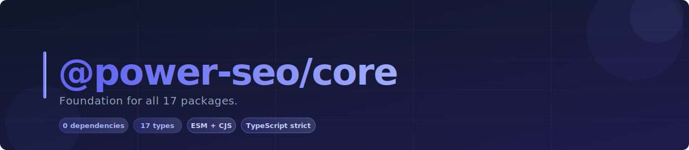

# @power-seo/core



Framework-agnostic SEO utilities, types, and engines — the shared foundation of the entire @power-seo ecosystem, usable as a standalone TypeScript library that works anywhere.

[](https://www.npmjs.com/package/@power-seo/core)
[](https://www.npmjs.com/package/@power-seo/core)
[](https://socket.dev/npm/package/@power-seo/core)
[](https://github.com/CyberCraftBD/power-seo/actions)
[](https://opensource.org/licenses/MIT)
[](https://www.typescriptlang.org/)
[](https://bundlephobia.com/package/@power-seo/core)

`@power-seo/core` is the foundational library shared by all 17 `@power-seo` packages. It delivers pixel-accurate meta validators, structured meta and link tag builders, URL normalization, keyword density analysis, text statistics, Open Graph and Twitter Card builders, robots directive generation, title template engines, and a token-bucket rate limiter — all in a single zero-dependency TypeScript package. Think of it as combining `next-seo`, `seo-utils`, `keyword-density`, `url-normalize`, and `text-statistics` into one unified, tree-shakeable library that runs in Next.js, Remix, Vite, vanilla Node.js, Cloudflare Workers, and Vercel Edge. All 9 utility modules are fully configurable and independently importable.

> **Zero runtime dependencies** — installs clean with nothing else to pull in.

---

## Why @power-seo/core?

| | Without | With |
|---|---|---|
| Meta tag building | ❌ Hand-written HTML strings | ✅ Type-safe `buildMetaTags()` with OG + Twitter |
| Title validation | ❌ Character count only | ✅ Pixel-accurate SERP width via `validateTitle()` |
| Keyword density | ❌ Manual regex counting | ✅ `calculateKeywordDensity()` with density % |
| URL canonicalization | ❌ String manipulation | ✅ `resolveCanonical()` with full normalization |
| Text statistics | ❌ Multiple separate packages | ✅ `getTextStatistics()` — words, sentences, syllables |
| Robots directives | ❌ Concatenated strings | ✅ Type-safe `buildRobotsContent()` builder |
| Title templates | ❌ Manual string interpolation | ✅ `createTitleTemplate()` with site-wide defaults |
| Rate limiting | ❌ No built-in utility | ✅ Token bucket `createTokenBucket()` for API calls |
| TypeScript types | ❌ Duplicated across packages | ✅ 25+ shared interfaces for the full ecosystem |


<a href="https://www.buymeacoffee.com/ccbd.dev" target="_blank"></a>

---

## Features

- **Meta tag builder** — `buildMetaTags()` generates typed arrays of meta tags from a structured `SEOConfig`
- **Open Graph builder** — `buildOpenGraphTags()` with full support for article, profile, book, video, and music OG types
- **Twitter Card builder** — `buildTwitterTags()` for summary, large image, player, and app card types
- **Hreflang builder** — `buildHreflangTags()` generates `<link rel="alternate">` tags for multi-language pages
- **Title template engine** — `applyTitleTemplate()` and `createTitleTemplate()` with `%variable%` substitution and separator cleanup
- **Pixel-accurate meta validators** — `validateTitle()` and `validateMetaDescription()` measure real SERP pixel widths using Arial font metrics
- **URL utilities** — `resolveCanonical()`, `normalizeUrl()`, `toSlug()`, `stripTrackingParams()`, `extractSlug()`, and more
- **Text statistics engine** — `getTextStatistics()` returns word, sentence, paragraph, syllable, and character counts from HTML
- **Keyword density calculator** — `calculateKeywordDensity()` and `analyzeKeyphraseOccurrences()` for single and multi-word keyphrases
- **Robots directive builder** — `buildRobotsContent()` and `parseRobotsContent()` for structured robots meta directives
- **Rate limiting** — token bucket implementation with `createTokenBucket()`, `consumeToken()`, and `getWaitTime()`
- **SEO constants** — exported `TITLE_MAX_PIXELS`, `META_DESCRIPTION_MAX_PIXELS`, `KEYWORD_DENSITY`, `READABILITY`, `OG_IMAGE`, `AI_CRAWLERS`, and `SCHEMA_TYPES`
- **25+ shared TypeScript types** — `SEOConfig`, `MetaTag`, `LinkTag`, `OpenGraphConfig`, `TwitterCardConfig`, `ContentAnalysisInput`, and more
- **Framework-agnostic** — works in Next.js, Remix, Gatsby, Vite, vanilla Node.js, Edge
- **Tree-shakeable** — `"sideEffects": false` with named exports per module; import only what you use


---

## Comparison

| Feature                              | @power-seo/core | next-seo | seo-utils | keyword-density | text-statistics |
| ------------------------------------ | :-------------: | :------: | :-------: | :-------------: | :-------------: |
| Meta tag builder                     | ✅              | Partial  | ❌        | ❌              | ❌              |
| Pixel-accurate title/meta validation | ✅              | ❌       | ❌        | ❌              | ❌              |
| Open Graph builder                   | ✅              | Partial  | ❌        | ❌              | ❌              |
| Twitter Card builder                 | ✅              | Partial  | ❌        | ❌              | ❌              |
| Keyphrase density calculator         | ✅              | ❌       | ❌        | ✅              | ❌              |
| Keyphrase occurrence analysis        | ✅              | ❌       | ❌        | ❌              | ❌              |
| Robots directive builder             | ✅              | Partial  | ❌        | ❌              | ❌              |
| URL normalization + slug             | ✅              | ❌       | Partial   | ❌              | ❌              |
| Text statistics engine               | ✅              | ❌       | ❌        | ❌              | Partial         |
| Title template engine                | ✅              | Partial  | ❌        | ❌              | ❌              |
| Hreflang builder                     | ✅              | Partial  | ❌        | ❌              | ❌              |
| Rate limiting utility                | ✅              | ❌       | ❌        | ❌              | ❌              |
| 25+ shared SEO types                 | ✅              | Partial  | ❌        | ❌              | ❌              |
| TypeScript-first                     | ✅              | Partial  | ❌        | ❌              | ❌              |
| Zero runtime dependencies            | ✅              | ❌       | ❌        | ❌              | ❌              |


---

## Installation

```bash
npm install @power-seo/core
```

```bash
yarn add @power-seo/core
```

```bash
pnpm add @power-seo/core
```

---

## Quick Start

```ts
import { buildMetaTags, buildLinkTags, validateTitle, resolveCanonical } from '@power-seo/core';

const tags = buildMetaTags({
  description: 'Master SEO in Next.js with structured data and meta tags.',
  openGraph: {
    type: 'article',
    title: 'Next.js SEO Guide',
    images: [{ url: 'https://example.com/og.jpg', width: 1200, height: 630 }],
  },
  twitter: { cardType: 'summary_large_image', site: '@mysite' },
});

const links = buildLinkTags({
  canonical: resolveCanonical('https://example.com', '/nextjs-seo'),
});

const titleCheck = validateTitle('Next.js SEO Best Practices Guide');
console.log(titleCheck.valid);       // true
console.log(titleCheck.pixelWidth);  // ~291 (well under 580px limit)
```


**Validation severity levels:**
- `error` — field is missing or critically invalid
- `warning` — field exists but fails recommended limits
- `info` — field passes all checks

---

## Usage

### Building Meta Tags

`buildMetaTags()` assembles a flat array of `MetaTag` objects from a typed `SEOConfig`. Frameworks render these into actual `<meta>` HTML elements.

```ts
import { buildMetaTags } from '@power-seo/core';

const tags = buildMetaTags({
  description: 'A TypeScript-first SEO library for modern JavaScript frameworks.',
  robots: { index: true, follow: true, maxSnippet: 150, maxImagePreview: 'large' },
  openGraph: {
    type: 'website',
    title: '@power-seo/core',
    siteName: 'My Site',
    locale: 'en_US',
    images: [{ url: 'https://example.com/og.jpg', width: 1200, height: 630, alt: 'SEO Core' }],
  },
  twitter: {
    cardType: 'summary_large_image',
    site: '@mysite',
    creator: '@author',
    image: 'https://example.com/twitter.jpg',
  },
});
// tags → MetaTag[] — pass to your framework's meta renderer
```

### Validating Titles and Meta Descriptions

`validateTitle()` and `validateMetaDescription()` calculate the real pixel width Google uses for SERP truncation — not just character count.

```ts
import { validateTitle, validateMetaDescription } from '@power-seo/core';

const title = validateTitle('Best Running Shoes for Beginners — 2026 Guide');
// { valid: true, severity: 'info', charCount: 46, pixelWidth: 316.8 }

const meta = validateMetaDescription('Discover expert-reviewed running shoes for beginners.');
// { valid: true, severity: 'warning', charCount: 52, pixelWidth: 335.3 }
// → short (under 120 chars), suggests expanding to 120–160 chars
```

### URL Utilities

```ts
import {
  resolveCanonical,
  normalizeUrl,
  toSlug,
  stripTrackingParams,
  extractSlug,
  isAbsoluteUrl,
} from '@power-seo/core';

resolveCanonical('https://example.com', '/blog/post');
// => "https://example.com/blog/post"

toSlug('My Blog Post Title! — 2026');
// => "my-blog-post-title-2026"

stripTrackingParams('https://example.com/page?utm_source=twitter&id=123');
// => "https://example.com/page?id=123"

extractSlug('https://example.com/blog/my-post');
// => "my-post"
```

### Keyword Density Analysis

```ts
import { calculateKeywordDensity, analyzeKeyphraseOccurrences } from '@power-seo/core';

const density = calculateKeywordDensity('react seo', bodyHtml);
// { keyword: 'react seo', count: 4, density: 1.8, totalWords: 450 }

const occurrences = analyzeKeyphraseOccurrences({
  keyphrase: 'react seo',
  title: 'React SEO Best Practices',
  metaDescription: 'Learn React SEO...',
  content: htmlString,
  slug: 'react-seo',
  images: [{ alt: 'React SEO diagram' }],
});
// { inTitle: true, inH1: true, inFirstParagraph: true, density: 1.8, ... }
```

### Text Statistics

```ts
import { getTextStatistics, stripHtml, getWords, getSentences } from '@power-seo/core';

const stats = getTextStatistics('<h1>Hello</h1><p>This is a test sentence. And another one.</p>');
// {
//   wordCount: 9,
//   sentenceCount: 2,
//   paragraphCount: 1,
//   syllableCount: 11,
//   characterCount: 42,
//   avgWordsPerSentence: 4.5,
//   avgSyllablesPerWord: 1.22
// }
```

### Robots Directives

```ts
import { buildRobotsContent, parseRobotsContent } from '@power-seo/core';

buildRobotsContent({ index: false, follow: true, maxSnippet: 150, maxImagePreview: 'large' });
// => "noindex, follow, max-snippet:150, max-image-preview:large"

parseRobotsContent('noindex, follow, max-snippet:150');
// => { index: false, follow: true, maxSnippet: 150 }
```

### Title Template Engine

```ts
import { createTitleTemplate, applyTitleTemplate } from '@power-seo/core';

const makeTitle = createTitleTemplate({ siteName: 'My Site', separator: '—' });
makeTitle('About Us');                       // => "About Us — My Site"
makeTitle('Contact', { separator: '|' });    // => "Contact | My Site"

applyTitleTemplate('%title% | %siteName% — Page %page%', {
  title: 'Blog',
  siteName: 'My Site',
  page: 2,
});
// => "Blog | My Site — Page 2"
```

### Rate Limiting

```ts
import { createTokenBucket, consumeToken, getWaitTime, sleep } from '@power-seo/core';

const bucket = createTokenBucket(60); // 60 requests per minute

async function callApi() {
  if (!consumeToken(bucket)) {
    const waitMs = getWaitTime(bucket);
    await sleep(waitMs);
  }
  // make your rate-limited API call
}
```

### Inside a CI Content Quality Gate

Block deploys when keyword density or word count fail:

```ts
import { calculateKeywordDensity, getTextStatistics } from '@power-seo/core';

const stats = getTextStatistics(bodyHtml);
const density = calculateKeywordDensity(keyphrase, bodyHtml);

if (stats.wordCount < 300) {
  console.error(`✗ Word count too low: ${stats.wordCount} (minimum 300)`);
  process.exit(1);
}

if (density.density < 0.5 || density.density > 2.5) {
  console.error(`✗ Keyword density out of range: ${density.density}% (target 0.5–2.5%)`);
  process.exit(1);
}
```

---

## API Reference

### Entry Points

| Import | Description |
| --- | --- |
| `@power-seo/core` | All utilities, types, constants, builders, and validators |

### Meta Builder Functions

| Function | Description |
| --- | --- |
| `buildMetaTags(config)` | Build `MetaTag[]` array from `SEOConfig` |
| `buildLinkTags(config)` | Build `LinkTag[]` including canonical and hreflang |
| `buildOpenGraphTags(og)` | Build Open Graph `MetaTag[]` from `OpenGraphConfig` |
| `buildTwitterTags(twitter)` | Build Twitter Card `MetaTag[]` from `TwitterCardConfig` |
| `buildHreflangTags(alternates)` | Build hreflang `LinkTag[]` from `HreflangConfig[]` |
| `resolveTitle(config)` | Resolve final title applying template if set |

### Meta Validator Functions

| Function | Description |
| --- | --- |
| `validateTitle(title)` | Validate title — char count, pixel width, severity |
| `validateMetaDescription(desc)` | Validate meta description — char count, pixel width, severity |
| `calculatePixelWidth(text)` | Calculate SERP pixel width using Arial font metrics |

### URL Utility Functions

| Function | Description |
| --- | --- |
| `resolveCanonical(base, path?)` | Resolve and normalize a canonical URL |
| `normalizeUrl(url)` | Remove default ports, double slashes, trailing slashes |
| `ensureTrailingSlash(url)` | Add trailing slash to non-file URLs |
| `removeTrailingSlash(url)` | Strip trailing slash from a URL |
| `stripQueryParams(url, keep?)` | Remove all or selected query parameters |
| `stripTrackingParams(url)` | Remove UTM, fbclid, gclid, and other tracking params |
| `extractSlug(url)` | Extract the last path segment as a slug |
| `isAbsoluteUrl(url)` | Check whether a URL is absolute |
| `toSlug(text)` | Convert any string to a URL-safe slug |

### Text Statistics Functions

| Function | Description |
| --- | --- |
| `getTextStatistics(content)` | Full stats — word, sentence, paragraph, syllable counts |
| `stripHtml(html)` | Strip HTML tags, decode entities, return plain text |
| `getWords(text)` | Split text into individual words |
| `getSentences(text)` | Split text into sentences |
| `getParagraphs(html)` | Extract paragraph blocks from HTML |
| `countSyllables(word)` | Count syllables in a single word |
| `countTotalSyllables(text)` | Count total syllables across all words in text |

### Keyword Density Functions

| Function | Description |
| --- | --- |
| `calculateKeywordDensity(keyword, content)` | Density %, occurrence count, word total |
| `countKeywordOccurrences(text, keyword)` | Count keyword occurrences (case-insensitive, word-boundary) |
| `analyzeKeyphraseOccurrences(config)` | Full occurrence map — title, H1, meta, slug, alt text |

### Robots Builder Functions

| Function | Description |
| --- | --- |
| `buildRobotsContent(directive)` | Serialize `RobotsDirective` to robots meta content string |
| `parseRobotsContent(content)` | Parse robots meta content string to `RobotsDirective` |

### Title Template Functions

| Function | Description |
| --- | --- |
| `applyTitleTemplate(template, vars)` | Apply `%variable%` substitution to a title template |
| `createTitleTemplate(defaults)` | Create a reusable title factory with site-wide defaults |

### Rate Limiting Functions

| Function | Description |
| --- | --- |
| `createTokenBucket(requestsPerMinute)` | Create a token bucket with capacity and refill rate |
| `consumeToken(bucket)` | Consume one token; returns `true` if allowed |
| `getWaitTime(bucket)` | Milliseconds to wait before next allowed request |
| `sleep(ms)` | Promise-based sleep utility |

### Constants

| Constant | Value | Description |
| --- | --- | --- |
| `TITLE_MAX_PIXELS` | `580` | Google SERP max title display width (pixels) |
| `TITLE_MAX_LENGTH` | `60` | Recommended max title character length |
| `TITLE_MIN_LENGTH` | `50` | Recommended min title character length |
| `META_DESCRIPTION_MAX_PIXELS` | `920` | Google SERP max meta description width (pixels) |
| `META_DESCRIPTION_MAX_LENGTH` | `160` | Recommended max meta description length |
| `META_DESCRIPTION_MIN_LENGTH` | `120` | Recommended min meta description length |
| `MIN_WORD_COUNT` | `300` | Minimum word count to avoid thin content |
| `RECOMMENDED_WORD_COUNT` | `1000` | Recommended word count for blog posts |
| `MAX_URL_LENGTH` | `75` | Maximum recommended URL length for SEO |
| `KEYWORD_DENSITY` | `{ MIN: 0.5, MAX: 2.5, OPTIMAL: 1.5 }` | Optimal keyword density range (%) |
| `READABILITY` | `{ FLESCH_EASE_GOOD: 60, MAX_SENTENCE_LENGTH: 20, ... }` | Readability scoring thresholds |
| `OG_IMAGE` | `{ WIDTH: 1200, HEIGHT: 630, ASPECT_RATIO: 1.91 }` | Open Graph recommended image dimensions |
| `TWITTER_IMAGE` | `{ SUMMARY: { WIDTH: 144, HEIGHT: 144 }, SUMMARY_LARGE: { WIDTH: 800, HEIGHT: 418 } }` | Twitter Card recommended image dimensions |
| `AI_CRAWLERS` | `['GPTBot', 'ClaudeBot', 'CCBot', ...]` | Common AI crawler user agents |
| `SCHEMA_TYPES` | `['Article', 'Product', 'FAQPage', ...]` | Common Schema.org types used in SEO |

### Types

| Type | Description |
| --- | --- |
| `SEOConfig` | Full SEO configuration with title, meta, robots, OG, Twitter |
| `MetaTag` | `{ name?, property?, httpEquiv?, content }` |
| `LinkTag` | `{ rel, href, hreflang?, type?, sizes?, media? }` |
| `OpenGraphConfig` | OG configuration with type, images, videos, article, profile |
| `OpenGraphType` | `'website' \| 'article' \| 'book' \| 'profile' \| 'product' \| ...` |
| `OpenGraphImage` | `{ url, secureUrl?, type?, width?, height?, alt? }` |
| `TwitterCardConfig` | Twitter Card with card type, site, image, player, app |
| `TwitterCardType` | `'summary' \| 'summary_large_image' \| 'app' \| 'player'` |
| `RobotsDirective` | `{ index?, follow?, noarchive?, maxSnippet?, maxImagePreview?, ... }` |
| `HreflangConfig` | `{ hrefLang, href }` |
| `ContentAnalysisInput` | Input for content analysis — title, meta, content, keyphrase |
| `ContentAnalysisOutput` | Output with score, maxScore, results, recommendations |
| `AnalysisResult` | `{ id, title, description, status, score, maxScore }` |
| `AnalysisStatus` | `'good' \| 'ok' \| 'poor'` |
| `ReadabilityInput` | `{ content, locale? }` |
| `ReadabilityOutput` | Flesch scores, passive voice %, transition word % |
| `TextStatistics` | `{ wordCount, sentenceCount, paragraphCount, syllableCount, characterCount, ... }` |
| `SitemapURL` | `{ loc, lastmod?, changefreq?, priority?, images?, videos?, news? }` |
| `SitemapConfig` | `{ hostname, urls, maxUrlsPerSitemap?, outputDir? }` |
| `RedirectRule` | `{ source, destination, statusCode, isRegex? }` |
| `SchemaBase` | `{ '@context'?, '@type', '@id'?, [key]: unknown }` |
| `SchemaGraphConfig` | `{ '@context': 'https://schema.org', '@graph': SchemaBase[] }` |
| `KeywordDensityResult` | `{ keyword, count, density, totalWords }` |
| `KeyphraseOccurrences` | Full occurrence map — title, H1, meta, slug, alt text, density |
| `TokenBucket` | `{ tokens, lastRefill, maxTokens, refillRate }` |
| `ValidationResult` | `{ valid, severity, message, charCount?, pixelWidth? }` |
| `ValidationSeverity` | `'error' \| 'warning' \| 'info'` |
| `TitleTemplateVars` | `{ title?, siteName?, separator?, tagline?, page?, [key]: string \| number }` |

---

## Use Cases

- **@power-seo packages** — all 17 packages use `@power-seo/core` as a peer dependency for shared types, constants, and utilities
- **Custom SEO libraries** — build your own SEO tooling on top of core's typed primitives without starting from scratch
- **Next.js / Remix apps** — use `buildMetaTags()` and `buildLinkTags()` server-side in route handlers or layout components
- **Content editors** — validate title and meta description SERP pixel widths in real time before publishing
- **CI content quality gates** — check keyword density and word count programmatically in build pipelines
- **eCommerce product pages** — validate product titles, descriptions, and slug quality at scale
- **Rate-limited API integrations** — use the token bucket to respect rate limits for Google Search Console, Semrush, or Ahrefs APIs
- **Headless CMS plugins** — use `analyzeKeyphraseOccurrences()` to show Yoast-style keyphrase feedback to editors

---

## Architecture Overview

- **Pure TypeScript** — no compiled binary, no native modules
- **Zero runtime dependencies** — ships clean with nothing else to install
- **Framework-agnostic** — works in any JavaScript environment with no assumptions about React, Vue, or any framework
- **SSR compatible** — safe to run in Next.js Server Components, Remix loaders, or Express handlers
- **Edge runtime safe** — no Node.js-specific APIs; runs in Cloudflare Workers, Vercel Edge, Deno Deploy
- **Tree-shakeable** — `"sideEffects": false` with named exports per module; import only what you use
- **Dual ESM + CJS** — ships both formats via tsup for any bundler or `require()` usage

---

## Supply Chain Security

- No install scripts (`postinstall`, `preinstall`)
- No runtime network access
- No `eval` or dynamic code execution
- npm provenance enabled — every release is signed via Sigstore through GitHub Actions
- CI-signed builds — all releases published via verified `github.com/CyberCraftBD/power-seo` workflow
- Safe for SSR, Edge, and server environments

---

## The [@power-seo](https://www.npmjs.com/org/power-seo) Ecosystem

All 17 packages are independently installable — use only what you need.

| Package                                                                                    | Install                             | Description                                                             |
| ------------------------------------------------------------------------------------------ | ----------------------------------- | ----------------------------------------------------------------------- |
| [`@power-seo/core`](https://www.npmjs.com/package/@power-seo/core)                         | `npm i @power-seo/core`             | Framework-agnostic utilities, types, validators, and constants          |
| [`@power-seo/react`](https://www.npmjs.com/package/@power-seo/react)                       | `npm i @power-seo/react`            | React SEO components — meta, Open Graph, Twitter Card, breadcrumbs      |
| [`@power-seo/meta`](https://www.npmjs.com/package/@power-seo/meta)                         | `npm i @power-seo/meta`             | SSR meta helpers for Next.js App Router, Remix v2, and generic SSR      |
| [`@power-seo/schema`](https://www.npmjs.com/package/@power-seo/schema)                     | `npm i @power-seo/schema`           | Type-safe JSON-LD structured data — 23 builders + 21 React components   |
| [`@power-seo/content-analysis`](https://www.npmjs.com/package/@power-seo/content-analysis) | `npm i @power-seo/content-analysis` | Yoast-style SEO content scoring engine with React components            |
| [`@power-seo/readability`](https://www.npmjs.com/package/@power-seo/readability)           | `npm i @power-seo/readability`      | Readability scoring — Flesch-Kincaid, Gunning Fog, Coleman-Liau, ARI    |
| [`@power-seo/preview`](https://www.npmjs.com/package/@power-seo/preview)                   | `npm i @power-seo/preview`          | SERP, Open Graph, and Twitter/X Card preview generators                 |
| [`@power-seo/sitemap`](https://www.npmjs.com/package/@power-seo/sitemap)                   | `npm i @power-seo/sitemap`          | XML sitemap generation, streaming, index splitting, and validation      |
| [`@power-seo/redirects`](https://www.npmjs.com/package/@power-seo/redirects)               | `npm i @power-seo/redirects`        | Redirect engine with Next.js, Remix, and Express adapters               |
| [`@power-seo/links`](https://www.npmjs.com/package/@power-seo/links)                       | `npm i @power-seo/links`            | Link graph analysis — orphan detection, suggestions, equity scoring     |
| [`@power-seo/audit`](https://www.npmjs.com/package/@power-seo/audit)                       | `npm i @power-seo/audit`            | Full SEO audit engine — meta, content, structure, performance rules     |
| [`@power-seo/images`](https://www.npmjs.com/package/@power-seo/images)                     | `npm i @power-seo/images`           | Image SEO — alt text, lazy loading, format analysis, image sitemaps     |
| [`@power-seo/ai`](https://www.npmjs.com/package/@power-seo/ai)                             | `npm i @power-seo/ai`               | LLM-agnostic AI prompt templates and parsers for SEO tasks              |
| [`@power-seo/analytics`](https://www.npmjs.com/package/@power-seo/analytics)               | `npm i @power-seo/analytics`        | Merge GSC + audit data, trend analysis, ranking insights, dashboard     |
| [`@power-seo/search-console`](https://www.npmjs.com/package/@power-seo/search-console)     | `npm i @power-seo/search-console`   | Google Search Console API — OAuth2, service account, URL inspection     |
| [`@power-seo/integrations`](https://www.npmjs.com/package/@power-seo/integrations)         | `npm i @power-seo/integrations`     | Semrush and Ahrefs API clients with rate limiting and pagination        |
| [`@power-seo/tracking`](https://www.npmjs.com/package/@power-seo/tracking)                 | `npm i @power-seo/tracking`         | GA4, Clarity, PostHog, Plausible, Fathom — scripts + consent management |

---

## About [CyberCraft Bangladesh](https://ccbd.dev)

**[CyberCraft Bangladesh](https://ccbd.dev)** is a Bangladesh-based enterprise-grade software development and Full Stack SEO service provider company specializing in ERP system development, AI-powered SaaS and business applications, full-stack SEO services, custom website development, and scalable eCommerce platforms. We design and develop intelligent, automation-driven SaaS and enterprise solutions that help startups, SMEs, NGOs, educational institutes, and large organizations streamline operations, enhance digital visibility, and accelerate growth through modern cloud-native technologies.

[](https://ccbd.dev)
[](https://github.com/cybercraftbd)
[](https://www.npmjs.com/org/power-seo)
[](mailto:info@ccbd.dev)

© 2026 [CyberCraft Bangladesh](https://ccbd.dev) · Released under the [MIT License](../../LICENSE)
