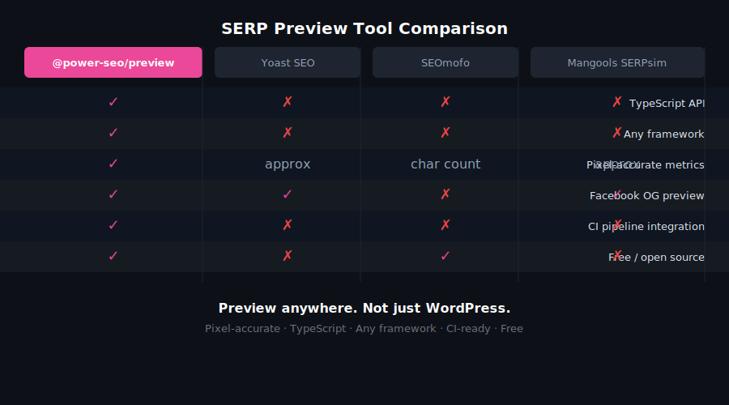
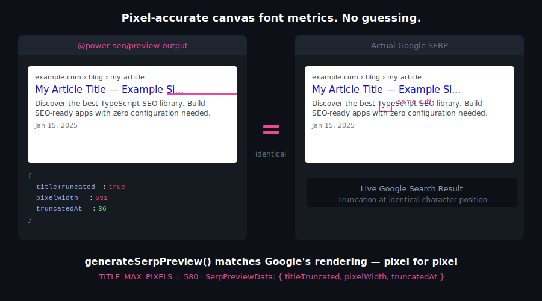
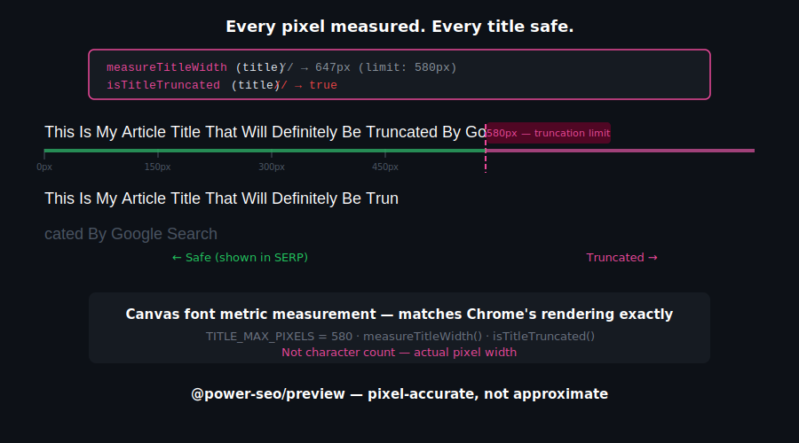
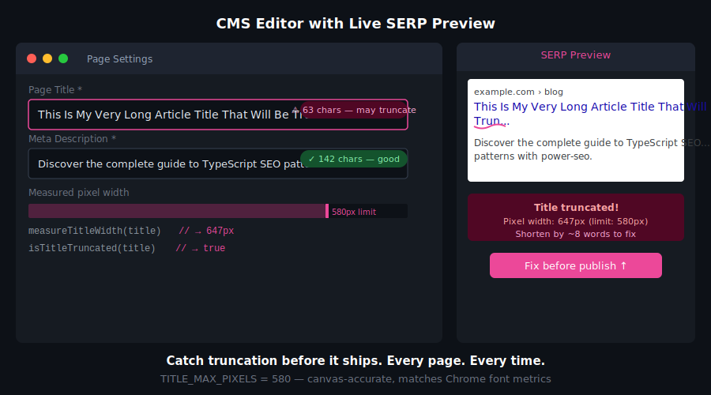

# @power-seo/preview


Pixel-accurate SERP, Open Graph, and Twitter/X Card preview generators for TypeScript — compute exactly how a page appears in Google search results and social shares without a headless browser or canvas.

[](https://www.npmjs.com/package/@power-seo/preview)
[](https://www.npmjs.com/package/@power-seo/preview)
[](https://socket.dev/npm/package/@power-seo/preview)
[](https://github.com/CyberCraftBD/power-seo/actions)
[](https://opensource.org/licenses/MIT)
[](https://www.typescriptlang.org/)
[](https://bundlephobia.com/package/@power-seo/preview)

`@power-seo/preview` delivers pixel-width-aware SERP snippet generation, Open Graph image validation, and Twitter/X Card preview data — comparable to what Yoast SEO, Semrush, and Moz Pro show in their browser-based UIs, but as a standalone TypeScript library that runs anywhere. Provide a title, meta description, URL, and optional OG image — get back structured preview data with truncation flags, breadcrumb paths, and image validation results. Run it server-side in a CMS pipeline, client-side in a React editor, or inside a CI content gate. All four generators are fully tree-shakeable.

> **Zero runtime dependencies** — only `@power-seo/core` as a peer.

---

## Why @power-seo/preview?

|                             | Without                             | With                                                                    |
| --------------------------- | ----------------------------------- | ----------------------------------------------------------------------- |
| SERP title truncation       | ❌ Guesswork (character count)      | ✅ Pixel-accurate truncation at 580px                                   |
| SERP description truncation | ❌ Unchecked                        | ✅ Pixel-accurate truncation at 920px                                   |
| OG image validation         | ❌ Silent drop by Facebook/LinkedIn | ✅ Dimension check with pass/fail message                               |
| Twitter/X Card preview      | ❌ Manual spec lookup               | ✅ `summary` + `summary_large_image` with image validation              |
| breadcrumb path             | ❌ Unknown                          | ✅ Google-style `example.com › blog › post` format                      |
| React preview components    | ❌ Build from scratch               | ✅ Drop-in `SerpPreview`, `OgPreview`, `TwitterPreview`, `PreviewPanel` |
| Framework support           | ❌ Browser tools only               | ✅ Next.js, Remix, Node.js, Edge, any JS environment                    |



---

## Features

- **Pixel-accurate SERP truncation** — `generateSerpPreview()` truncates title at 580px, description at 920px using character-width lookup tables
- **Site title composition** — optional `siteTitle` field appended as `"title - siteTitle"` before truncation, matching Google's display format
- **Google breadcrumb URL** — formats `https://example.com/blog/my-post` as `example.com › blog › my-post`
- **Open Graph image validation** — `generateOgPreview()` validates image dimensions against the recommended 1200×630 minimum and reports pass/fail with a message
- **Twitter/X Card support** — `generateTwitterPreview()` handles `summary` and `summary_large_image` card types with per-type image dimension requirements
- **Low-level truncation primitive** — `truncateAtPixelWidth()` truncates any string at any pixel budget, usable independently of the preview generators
- **Structured typed output** — returns plain data objects ready for any UI renderer; no HTML, no DOM required
- **React UI components** — pre-built `SerpPreview`, `OgPreview`, `TwitterPreview`, and `PreviewPanel` from the `/react` subpath
- **Framework-agnostic** — works in Next.js, Remix, Gatsby, Vite, vanilla Node.js, Edge
- **Full TypeScript support** — complete type definitions for all inputs, outputs, and validation results
- **Tree-shakeable** — import only the generators you use; `"sideEffects": false`
- **Zero runtime dependencies** — pure computation, no canvas, no browser, no external libraries



---

## Comparison

| Feature                           | @power-seo/preview |     Yoast SEO     | next-seo | react-helmet | seo-analyzer |
| --------------------------------- | :----------------: | :---------------: | :------: | :----------: | :----------: |
| Pixel-accurate SERP truncation    |         ✅         | ✅ (browser only) |    ❌    |      ❌      |      ❌      |
| SERP description truncation       |         ✅         | ✅ (browser only) |    ❌    |      ❌      |      ❌      |
| Google breadcrumb URL format      |         ✅         |        ✅         |    ❌    |      ❌      |      ❌      |
| Open Graph image validation       |         ✅         |        ❌         |    ❌    |      ❌      |      ❌      |
| Twitter/X Card preview generation |         ✅         |        ❌         |    ❌    |      ❌      |      ❌      |
| React preview components          |         ✅         |        ✅         |    ❌    |      ❌      |      ❌      |
| Works outside WordPress           |         ✅         |        ❌         |    ✅    |      ✅      |      ✅      |
| Edge runtime safe                 |         ✅         |        ❌         |    ✅    |      ✅      |      ❌      |
| Structured data output (not HTML) |         ✅         |        ❌         |    ❌    |      ❌      |      ❌      |
| TypeScript-first                  |         ✅         |        ❌         | Partial  |      ❌      |      ❌      |
| Tree-shakeable                    |         ✅         |        ❌         | Partial  |      ❌      |      ❌      |
| CI / Node.js usage                |         ✅         |        ❌         |    ❌    |      ❌      |      ✅      |
| Zero runtime dependencies         |         ✅         |        ❌         |    ❌    |      ❌      |      ❌      |



---

## Installation

```bash
npm install @power-seo/preview
```

```bash
yarn add @power-seo/preview
```

```bash
pnpm add @power-seo/preview
```

---

## Quick Start

```ts
import { generateSerpPreview, generateOgPreview } from '@power-seo/preview';

const serp = generateSerpPreview({
  title: 'How to Add SEO to React Apps',
  description: 'Learn how to add meta tags, Open Graph, and JSON-LD to any React application.',
  url: 'https://example.com/blog/react-seo',
  siteTitle: 'My Blog', // optional — appended as "title - siteTitle"
});

console.log(serp.title); // 'How to Add SEO to React Apps - My Blog' (truncated at 580px if too long)
console.log(serp.displayUrl); // 'example.com › blog › react-seo'
console.log(serp.titleTruncated); // false

const og = generateOgPreview({
  title: 'React SEO Guide',
  description: 'Complete SEO for React',
  url: 'https://example.com/blog/react-seo',
  image: { url: 'https://example.com/og.jpg', width: 1200, height: 630 },
});

console.log(og.image?.valid); // true
console.log(og.image?.message); // undefined (dimensions are correct)
```



---

## Usage

### Generating a Google SERP Preview

`generateSerpPreview()` computes the display title, breadcrumb URL, and description that Google would show, with pixel-accurate truncation flags.

```ts
import { generateSerpPreview } from '@power-seo/preview';

const serp = generateSerpPreview({
  title: 'Next.js SEO Best Practices',
  description:
    'Learn how to optimize your Next.js app for search engines with meta tags and structured data.',
  url: 'https://example.com/nextjs-seo',
  siteTitle: 'Dev Blog', // optional
});

// serp.title            → 'Next.js SEO Best Practices - Dev Blog' (possibly truncated)
// serp.displayUrl       → 'example.com › nextjs-seo'
// serp.description      → display description (possibly truncated at 920px)
// serp.titleTruncated   → true | false
// serp.titleValidation  → ValidationResult from @power-seo/core
```

### Generating an Open Graph Preview

`generateOgPreview()` validates image dimensions and returns a structured card data object for Facebook, LinkedIn, and other OG-compatible platforms.

```ts
import { generateOgPreview } from '@power-seo/preview';

const og = generateOgPreview({
  title: 'React SEO Guide',
  description: 'Complete guide to adding SEO in React apps.',
  url: 'https://example.com/react-seo',
  siteName: 'Dev Blog',
  image: { url: 'https://example.com/og.jpg', width: 800, height: 400 },
});

// og.image?.valid    → false (too small)
// og.image?.message  → 'Image is 800x400px. Minimum size is 200x200px.'
```

### Generating a Twitter/X Card Preview

`generateTwitterPreview()` handles both `summary` and `summary_large_image` card types, each with different image dimension requirements.

```ts
import { generateTwitterPreview } from '@power-seo/preview';

const twitter = generateTwitterPreview({
  cardType: 'summary_large_image',
  title: 'React SEO Guide',
  description: 'Everything you need to add SEO to any React application.',
  url: 'https://example.com/react-seo',
  site: '@myblog',
  image: { url: 'https://example.com/twitter.jpg', width: 1200, height: 628 },
});

// twitter.cardType  → 'summary_large_image'
// twitter.domain    → 'myblog'
// twitter.image?.valid → true
```

### Using the Low-Level Truncation Primitive

`truncateAtPixelWidth()` is a standalone utility — use it to truncate any string at any pixel budget, independent of the SERP generator.

```ts
import { truncateAtPixelWidth } from '@power-seo/preview';

const result = truncateAtPixelWidth(
  'Buy Premium Running Shoes Online — Free Shipping Worldwide',
  580,
);

// result.text      → 'Buy Premium Running Shoes Online — Free Shippi...'
// result.truncated → true
```

### React Components

Import from the `/react` entry point for pre-built preview UI components:

```tsx
import { SerpPreview, OgPreview, TwitterPreview, PreviewPanel } from '@power-seo/preview/react';

// All-in-one tabbed panel (Google / Facebook / Twitter)
function EditorSidebar() {
  return (
    <PreviewPanel
      title="How to Add SEO to React Apps"
      description="Learn meta tags, Open Graph, and JSON-LD for React."
      url="https://example.com/blog/react-seo"
      siteTitle="My Blog"
      siteName="My Blog"
      image={{ url: 'https://example.com/og.jpg', width: 1200, height: 630 }}
      twitterCardType="summary_large_image"
      twitterSite="@myblog"
    />
  );
}

// Or use individual components
function SerpCard() {
  return (
    <SerpPreview
      title="How to Add SEO to React Apps"
      description="Learn meta tags, Open Graph, and JSON-LD for React."
      url="https://example.com/blog/react-seo"
      siteTitle="My Blog"
    />
  );
}
```

### Inside a CI Content Quality Gate

Block deploys when SERP titles or OG images fail validation:

```ts
import { generateSerpPreview, generateOgPreview } from '@power-seo/preview';

const serp = generateSerpPreview({ title, description, url, siteTitle });
const og = generateOgPreview({ title, description, url, image });

if (serp.titleTruncated) {
  console.error('SERP title exceeds 580px — will be cut off in Google results');
  process.exit(1);
}

if (og.image && !og.image.valid) {
  console.error('OG image invalid:', og.image.message);
  process.exit(1);
}
```

---

## API Reference

### Entry Points

| Import                     | Description                                    |
| -------------------------- | ---------------------------------------------- |
| `@power-seo/preview`       | Core preview generators and truncation utility |
| `@power-seo/preview/react` | React components for preview UI                |

### `generateSerpPreview()`

```ts
function generateSerpPreview(input: SerpPreviewInput): SerpPreviewData;
```

#### `SerpPreviewInput`

| Prop          | Type     | Required | Description                                                     |
| ------------- | -------- | -------- | --------------------------------------------------------------- |
| `title`       | `string` | ✅       | Page title                                                      |
| `description` | `string` | ✅       | Meta description                                                |
| `url`         | `string` | ✅       | Canonical page URL                                              |
| `siteTitle`   | `string` | —        | Site name — appended as `"title - siteTitle"` before truncation |

#### `SerpPreviewData`

| Output Field            | Type               | Description                                        |
| ----------------------- | ------------------ | -------------------------------------------------- |
| `title`                 | `string`           | Display title (truncated at 580px if needed)       |
| `displayUrl`            | `string`           | Breadcrumb path (e.g. `example.com › blog › post`) |
| `description`           | `string`           | Display description (truncated at 920px if needed) |
| `titleTruncated`        | `boolean`          | Whether title was truncated                        |
| `descriptionTruncated`  | `boolean`          | Whether description was truncated                  |
| `titleValidation`       | `ValidationResult` | Title length/pixel validation result               |
| `descriptionValidation` | `ValidationResult` | Description length/pixel validation result         |

---

### `generateOgPreview()`

```ts
function generateOgPreview(input: OgPreviewInput): OgPreviewData;
```

#### `OgPreviewInput`

| Prop          | Type                                               | Required | Description                     |
| ------------- | -------------------------------------------------- | -------- | ------------------------------- |
| `title`       | `string`                                           | ✅       | OG title                        |
| `description` | `string`                                           | ✅       | OG description                  |
| `url`         | `string`                                           | ✅       | Canonical URL                   |
| `image`       | `{ url: string; width?: number; height?: number }` | —        | OG image (recommended 1200×630) |
| `siteName`    | `string`                                           | —        | Site name displayed on the card |

#### `OgPreviewData`

| Output Field  | Type                             | Description                              |
| ------------- | -------------------------------- | ---------------------------------------- |
| `title`       | `string`                         | OG title                                 |
| `description` | `string`                         | OG description                           |
| `url`         | `string`                         | Canonical URL                            |
| `siteName`    | `string \| undefined`            | Site name                                |
| `image`       | `OgImageValidation \| undefined` | Image with validation result (see below) |

#### `OgImageValidation`

| Field     | Type                  | Description                                               |
| --------- | --------------------- | --------------------------------------------------------- |
| `url`     | `string`              | Image URL                                                 |
| `width`   | `number \| undefined` | Image width in pixels                                     |
| `height`  | `number \| undefined` | Image height in pixels                                    |
| `valid`   | `boolean`             | Whether the image meets OG dimension requirements         |
| `message` | `string \| undefined` | Human-readable validation message when dimensions deviate |

---

### `generateTwitterPreview()`

```ts
function generateTwitterPreview(input: TwitterPreviewInput): TwitterPreviewData;
```

#### `TwitterPreviewInput`

| Prop          | Type                                               | Required | Description                                      |
| ------------- | -------------------------------------------------- | -------- | ------------------------------------------------ |
| `cardType`    | `'summary' \| 'summary_large_image'`               | ✅       | Twitter Card type                                |
| `title`       | `string`                                           | ✅       | Card title                                       |
| `description` | `string`                                           | ✅       | Card description                                 |
| `image`       | `{ url: string; width?: number; height?: number }` | —        | Card image                                       |
| `site`        | `string`                                           | —        | Twitter @username of the site (e.g. `'@myblog'`) |

#### `TwitterPreviewData`

| Output Field  | Type                                  | Description                                            |
| ------------- | ------------------------------------- | ------------------------------------------------------ |
| `cardType`    | `TwitterCardType`                     | The card type (`'summary'` or `'summary_large_image'`) |
| `title`       | `string`                              | Card title                                             |
| `description` | `string`                              | Card description                                       |
| `image`       | `TwitterImageValidation \| undefined` | Image with validation result                           |
| `domain`      | `string \| undefined`                 | Extracted domain from `site` handle                    |

---

### `truncateAtPixelWidth()`

```ts
function truncateAtPixelWidth(text: string, maxPixels: number): TruncateResult;
```

#### `TruncateResult`

| Output Field | Type      | Description                           |
| ------------ | --------- | ------------------------------------- |
| `text`       | `string`  | Resulting (possibly truncated) string |
| `truncated`  | `boolean` | Whether truncation occurred           |

---

### React Components

Import all components from `@power-seo/preview/react`.

```ts
import { SerpPreview, OgPreview, TwitterPreview, PreviewPanel } from '@power-seo/preview/react';
```

#### `SerpPreview`

Renders a Google-style SERP result card.

| Prop          | Type     | Required | Description                                            |
| ------------- | -------- | -------- | ------------------------------------------------------ |
| `title`       | `string` | ✅       | Page title                                             |
| `description` | `string` | ✅       | Meta description                                       |
| `url`         | `string` | ✅       | Canonical URL                                          |
| `siteTitle`   | `string` | —        | Site name — appended to title as `"title - siteTitle"` |

#### `OgPreview`

Renders a Facebook/Open Graph card mockup.

| Prop          | Type                                               | Required | Description                     |
| ------------- | -------------------------------------------------- | -------- | ------------------------------- |
| `title`       | `string`                                           | ✅       | OG title                        |
| `description` | `string`                                           | ✅       | OG description                  |
| `url`         | `string`                                           | ✅       | Canonical URL                   |
| `image`       | `{ url: string; width?: number; height?: number }` | —        | OG image                        |
| `siteName`    | `string`                                           | —        | Site name shown above the title |

#### `TwitterPreview`

Renders a Twitter/X card mockup for `summary` or `summary_large_image` card types.

| Prop          | Type                                               | Required | Description                            |
| ------------- | -------------------------------------------------- | -------- | -------------------------------------- |
| `cardType`    | `TwitterCardType`                                  | ✅       | `'summary'` or `'summary_large_image'` |
| `title`       | `string`                                           | ✅       | Card title                             |
| `description` | `string`                                           | ✅       | Card description                       |
| `image`       | `{ url: string; width?: number; height?: number }` | —        | Card image                             |
| `site`        | `string`                                           | —        | Twitter @username of the site          |

#### `PreviewPanel`

Tabbed container with Google, Facebook, and Twitter/X preview cards in a single component.

| Prop              | Type                                               | Required | Description                                          |
| ----------------- | -------------------------------------------------- | -------- | ---------------------------------------------------- |
| `title`           | `string`                                           | ✅       | Page title                                           |
| `description`     | `string`                                           | ✅       | Meta description                                     |
| `url`             | `string`                                           | ✅       | Canonical URL                                        |
| `image`           | `{ url: string; width?: number; height?: number }` | —        | Shared image for OG and Twitter cards                |
| `siteName`        | `string`                                           | —        | OG site name                                         |
| `siteTitle`       | `string`                                           | —        | SERP site name (appended to title)                   |
| `twitterSite`     | `string`                                           | —        | Twitter @username                                    |
| `twitterCardType` | `TwitterCardType`                                  | —        | Twitter Card type (default: `'summary_large_image'`) |

---

### Types

| Type                     | Description                                                   |
| ------------------------ | ------------------------------------------------------------- |
| `SerpPreviewInput`       | Input shape for `generateSerpPreview()`                       |
| `SerpPreviewData`        | Output shape from `generateSerpPreview()`                     |
| `OgPreviewInput`         | Input shape for `generateOgPreview()`                         |
| `OgPreviewData`          | Output shape from `generateOgPreview()`                       |
| `OgImageValidation`      | Image validation result on `OgPreviewData.image`              |
| `TwitterPreviewInput`    | Input shape for `generateTwitterPreview()`                    |
| `TwitterPreviewData`     | Output shape from `generateTwitterPreview()`                  |
| `TwitterImageValidation` | Image validation result on `TwitterPreviewData.image`         |
| `TruncateResult`         | Output shape from `truncateAtPixelWidth()`                    |
| `TwitterCardType`        | `'summary' \| 'summary_large_image'` (from `@power-seo/core`) |
| `ValidationResult`       | Title/description validation result (from `@power-seo/core`)  |

---

## Use Cases

- **CMS live preview panels** — show authors how their title and description appear in Google before publishing
- **SEO auditing pipelines** — detect truncated titles and invalid OG images at build time
- **Programmatic SEO sites** — validate auto-generated titles for thousands of pages at once
- **Social media schedulers** — validate OG image dimensions before queuing posts
- **SaaS marketing dashboards** — show SERP and social card previews for every page
- **Blog platforms** — live preview as editors type the meta description
- **eCommerce product pages** — ensure product image dimensions meet OG card requirements
- **Landing page builders** — embed SERP and social card previews in the editor UI
- **CI content quality gates** — fail builds when SERP titles are truncated or OG images are too small

---

## Architecture Overview

- **Pure TypeScript** — no compiled binary, no native modules
- **Zero runtime dependencies** — only `@power-seo/core` as a peer dependency
- **Character-width lookup** — pixel truncation uses per-character width tables matching Google's SERP font metrics, not character counts
- **Framework-agnostic** — works in any JavaScript environment
- **SSR compatible** — safe to run in Next.js Server Components, Remix loaders, or Express handlers
- **Edge runtime safe** — no Node.js-specific APIs; no `fs`, no `canvas`; runs in Cloudflare Workers, Vercel Edge, Deno
- **Tree-shakeable** — `"sideEffects": false` with named exports per generator function
- **Dual ESM + CJS** — ships both formats via tsup for any bundler or `require()` usage
- **React optional** — React is a peer dependency; the `/react` subpath is only included when React is present

---

## Supply Chain Security

- No install scripts (`postinstall`, `preinstall`)
- No runtime network access
- No `eval` or dynamic code execution
- npm provenance enabled — every release is signed via Sigstore through GitHub Actions
- CI-signed builds — all releases published via verified `github.com/CyberCraftBD/power-seo` workflow
- Safe for SSR, Edge, and server environments

---

## The [@power-seo](https://www.npmjs.com/org/power-seo) Ecosystem

All 17 packages are independently installable — use only what you need.

| Package                                                                                    | Install                             | Description                                                             |
| ------------------------------------------------------------------------------------------ | ----------------------------------- | ----------------------------------------------------------------------- |
| [`@power-seo/core`](https://www.npmjs.com/package/@power-seo/core)                         | `npm i @power-seo/core`             | Framework-agnostic utilities, types, validators, and constants          |
| [`@power-seo/react`](https://www.npmjs.com/package/@power-seo/react)                       | `npm i @power-seo/react`            | React SEO components — meta, Open Graph, Twitter Card, breadcrumbs      |
| [`@power-seo/meta`](https://www.npmjs.com/package/@power-seo/meta)                         | `npm i @power-seo/meta`             | SSR meta helpers for Next.js App Router, Remix v2, and generic SSR      |
| [`@power-seo/schema`](https://www.npmjs.com/package/@power-seo/schema)                     | `npm i @power-seo/schema`           | Type-safe JSON-LD structured data — 23 builders + 21 React components   |
| [`@power-seo/content-analysis`](https://www.npmjs.com/package/@power-seo/content-analysis) | `npm i @power-seo/content-analysis` | Yoast-style SEO content scoring engine with React components            |
| [`@power-seo/readability`](https://www.npmjs.com/package/@power-seo/readability)           | `npm i @power-seo/readability`      | Readability scoring — Flesch-Kincaid, Gunning Fog, Coleman-Liau, ARI    |
| [`@power-seo/preview`](https://www.npmjs.com/package/@power-seo/preview)                   | `npm i @power-seo/preview`          | SERP, Open Graph, and Twitter/X Card preview generators                 |
| [`@power-seo/sitemap`](https://www.npmjs.com/package/@power-seo/sitemap)                   | `npm i @power-seo/sitemap`          | XML sitemap generation, streaming, index splitting, and validation      |
| [`@power-seo/redirects`](https://www.npmjs.com/package/@power-seo/redirects)               | `npm i @power-seo/redirects`        | Redirect engine with Next.js, Remix, and Express adapters               |
| [`@power-seo/links`](https://www.npmjs.com/package/@power-seo/links)                       | `npm i @power-seo/links`            | Link graph analysis — orphan detection, suggestions, equity scoring     |
| [`@power-seo/audit`](https://www.npmjs.com/package/@power-seo/audit)                       | `npm i @power-seo/audit`            | Full SEO audit engine — meta, content, structure, performance rules     |
| [`@power-seo/images`](https://www.npmjs.com/package/@power-seo/images)                     | `npm i @power-seo/images`           | Image SEO — alt text, lazy loading, format analysis, image sitemaps     |
| [`@power-seo/ai`](https://www.npmjs.com/package/@power-seo/ai)                             | `npm i @power-seo/ai`               | LLM-agnostic AI prompt templates and parsers for SEO tasks              |
| [`@power-seo/analytics`](https://www.npmjs.com/package/@power-seo/analytics)               | `npm i @power-seo/analytics`        | Merge GSC + audit data, trend analysis, ranking insights, dashboard     |
| [`@power-seo/search-console`](https://www.npmjs.com/package/@power-seo/search-console)     | `npm i @power-seo/search-console`   | Google Search Console API — OAuth2, service account, URL inspection     |
| [`@power-seo/integrations`](https://www.npmjs.com/package/@power-seo/integrations)         | `npm i @power-seo/integrations`     | Semrush and Ahrefs API clients with rate limiting and pagination        |
| [`@power-seo/tracking`](https://www.npmjs.com/package/@power-seo/tracking)                 | `npm i @power-seo/tracking`         | GA4, Clarity, PostHog, Plausible, Fathom — scripts + consent management |

---

## Keywords

seo · serp · serp preview · preview · open graph · og preview · twitter card · pixel truncation · meta preview · seo preview · social preview · og image · pixel accurate · nextjs · cms preview · seo tooling · og validator · react · typescript · meta description truncation

---

## About [CyberCraft Bangladesh](https://ccbd.dev)

**[CyberCraft Bangladesh](https://ccbd.dev)** is a Bangladesh-based enterprise-grade software development and Full Stack SEO service provider company specializing in ERP system development, AI-powered SaaS and business applications, full-stack SEO services, custom website development, and scalable eCommerce platforms. We design and develop intelligent, automation-driven SaaS and enterprise solutions that help startups, SMEs, NGOs, educational institutes, and large organizations streamline operations, enhance digital visibility, and accelerate growth through modern cloud-native technologies.

[](https://ccbd.dev)
[](https://github.com/cybercraftbd)
[](https://www.npmjs.com/org/power-seo)
[](mailto:info@ccbd.dev)

© 2026 [CyberCraft Bangladesh](https://ccbd.dev) · Released under the [MIT License](../../LICENSE)
