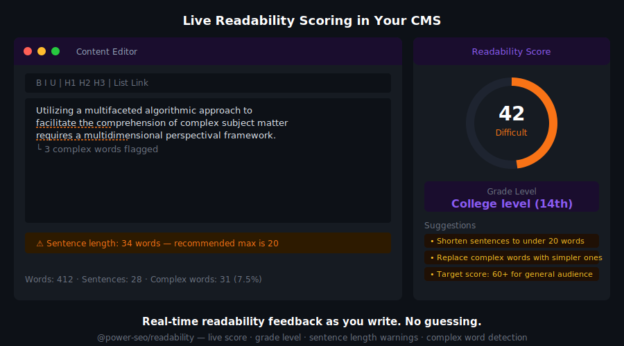
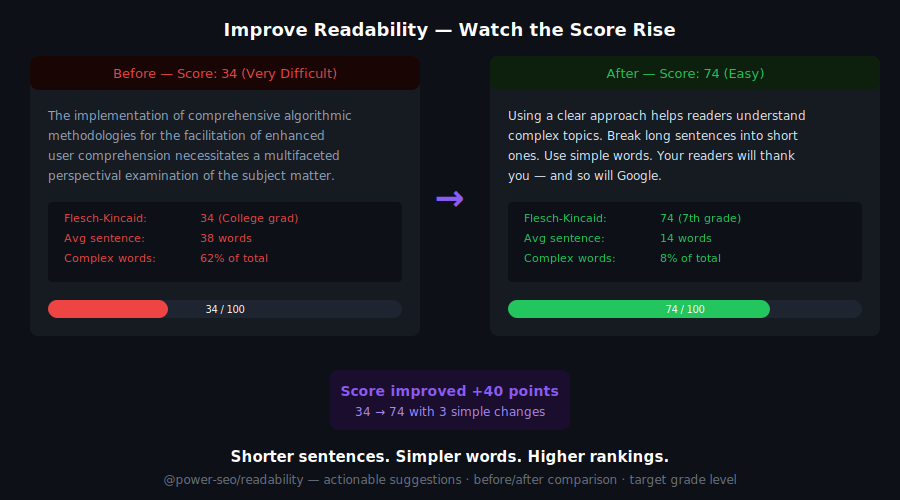
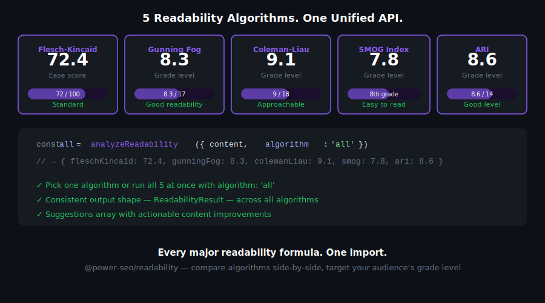

# @power-seo/readability


Multi-algorithm readability scoring for TypeScript — Flesch Reading Ease, Flesch-Kincaid, Gunning Fog, Coleman-Liau, and ARI in one unified API with actionable status labels.

[](https://www.npmjs.com/package/@power-seo/readability)
[](https://www.npmjs.com/package/@power-seo/readability)
[](https://socket.dev/npm/package/@power-seo/readability)
[](https://github.com/CyberCraftBD/power-seo/actions)
[](https://opensource.org/licenses/MIT)
[](https://www.typescriptlang.org/)
[](https://bundlephobia.com/package/@power-seo/readability)

`@power-seo/readability` runs five industry-standard readability formulas against any text or HTML string and returns structured, typed score objects with numeric values and `'good'` / `'improvement'` / `'error'` status labels — comparable to the readability scoring panels in Yoast SEO or Hemingway App, but as a standalone TypeScript library. Run it server-side in a CMS pipeline, client-side in a React editor, or inside a CI content quality gate. All five algorithm functions are independently importable and tree-shakeable.

> **Zero runtime dependencies** — pure TypeScript, no NLP libraries, works in any JavaScript environment.

---

## Why @power-seo/readability?

|                    | Without                                             | With                                                                                    |
| ------------------ | --------------------------------------------------- | --------------------------------------------------------------------------------------- |
| Algorithm coverage | ❌ One-off Flesch score, no other algorithms        | ✅ Five algorithms in one call — Flesch, Flesch-Kincaid, Gunning Fog, Coleman-Liau, ARI |
| Status labels      | ❌ Raw numbers only — interpret thresholds manually | ✅ `'good'` / `'improvement'` / `'error'` per score with a human message                |
| HTML input         | ❌ Must strip HTML before calling                   | ✅ HTML tags stripped automatically                                                     |
| Composite status   | ❌ No aggregate result                              | ✅ `overall.status` combines all five algorithms                                        |
| TypeScript         | ❌ Untyped result objects                           | ✅ Full type inference for all inputs and outputs                                       |
| CI integration     | ❌ Manual threshold checks                          | ✅ `overall.status === 'error'` fails builds                                            |
| Framework support  | ❌ Browser-only or Node-only tools                  | ✅ Works in Next.js, Remix, Gatsby, Vite, Edge, browser                                 |


---

## Features

- **Flesch Reading Ease** — 0–100 score; higher = easier; target 60–70 for most web content
- **Flesch-Kincaid Grade Level** — maps content to US school grade levels (e.g. 8.0 = 8th grade)
- **Gunning Fog Index** — grade-level estimate based on complex word (3+ syllable) density
- **Coleman-Liau Index** — character-based formula; no syllable counting required
- **Automated Readability Index (ARI)** — grade estimate from character and word counts
- **Unified `analyzeReadability()` API** — run all five algorithms in a single call with composite status
- **Text statistics** — sentence count, word count, syllable count, character count, avg sentence length
- **Status labels** — each score maps to `'good'` / `'improvement'` / `'error'` with a human message
- **HTML stripping** — HTML tags are removed automatically before scoring; no preprocessing required
- **Zero runtime dependencies** — pure TypeScript; no NLP libraries
- **Tree-shakeable** — import only the algorithms you need; `"sideEffects": false`
- **Type-safe API** — TypeScript-first with full type inference for all inputs and outputs
- **Framework-agnostic** — works in Node.js, browser, Next.js, Remix, Gatsby, Vite, Edge



---

## Comparison

| Feature                                | @power-seo/readability | text-readability | readability-scores | flesch |
| -------------------------------------- | :--------------------: | :--------------: | :----------------: | :----: |
| Flesch Reading Ease                    |           ✅           |        ✅        |         ✅         |   ✅   |
| Flesch-Kincaid Grade                   |           ✅           |        ✅        |         ✅         |   ❌   |
| Gunning Fog Index                      |           ✅           |        ✅        |         ✅         |   ❌   |
| Coleman-Liau Index                     |           ✅           |        ✅        |         ✅         |   ❌   |
| Automated Readability Index            |           ✅           |        ✅        |         ✅         |   ❌   |
| Status labels (good/improvement/error) |           ✅           |        ❌        |         ❌         |   ❌   |
| Unified multi-algorithm API            |           ✅           |        ❌        |         ❌         |   ❌   |
| Composite overall status               |           ✅           |        ❌        |         ❌         |   ❌   |
| HTML auto-stripping                    |           ✅           |        ❌        |         ❌         |   ❌   |
| TypeScript-first with full types       |           ✅           |        ❌        |         ❌         |   ❌   |
| Zero runtime dependencies              |           ✅           |        ✅        |         ✅         |   ✅   |
| Tree-shakeable individual functions    |           ✅           |        ❌        |         ❌         |   ✅   |



---

## Installation

```bash
npm install @power-seo/readability
```

```bash
yarn add @power-seo/readability
```

```bash
pnpm add @power-seo/readability
```

---

## Quick Start

```ts
import { analyzeReadability } from '@power-seo/readability';

const result = analyzeReadability({
  text: 'Search engine optimization is the practice of improving web pages to rank higher in search results. Good content uses clear sentences and relevant keywords.',
});

console.log(result.fleschReadingEase.score); // e.g. 58.4
console.log(result.fleschKincaidGrade.score); // e.g. 10.2
console.log(result.overall.status); // 'improvement'
console.log(result.overall.message); // 'Content may be difficult for some readers...'
```

**Status thresholds (per score):**

- `good` — score is within the optimal range for web content
- `improvement` — score is outside the ideal range; consider simplifying
- `error` — score indicates content is too complex for most web readers



---

## Usage

### Running All Algorithms at Once

`analyzeReadability()` runs all five algorithms and returns a composite `overall` status:

```ts
import { analyzeReadability } from '@power-seo/readability';

const result = analyzeReadability({
  text: '<h1>React SEO Best Practices</h1><p>Search engine optimization for React applications requires attention to meta tags, structured data, and performance metrics.</p>',
});

// result.fleschReadingEase    → AlgorithmScore
// result.fleschKincaidGrade   → AlgorithmScore
// result.gunningFog           → AlgorithmScore
// result.colemanLiau          → AlgorithmScore
// result.automatedReadability → AlgorithmScore
// result.stats                → TextStatistics
// result.overall              → AnalysisResult
```

### Running Individual Algorithms

Import individual algorithm functions for targeted scoring in performance-sensitive paths. All accept `TextStatistics` and return `AlgorithmScore`:

```ts
import { computeTextStatistics, fleschReadingEase, gunningFog } from '@power-seo/readability';

const stats = computeTextStatistics('Your plain text here.');
const ease = fleschReadingEase(stats);
const fog = gunningFog(stats);

console.log(ease.score); // 0–100 (higher = easier)
console.log(fog.score); // grade level
console.log(ease.status); // 'good' | 'improvement' | 'error'
```

### Inside a CI Content Quality Gate

Fail builds when content readability is too low:

```ts
import { analyzeReadability } from '@power-seo/readability';

const result = analyzeReadability({ text: pageContent });

if (result.overall.status === 'error') {
  console.error('Readability check failed:', result.overall.message);
  console.error('Flesch Reading Ease:', result.fleschReadingEase.score);
  console.error('Gunning Fog Index:', result.gunningFog.score);
  process.exit(1);
}
```

### Score Interpretation

| Flesch Reading Ease | Difficulty       | Typical Audience                               |
| ------------------- | ---------------- | ---------------------------------------------- |
| 90–100              | Very Easy        | 5th grade                                      |
| 70–90               | Easy             | 6th grade                                      |
| 60–70               | Standard         | 7th–8th grade — **ideal for most web content** |
| 50–60               | Fairly Difficult | High school                                    |
| 30–50               | Difficult        | College                                        |
| 0–30                | Very Difficult   | Academic / professional                        |

| Grade Level Score | Status                                       |
| ----------------- | -------------------------------------------- |
| ≤ 8               | `'good'` — accessible to general audiences   |
| 9–12              | `'improvement'` — consider simplifying       |
| > 12              | `'error'` — too complex for most web readers |

---

## API Reference

### `analyzeReadability(input)`

```ts
function analyzeReadability(input: ReadabilityInput): ReadabilityOutput;
```

#### `ReadabilityInput`

| Prop   | Type     | Description                                                  |
| ------ | -------- | ------------------------------------------------------------ |
| `text` | `string` | Plain text or HTML string (HTML tags stripped automatically) |

#### `ReadabilityOutput`

| Field                  | Type             | Description                        |
| ---------------------- | ---------------- | ---------------------------------- |
| `fleschReadingEase`    | `AlgorithmScore` | Flesch Reading Ease result         |
| `fleschKincaidGrade`   | `AlgorithmScore` | Flesch-Kincaid Grade Level result  |
| `gunningFog`           | `AlgorithmScore` | Gunning Fog Index result           |
| `colemanLiau`          | `AlgorithmScore` | Coleman-Liau Index result          |
| `automatedReadability` | `AlgorithmScore` | Automated Readability Index result |
| `stats`                | `TextStatistics` | Underlying text statistics         |
| `overall`              | `AnalysisResult` | Composite status and message       |

### Individual Algorithm Functions

All accept `TextStatistics` and return `AlgorithmScore`:

```ts
function fleschReadingEase(stats: TextStatistics): AlgorithmScore;
function fleschKincaidGrade(stats: TextStatistics): AlgorithmScore;
function gunningFog(stats: TextStatistics): AlgorithmScore;
function colemanLiau(stats: TextStatistics): AlgorithmScore;
function automatedReadability(stats: TextStatistics): AlgorithmScore;
```

### `computeTextStatistics(text)`

```ts
function computeTextStatistics(plainText: string): TextStatistics;
```

Returns raw statistics used by all algorithm functions. Input must be plain text (no HTML).

### Types

| Type                | Description                                                                                                |
| ------------------- | ---------------------------------------------------------------------------------------------------------- |
| `ReadabilityInput`  | `{ text: string }`                                                                                         |
| `ReadabilityOutput` | Full result with all five algorithm scores + stats + overall                                               |
| `TextStatistics`    | `{ sentences: number; words: number; syllables: number; characters: number; avgWordsPerSentence: number }` |
| `AlgorithmScore`    | `{ score: number; status: AnalysisStatus; message: string }`                                               |
| `AnalysisStatus`    | `'good' \| 'improvement' \| 'error'`                                                                       |
| `AnalysisResult`    | `{ status: AnalysisStatus; message: string }`                                                              |

---

## Use Cases

- **Programmatic SEO pages** — score thousands of auto-generated pages at build time
- **CMS editorial dashboards** — show live readability scores as editors write content
- **SaaS marketing sites** — gate content publication behind a minimum readability threshold
- **Blog and content pipelines** — CI check that fails when content is too complex
- **E-commerce product descriptions** — ensure product copy is accessible to your target audience
- **Educational platforms** — match content reading level to target student grade
- **Next.js / Remix apps** — score content server-side per route and expose scores in admin dashboards

---

## Architecture Overview

- **Pure TypeScript** — no compiled binary, no native modules
- **Zero runtime dependencies** — pure computation; no NLP libraries, no external tools
- **Framework-agnostic** — works in any JavaScript environment with no DOM requirement
- **SSR compatible** — safe to run in Next.js Server Components, Remix loaders, or Express handlers
- **Edge runtime safe** — no Node.js-specific APIs; runs in Cloudflare Workers, Vercel Edge, Deno
- **HTML stripping** — uses a string-based tag removal loop (no regex ReDoS risk)
- **Tree-shakeable** — `"sideEffects": false` with named exports per algorithm function
- **Dual ESM + CJS** — ships both formats via tsup for any bundler or `require()` usage

---

## Supply Chain Security

- No install scripts (`postinstall`, `preinstall`)
- No runtime network access
- No `eval` or dynamic code execution
- npm provenance enabled — every release is signed via Sigstore through GitHub Actions
- CI-signed builds — all releases published via verified `github.com/CyberCraftBD/power-seo` workflow
- Safe for SSR, Edge, and server environments

---

## The [@power-seo](https://www.npmjs.com/org/power-seo) Ecosystem

All 17 packages are independently installable — use only what you need.

| Package                                                                                    | Install                             | Description                                                             |
| ------------------------------------------------------------------------------------------ | ----------------------------------- | ----------------------------------------------------------------------- |
| [`@power-seo/core`](https://www.npmjs.com/package/@power-seo/core)                         | `npm i @power-seo/core`             | Framework-agnostic utilities, types, validators, and constants          |
| [`@power-seo/react`](https://www.npmjs.com/package/@power-seo/react)                       | `npm i @power-seo/react`            | React SEO components — meta, Open Graph, Twitter Card, breadcrumbs      |
| [`@power-seo/meta`](https://www.npmjs.com/package/@power-seo/meta)                         | `npm i @power-seo/meta`             | SSR meta helpers for Next.js App Router, Remix v2, and generic SSR      |
| [`@power-seo/schema`](https://www.npmjs.com/package/@power-seo/schema)                     | `npm i @power-seo/schema`           | Type-safe JSON-LD structured data — 23 builders + 21 React components   |
| [`@power-seo/content-analysis`](https://www.npmjs.com/package/@power-seo/content-analysis) | `npm i @power-seo/content-analysis` | Yoast-style SEO content scoring engine with React components            |
| [`@power-seo/readability`](https://www.npmjs.com/package/@power-seo/readability)           | `npm i @power-seo/readability`      | Readability scoring — Flesch-Kincaid, Gunning Fog, Coleman-Liau, ARI    |
| [`@power-seo/preview`](https://www.npmjs.com/package/@power-seo/preview)                   | `npm i @power-seo/preview`          | SERP, Open Graph, and Twitter/X Card preview generators                 |
| [`@power-seo/sitemap`](https://www.npmjs.com/package/@power-seo/sitemap)                   | `npm i @power-seo/sitemap`          | XML sitemap generation, streaming, index splitting, and validation      |
| [`@power-seo/redirects`](https://www.npmjs.com/package/@power-seo/redirects)               | `npm i @power-seo/redirects`        | Redirect engine with Next.js, Remix, and Express adapters               |
| [`@power-seo/links`](https://www.npmjs.com/package/@power-seo/links)                       | `npm i @power-seo/links`            | Link graph analysis — orphan detection, suggestions, equity scoring     |
| [`@power-seo/audit`](https://www.npmjs.com/package/@power-seo/audit)                       | `npm i @power-seo/audit`            | Full SEO audit engine — meta, content, structure, performance rules     |
| [`@power-seo/images`](https://www.npmjs.com/package/@power-seo/images)                     | `npm i @power-seo/images`           | Image SEO — alt text, lazy loading, format analysis, image sitemaps     |
| [`@power-seo/ai`](https://www.npmjs.com/package/@power-seo/ai)                             | `npm i @power-seo/ai`               | LLM-agnostic AI prompt templates and parsers for SEO tasks              |
| [`@power-seo/analytics`](https://www.npmjs.com/package/@power-seo/analytics)               | `npm i @power-seo/analytics`        | Merge GSC + audit data, trend analysis, ranking insights, dashboard     |
| [`@power-seo/search-console`](https://www.npmjs.com/package/@power-seo/search-console)     | `npm i @power-seo/search-console`   | Google Search Console API — OAuth2, service account, URL inspection     |
| [`@power-seo/integrations`](https://www.npmjs.com/package/@power-seo/integrations)         | `npm i @power-seo/integrations`     | Semrush and Ahrefs API clients with rate limiting and pagination        |
| [`@power-seo/tracking`](https://www.npmjs.com/package/@power-seo/tracking)                 | `npm i @power-seo/tracking`         | GA4, Clarity, PostHog, Plausible, Fathom — scripts + consent management |

---

## Keywords

seo · readability · flesch kincaid · flesch reading ease · gunning fog · coleman liau · automated readability index · ari · reading score · text readability · content quality · readability checker · seo readability · content scoring · zero dependency · ci readability · cms readability · readability api · typescript · multi algorithm

---

## About [CyberCraft Bangladesh](https://ccbd.dev)

**[CyberCraft Bangladesh](https://ccbd.dev)** is a Bangladesh-based enterprise-grade software development and Full Stack SEO service provider company specializing in ERP system development, AI-powered SaaS and business applications, full-stack SEO services, custom website development, and scalable eCommerce platforms. We design and develop intelligent, automation-driven SaaS and enterprise solutions that help startups, SMEs, NGOs, educational institutes, and large organizations streamline operations, enhance digital visibility, and accelerate growth through modern cloud-native technologies.

[](https://ccbd.dev)
[](https://github.com/cybercraftbd)
[](https://www.npmjs.com/org/power-seo)
[](mailto:info@ccbd.dev)

© 2026 [CyberCraft Bangladesh](https://ccbd.dev) · Released under the [MIT License](../../LICENSE)
