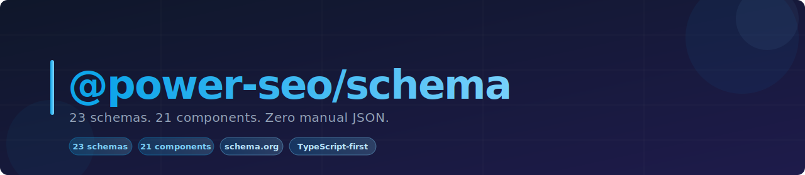
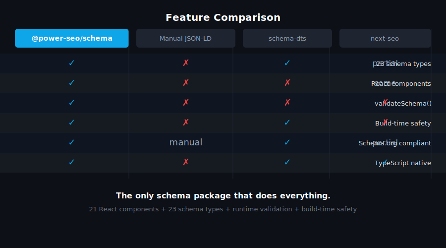
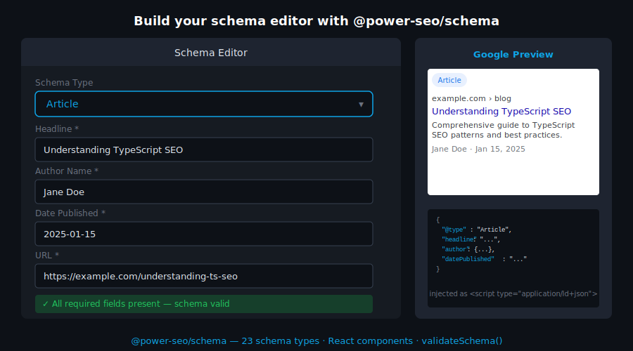
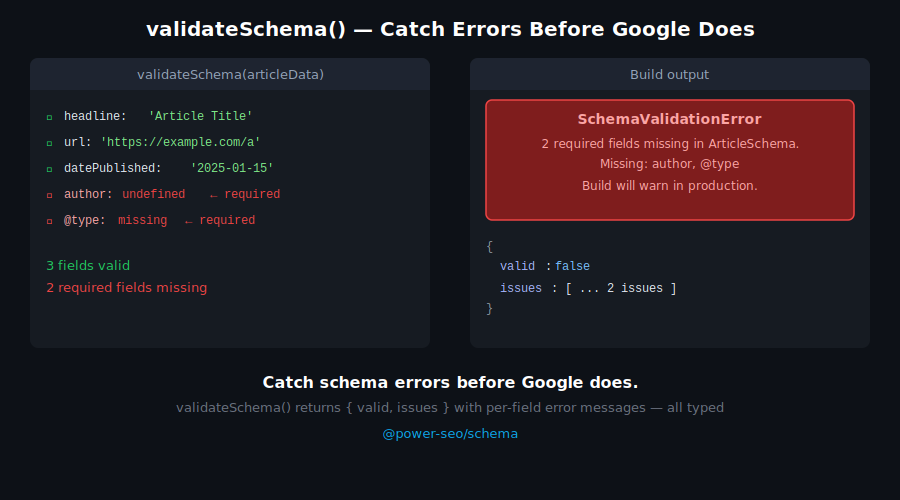
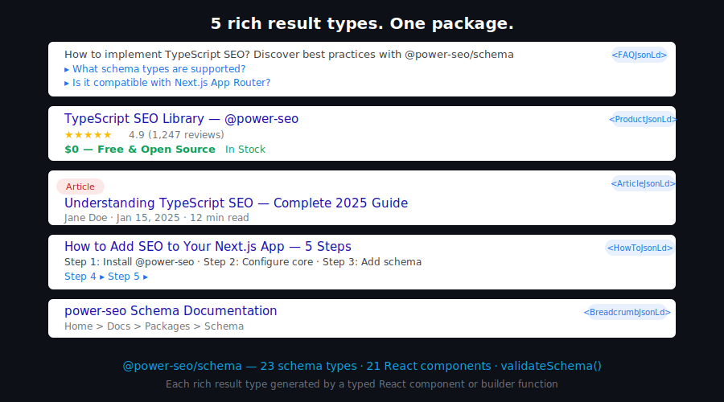

# @power-seo/schema



Type-safe JSON-LD structured data for TypeScript and React — 23 schema.org builder functions, 21 React components, schema graph support, and field validation. Works in Next.js, Remix, Node.js, and Edge runtimes.

[](https://www.npmjs.com/package/@power-seo/schema)
[](https://www.npmjs.com/package/@power-seo/schema)
[](https://socket.dev/npm/package/@power-seo/schema)
[](https://github.com/CyberCraftBD/power-seo/actions)
[](https://opensource.org/licenses/MIT)
[](https://www.typescriptlang.org/)
[](https://bundlephobia.com/package/@power-seo/schema)

`@power-seo/schema` gives you a fully typed, builder-function API for generating Google-compliant schema.org markup — with compile-time type checking on every schema property, a `validateSchema()` utility that surfaces missing required fields before pages go live, and pre-built React components that render `<script type="application/ld+json">` tags in one line. Combine multiple schemas into a single `@graph` document via `schemaGraph()` so Google parses all of them. All 23 schema types are independently importable and tree-shakeable.

> **Zero runtime dependencies** — only `@power-seo/core` as a peer.

---

## Why @power-seo/schema?

| | Without | With |
|---|---|---|
| Field type safety | ❌ Hand-written JSON, no types | ✅ Typed builder functions catch missing fields at compile time |
| Multiple schemas per page | ❌ Separate `<script>` tags, Google may miss some | ✅ `schemaGraph()` combines all into one `@graph` document |
| Field validation | ❌ Silent failures in rich results | ✅ `validateSchema()` returns structured issues before deploy |
| React rendering | ❌ Manual `dangerouslySetInnerHTML` boilerplate | ✅ `<ArticleJsonLd>` and 20 other components in one import |
| Schema coverage | ❌ Only Article/FAQ in most packages | ✅ 23 types: Article, Product, FAQ, LocalBusiness, Event, Recipe, and more |
| Framework support | ❌ WordPress / next-seo only | ✅ Next.js, Remix, Node.js, Edge, static site generators |



---

## Features

- **23 schema.org type builder functions** — Article, BlogPosting, NewsArticle, Product, FAQPage, BreadcrumbList, LocalBusiness, Organization, Person, Event, Recipe, HowTo, VideoObject, Course, JobPosting, SoftwareApplication, WebSite, ItemList, Review, Service, Brand, SiteNavigationElement, ImageObject
- **21 pre-built React components** — `<ArticleJsonLd>`, `<FAQJsonLd>`, `<ProductJsonLd>`, `<BreadcrumbJsonLd>`, `<LocalBusinessJsonLd>`, `<OrganizationJsonLd>`, `<PersonJsonLd>`, `<EventJsonLd>`, `<RecipeJsonLd>`, `<HowToJsonLd>`, `<VideoJsonLd>`, `<CourseJsonLd>`, `<JobPostingJsonLd>`, `<SoftwareAppJsonLd>`, `<WebSiteJsonLd>`, `<ItemListJsonLd>`, `<ReviewJsonLd>`, `<ServiceJsonLd>`, `<BrandJsonLd>`, `<NewsArticleJsonLd>`, `<BlogPostingJsonLd>`
- **Generic `<JsonLd>` component** — renders any custom schema object as a JSON-LD script tag
- **`schemaGraph()`** — combine multiple schemas into a single `@graph` document for optimal Google parsing
- **`toJsonLdString()`** — serialize any schema object to a safe JSON-LD string for `dangerouslySetInnerHTML`
- **`validateSchema()`** — validate required fields without throwing; returns `{ valid, issues }` with severity, field, and message per issue
- **React optional** — all 23 builder functions work without React; components available via `/react` subpath export
- **Type-safe API** — TypeScript-first with full typed interfaces for every schema type including nested objects
- **Tree-shakeable** — import only the schema types you use; zero dead code in your bundle
- **Dual ESM + CJS** — ships both formats via tsup for any bundler or `require()` usage



---

## Comparison

| Feature                        | @power-seo/schema | next-seo | schema-dts | json-ld.js | react-schemaorg |
| ------------------------------ | :---------------: | :------: | :--------: | :--------: | :-------------: |
| Typed builder functions        | ✅                | Partial  | ❌         | ❌         | ❌              |
| Ready-to-use React components  | ✅                | ✅       | ❌         | ❌         | Partial         |
| `@graph` support               | ✅                | ❌       | ❌         | ✅         | ❌              |
| Built-in field validation      | ✅                | ❌       | ❌         | ❌         | ❌              |
| Works without React            | ✅                | ❌       | ✅         | ✅         | ❌              |
| 23 schema types                | ✅                | Partial  | ✅         | ✅         | ❌              |
| CI / Node.js usage             | ✅                | ❌       | ✅         | ✅         | ❌              |
| Zero runtime dependencies      | ✅                | ❌       | ✅         | ❌         | ❌              |
| TypeScript-first               | ✅                | Partial  | ✅         | ❌         | ❌              |
| Tree-shakeable                 | ✅                | ❌       | ✅         | ❌         | ❌              |



---

## Installation

```bash
npm install @power-seo/schema
```

```bash
yarn add @power-seo/schema
```

```bash
pnpm add @power-seo/schema
```

---

## Quick Start

```ts
// Builder function approach (works without React)
import { article, toJsonLdString } from '@power-seo/schema';

const schema = article({
  headline: 'My Blog Post',
  description: 'An informative article about SEO.',
  datePublished: '2026-01-15',
  dateModified: '2026-01-20',
  author: { name: 'Jane Doe', url: 'https://example.com/authors/jane-doe' },
  image: { url: 'https://example.com/article-cover.jpg', width: 1200, height: 630 },
});

const script = toJsonLdString(schema);
// → '{"@context":"https://schema.org","@type":"Article","headline":"My Blog Post",...}'
```

```tsx
// React component approach
import { ArticleJsonLd } from '@power-seo/schema/react';

<ArticleJsonLd
  headline="My Blog Post"
  description="An informative article about SEO."
  datePublished="2026-01-15"
  author={{ name: 'Jane Doe', url: 'https://example.com/authors/jane-doe' }}
  image={{ url: 'https://example.com/cover.jpg', width: 1200, height: 630 }}
/>
// Renders: <script type="application/ld+json">{"@context":"https://schema.org",...}</script>
```



---

## Usage

### Builder Functions (No React Required)

Call any builder function with a typed props object to produce a schema-ready JSON-LD object, then pass it to `toJsonLdString()` for serialization or `schemaGraph()` to combine with other schemas.

```ts
import { product, toJsonLdString } from '@power-seo/schema';

const schema = product({
  name: 'Wireless Headphones',
  description: 'Premium noise-cancelling headphones.',
  image: { url: 'https://example.com/headphones.jpg' },
  offers: {
    price: 149.99,
    priceCurrency: 'USD',
    availability: 'InStock',
  },
  aggregateRating: {
    ratingValue: 4.7,
    reviewCount: 312,
  },
});

console.log(toJsonLdString(schema));
```

### React Components

Import from the `/react` entry point for pre-built JSON-LD components that render `<script type="application/ld+json">` tags:

```tsx
import { FAQJsonLd, BreadcrumbJsonLd } from '@power-seo/schema/react';

function PageHead() {
  return (
    <>
      <FAQJsonLd
        questions={[
          { question: 'What is JSON-LD?', answer: 'A structured data format used by Google.' },
          { question: 'Do I need React?', answer: 'No — builder functions work without React.' },
        ]}
      />
      <BreadcrumbJsonLd
        items={[
          { name: 'Home', url: 'https://example.com' },
          { name: 'Blog', url: 'https://example.com/blog' },
          { name: 'My Post' },
        ]}
      />
    </>
  );
}
```

### Schema Graph (Multiple Schemas Per Page)

Use `schemaGraph()` to combine multiple schema objects into a single `@graph` document. This ensures Google parses all schemas on the page, not just the first `<script>` tag it finds.

```ts
import { article, breadcrumbList, organization, schemaGraph, toJsonLdString } from '@power-seo/schema';

const graph = schemaGraph([
  article({ headline: 'My Post', datePublished: '2026-01-01', author: { name: 'Jane Doe' } }),
  breadcrumbList([
    { name: 'Home', url: 'https://example.com' },
    { name: 'Blog', url: 'https://example.com/blog' },
    { name: 'My Post' },
  ]),
  organization({ name: 'Acme Corp', url: 'https://example.com' }),
]);

const script = toJsonLdString(graph);
// → '{"@context":"https://schema.org","@graph":[{...},{...},{...}]}'
```

### Field Validation

`validateSchema()` checks required fields and returns a structured result without throwing. Use it in CI pipelines to catch missing fields before pages are published.

```ts
import { article, validateSchema } from '@power-seo/schema';

const schema = article({ headline: 'Incomplete Article' }); // missing datePublished, author

const result = validateSchema(schema);
// result.valid → false
// result.issues → [
//   { severity: 'error', field: 'datePublished', message: 'datePublished is required for Article' },
//   { severity: 'error', field: 'author', message: 'author is required for Article' },
// ]

if (!result.valid) {
  const errors = result.issues.filter((i) => i.severity === 'error');
  console.error(`${errors.length} validation error(s) found`);
  errors.forEach((i) => console.error(` ✗ [${i.field}] ${i.message}`));
  process.exit(1);
}
```

### FAQ and Breadcrumb Builder Signatures

`faqPage()` and `breadcrumbList()` accept plain arrays directly — not a config object wrapper:

```ts
import { faqPage, breadcrumbList } from '@power-seo/schema';

// faqPage takes a plain array of { question, answer } items
const faq = faqPage([
  { question: 'What is schema.org?', answer: 'A shared vocabulary for structured data.' },
  { question: 'Does Google require JSON-LD?', answer: 'JSON-LD is the recommended format.' },
]);

// breadcrumbList takes a plain array of { name, url? } items
const breadcrumb = breadcrumbList([
  { name: 'Home', url: 'https://example.com' },
  { name: 'Products', url: 'https://example.com/products' },
  { name: 'Headphones' },
]);
```

### Next.js App Router

Use builder functions in `page.tsx` to generate JSON-LD for server-side rendering:

```tsx
import { article, toJsonLdString } from '@power-seo/schema';

export default function BlogPost({ post }: { post: Post }) {
  const schema = article({
    headline: post.title,
    description: post.excerpt,
    datePublished: post.publishedAt,
    dateModified: post.updatedAt,
    author: { name: post.author.name, url: post.author.profileUrl },
    image: { url: post.coverImage, width: 1200, height: 630 },
  });

  return (
    <>
      <script
        type="application/ld+json"
        dangerouslySetInnerHTML={{ __html: toJsonLdString(schema) }}
      />
      <article>{/* page content */}</article>
    </>
  );
}
```

> **Security note:** `toJsonLdString()` escapes `<`, `>`, and `&` to their Unicode escape sequences (`\u003c`, `\u003e`, `\u0026`) so a schema string value such as `"</script>"` cannot break out of the surrounding `<script>` tag. This protection is applied automatically — you do not need to sanitize schema field values yourself when using `toJsonLdString()` or the React components. If you write schema JSON manually and inject it with `dangerouslySetInnerHTML`, apply the same escaping or use `toJsonLdString()`.


### CI Validation Gate

Block deploys when schema validation fails:

```ts
import { validateSchema } from '@power-seo/schema';
import { allPageSchemas } from './build-schemas';

for (const schema of allPageSchemas) {
  const result = validateSchema(schema);
  if (!result.valid) {
    const errors = result.issues.filter((i) => i.severity === 'error');
    if (errors.length > 0) {
      console.error('Schema validation failed:');
      errors.forEach((i) => console.error(` ✗ [${i.field}] ${i.message}`));
      process.exit(1);
    }
  }
}
```

---

## API Reference

### Entry Points

| Import | Description |
| --- | --- |
| `@power-seo/schema` | Builder functions, utilities, and TypeScript types |
| `@power-seo/schema/react` | React components for rendering JSON-LD script tags |

### Builder Functions

| Function | Schema `@type` | Rich Result Eligible |
| --- | --- | --- |
| `article(props)` | `Article` | Yes — Article rich results |
| `blogPosting(props)` | `BlogPosting` | Yes — Article rich results |
| `newsArticle(props)` | `NewsArticle` | Yes — Top Stories |
| `product(props)` | `Product` | Yes — Product rich results |
| `faqPage(questions)` | `FAQPage` | Yes — FAQ rich results |
| `breadcrumbList(items)` | `BreadcrumbList` | Yes — Breadcrumbs in SERP |
| `localBusiness(props)` | `LocalBusiness` | Yes — Local Business panel |
| `organization(props)` | `Organization` | Yes — Knowledge Panel |
| `person(props)` | `Person` | Yes — Knowledge Panel |
| `event(props)` | `Event` | Yes — Event rich results |
| `recipe(props)` | `Recipe` | Yes — Recipe rich results |
| `howTo(props)` | `HowTo` | Yes — How-to rich results |
| `videoObject(props)` | `VideoObject` | Yes — Video rich results |
| `course(props)` | `Course` | Yes — Course rich results |
| `jobPosting(props)` | `JobPosting` | Yes — Job Posting results |
| `softwareApp(props)` | `SoftwareApplication` | Yes — App rich results |
| `webSite(props)` | `WebSite` | Yes — Sitelinks Searchbox |
| `itemList(props)` | `ItemList` | Yes — Carousel results |
| `review(props)` | `Review` | Yes — Review snippet |
| `service(props)` | `Service` | Partial |
| `brand(props)` | `Brand` | Partial |
| `siteNavigationElement(props)` | `SiteNavigationElement` | Partial |
| `imageObject(props)` | `ImageObject` | Yes — Image rich results |

### Utility Functions

| Function | Signature | Description |
| --- | --- | --- |
| `toJsonLdString` | `(schema: object, pretty?: boolean) => string` | Serialize schema to safe JSON-LD string |
| `schemaGraph` | `(schemas: object[]) => object` | Combine schemas into a single `@graph` document |
| `validateSchema` | `(schema: object) => { valid: boolean; issues: ValidationIssue[] }` | Validate required fields; returns structured issues |

### React Components

Import all components from `@power-seo/schema/react`.

| Component | Props | Description |
| --- | --- | --- |
| `<ArticleJsonLd>` | `Omit<ArticleSchema, '@type' \| '@context'>` | Article schema |
| `<BlogPostingJsonLd>` | `Omit<ArticleSchema, '@type' \| '@context'>` | BlogPosting schema |
| `<NewsArticleJsonLd>` | `Omit<ArticleSchema, '@type' \| '@context'>` | NewsArticle schema for Top Stories |
| `<ProductJsonLd>` | `Omit<ProductSchema, '@type' \| '@context'>` | Product with offers and ratings |
| `<FAQJsonLd>` | `{ questions: Array<{ question: string; answer: string }> }` | FAQPage schema |
| `<BreadcrumbJsonLd>` | `{ items: Array<{ name: string; url?: string }> }` | BreadcrumbList schema |
| `<LocalBusinessJsonLd>` | `Omit<LocalBusinessSchema, '@type' \| '@context'>` | LocalBusiness schema |
| `<OrganizationJsonLd>` | `Omit<OrganizationSchema, '@type' \| '@context'>` | Organization schema |
| `<PersonJsonLd>` | `Omit<PersonSchema, '@type' \| '@context'>` | Person schema |
| `<EventJsonLd>` | `Omit<EventSchema, '@type' \| '@context'>` | Event schema |
| `<RecipeJsonLd>` | `Omit<RecipeSchema, '@type' \| '@context'>` | Recipe schema |
| `<HowToJsonLd>` | `Omit<HowToSchema, '@type' \| '@context'>` | HowTo schema |
| `<VideoJsonLd>` | `Omit<VideoObjectSchema, '@type' \| '@context'>` | VideoObject schema |
| `<CourseJsonLd>` | `Omit<CourseSchema, '@type' \| '@context'>` | Course schema |
| `<JobPostingJsonLd>` | `Omit<JobPostingSchema, '@type' \| '@context'>` | JobPosting schema |
| `<SoftwareAppJsonLd>` | `Omit<SoftwareAppSchema, '@type' \| '@context'>` | SoftwareApplication schema |
| `<WebSiteJsonLd>` | `Omit<WebSiteSchema, '@type' \| '@context'>` | WebSite with SearchAction |
| `<ItemListJsonLd>` | `Omit<ItemListSchema, '@type' \| '@context'>` | ItemList schema |
| `<ReviewJsonLd>` | `Omit<ReviewSchema, '@type' \| '@context'>` | Review schema |
| `<ServiceJsonLd>` | `Omit<ServiceSchema, '@type' \| '@context'>` | Service schema |
| `<BrandJsonLd>` | `Omit<BrandSchema, '@type' \| '@context'>` | Brand schema |
| `<JsonLd>` | `{ schema: object }` | Generic — any schema object |

### Types

| Type | Description |
| --- | --- |
| `ArticleSchema` | Props for Article, BlogPosting, and NewsArticle builder functions |
| `ProductSchema` | Props for `product()` builder |
| `FAQPageSchema` | Output type of `faqPage()` |
| `BreadcrumbListSchema` | Output type of `breadcrumbList()` |
| `LocalBusinessSchema` | Props for `localBusiness()` builder |
| `OrganizationSchema` | Props for `organization()` builder |
| `PersonSchema` | Props for `person()` builder |
| `EventSchema` | Props for `event()` builder |
| `RecipeSchema` | Props for `recipe()` builder |
| `HowToSchema` | Props for `howTo()` builder |
| `VideoObjectSchema` | Props for `videoObject()` builder |
| `CourseSchema` | Props for `course()` builder |
| `JobPostingSchema` | Props for `jobPosting()` builder |
| `SoftwareAppSchema` | Props for `softwareApp()` builder |
| `WebSiteSchema` | Props for `webSite()` builder |
| `ItemListSchema` | Props for `itemList()` builder |
| `ReviewSchema` | Props for `review()` builder |
| `ServiceSchema` | Props for `service()` builder |
| `BrandSchema` | Props for `brand()` builder |
| `ValidationIssue` | `{ severity: 'error' \| 'warning'; field: string; message: string }` |

---

## Use Cases

- **Blog posts and articles** — Article and BlogPosting schema for Google Discover and Top Stories eligibility
- **FAQ pages** — FAQPage schema for FAQ accordion rich results in SERPs
- **Product pages** — Product schema with offers and aggregate ratings for product rich results and star display
- **Local business sites** — LocalBusiness schema for Google Business Panel and Local Pack
- **Recipe sites** — Recipe schema for rich cards with images, ratings, and cooking time
- **Job boards** — JobPosting schema for Google for Jobs integration
- **Event pages** — Event schema for Google Events rich results
- **Course platforms** — Course schema for education carousels in Google Search
- **Software landing pages** — SoftwareApplication schema for app details in results
- **Multi-schema pages** — `schemaGraph()` to combine Article + Breadcrumb + Organization into a single `@graph`
- **CI content pipelines** — `validateSchema()` to block deploys when required fields are missing

---

## Architecture Overview

- **Pure TypeScript** — no compiled binary, no native modules
- **Zero runtime dependencies** — only `@power-seo/core` as a peer dependency
- **Framework-agnostic** — builder functions work in any JavaScript environment with no DOM requirement
- **SSR compatible** — safe to run in Next.js Server Components, Remix loaders, or Express handlers
- **Edge runtime safe** — no Node.js-specific APIs; builder functions run in Cloudflare Workers, Vercel Edge, Deno
- **Tree-shakeable** — `"sideEffects": false` with named exports per schema type
- **Dual ESM + CJS** — ships both formats via tsup for any bundler or `require()` usage

---

## Supply Chain Security

- No install scripts (`postinstall`, `preinstall`)
- No runtime network access
- No `eval` or dynamic code execution
- npm provenance enabled — every release is signed via Sigstore through GitHub Actions
- CI-signed builds — all releases published via verified `github.com/CyberCraftBD/power-seo` workflow
- Safe for SSR, Edge, and server environments

---

## The [@power-seo](https://www.npmjs.com/org/power-seo) Ecosystem

All 17 packages are independently installable — use only what you need.

| Package | Install | Description |
| --- | --- | --- |
| [`@power-seo/core`](https://www.npmjs.com/package/@power-seo/core) | `npm i @power-seo/core` | Framework-agnostic utilities, types, validators, and constants |
| [`@power-seo/react`](https://www.npmjs.com/package/@power-seo/react) | `npm i @power-seo/react` | React SEO components — meta, Open Graph, Twitter Card, breadcrumbs |
| [`@power-seo/meta`](https://www.npmjs.com/package/@power-seo/meta) | `npm i @power-seo/meta` | SSR meta helpers for Next.js App Router, Remix v2, and generic SSR |
| [`@power-seo/schema`](https://www.npmjs.com/package/@power-seo/schema) | `npm i @power-seo/schema` | Type-safe JSON-LD structured data — 23 builders + 21 React components |
| [`@power-seo/content-analysis`](https://www.npmjs.com/package/@power-seo/content-analysis) | `npm i @power-seo/content-analysis` | Yoast-style SEO content scoring engine with React components |
| [`@power-seo/readability`](https://www.npmjs.com/package/@power-seo/readability) | `npm i @power-seo/readability` | Readability scoring — Flesch-Kincaid, Gunning Fog, Coleman-Liau, ARI |
| [`@power-seo/preview`](https://www.npmjs.com/package/@power-seo/preview) | `npm i @power-seo/preview` | SERP, Open Graph, and Twitter/X Card preview generators |
| [`@power-seo/sitemap`](https://www.npmjs.com/package/@power-seo/sitemap) | `npm i @power-seo/sitemap` | XML sitemap generation, streaming, index splitting, and validation |
| [`@power-seo/redirects`](https://www.npmjs.com/package/@power-seo/redirects) | `npm i @power-seo/redirects` | Redirect engine with Next.js, Remix, and Express adapters |
| [`@power-seo/links`](https://www.npmjs.com/package/@power-seo/links) | `npm i @power-seo/links` | Link graph analysis — orphan detection, suggestions, equity scoring |
| [`@power-seo/audit`](https://www.npmjs.com/package/@power-seo/audit) | `npm i @power-seo/audit` | Full SEO audit engine — meta, content, structure, performance rules |
| [`@power-seo/images`](https://www.npmjs.com/package/@power-seo/images) | `npm i @power-seo/images` | Image SEO — alt text, lazy loading, format analysis, image sitemaps |
| [`@power-seo/ai`](https://www.npmjs.com/package/@power-seo/ai) | `npm i @power-seo/ai` | LLM-agnostic AI prompt templates and parsers for SEO tasks |
| [`@power-seo/analytics`](https://www.npmjs.com/package/@power-seo/analytics) | `npm i @power-seo/analytics` | Merge GSC + audit data, trend analysis, ranking insights, dashboard |
| [`@power-seo/search-console`](https://www.npmjs.com/package/@power-seo/search-console) | `npm i @power-seo/search-console` | Google Search Console API — OAuth2, service account, URL inspection |
| [`@power-seo/integrations`](https://www.npmjs.com/package/@power-seo/integrations) | `npm i @power-seo/integrations` | Semrush and Ahrefs API clients with rate limiting and pagination |
| [`@power-seo/tracking`](https://www.npmjs.com/package/@power-seo/tracking) | `npm i @power-seo/tracking` | GA4, Clarity, PostHog, Plausible, Fathom — scripts + consent management |

---

## Keywords

seo · json ld · schema.org · structured data · rich results · nextjs json ld · react · faq schema · product schema · article schema · breadcrumb schema · local business schema · schema graph · validate schema · typescript json ld · nextjs · remix · job posting schema · programmatic seo · typescript

---

## About [CyberCraft Bangladesh](https://ccbd.dev)

**[CyberCraft Bangladesh](https://ccbd.dev)** is a Bangladesh-based enterprise-grade software development and Full Stack SEO service provider company specializing in ERP system development, AI-powered SaaS and business applications, full-stack SEO services, custom website development, and scalable eCommerce platforms. We design and develop intelligent, automation-driven SaaS and enterprise solutions that help startups, SMEs, NGOs, educational institutes, and large organizations streamline operations, enhance digital visibility, and accelerate growth through modern cloud-native technologies.

[](https://ccbd.dev)
[](https://github.com/cybercraftbd)
[](https://www.npmjs.com/org/power-seo)
[](mailto:info@ccbd.dev)

© 2026 [CyberCraft Bangladesh](https://ccbd.dev) · Released under the [MIT License](../../LICENSE)
