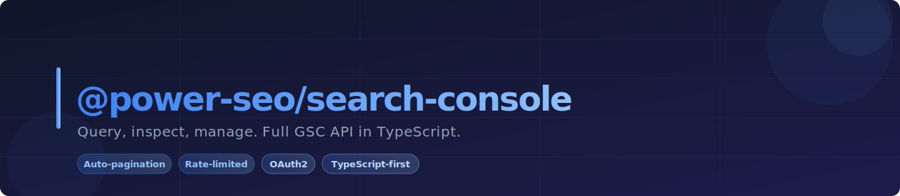
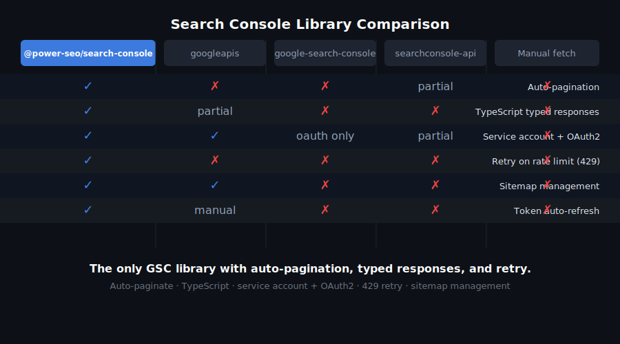
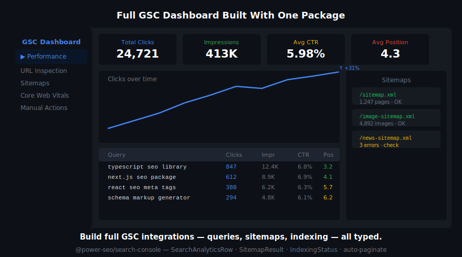
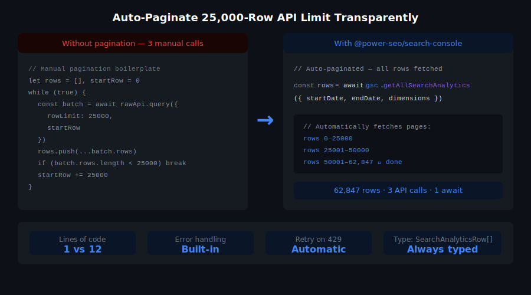
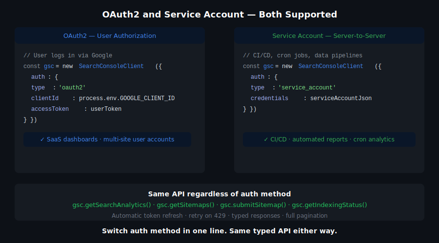

# @power-seo/search-console



Typed Google Search Console API client for TypeScript — OAuth2 and service account auth, auto-paginated search analytics, URL inspection, and sitemap management with zero boilerplate.

[](https://www.npmjs.com/package/@power-seo/search-console)
[](https://www.npmjs.com/package/@power-seo/search-console)
[](https://socket.dev/npm/package/@power-seo/search-console)
[](https://github.com/CyberCraftBD/power-seo/actions)
[](https://opensource.org/licenses/MIT)
[](https://www.typescriptlang.org/)
[](https://bundlephobia.com/package/@power-seo/search-console)

`@power-seo/search-console` is a production-ready Google Search Console API client for TypeScript. Provide OAuth2 credentials or a service account key — get back fully typed search analytics rows, URL inspection verdicts, and sitemap management operations. The token manager handles refresh cycles and JWT signing automatically. `querySearchAnalyticsAll()` transparently pages through the 25,000-row GSC API limit, merging all results into a single array. Use it in Next.js API routes, Remix loaders, Node.js scripts, and CI/CD pipelines. All operations are server-side only — service account credentials must never be exposed to the browser.

> **Zero runtime dependencies** — pure TypeScript with native `fetch` and `crypto`; no googleapis package required.

---

## Why @power-seo/search-console?

| | Without | With |
|---|---|---|
| OAuth2 token refresh | ❌ 50+ lines of boilerplate per project | ✅ Auto-refresh via `createTokenManager()` |
| GSC data pagination | ❌ Manual rowOffset loops and array merging | ✅ `querySearchAnalyticsAll()` — one call, all rows |
| URL inspection | ❌ Manual GSC UI check only | ✅ Programmatic `inspectUrl()` in CI pipelines |
| Service accounts | ❌ Complex JWT signing setup | ✅ `createTokenManager({ type: 'service-account' })` |
| Type safety | ❌ Raw API responses typed as `any` | ✅ Fully typed request and response shapes |
| Sitemap management | ❌ Manual GSC UI operations | ✅ `submitSitemap()`, `listSitemaps()`, `deleteSitemap()` |
| Framework support | ❌ Tied to googleapis setup | ✅ Works in Next.js, Remix, Node.js, CI/CD |




[](https://www.buymeacoffee.com/ccbd.dev)

---

## Features

- **OAuth2 authentication** — `createTokenManager({ type: 'oauth' })` handles token refresh automatically
- **Service account JWT authentication** — `createTokenManager({ type: 'service-account' })` signs JWTs for server-to-server access without user interaction
- **Low-level auth primitives** — `exchangeRefreshToken()` and `getServiceAccountToken()` for custom auth flows
- **Typed GSC client** — `createGSCClient(config)` returns a `GSCClient` scoped to a specific verified site URL
- **Search analytics** — `querySearchAnalytics()` supports all 6 dimensions: `query`, `page`, `country`, `device`, `date`, `searchAppearance`
- **All search types** — `web`, `image`, `video`, and `news` search types
- **Auto-paginated full fetch** — `querySearchAnalyticsAll()` merges all pages into one `SearchAnalyticsRow[]` array
- **URL inspection** — `inspectUrl()` returns verdict, indexing state, last crawl time, mobile usability, and rich result status
- **Direct URL inspection** — `inspectUrlDirect()` for the direct URL inspection API endpoint
- **Sitemap listing** — `listSitemaps()` with status, last download time, and error counts
- **Sitemap submission and deletion** — `submitSitemap()` and `deleteSitemap()`
- **Typed error handling** — `GSCApiError` class with `status`, `code`, and `message`
- **Full TypeScript support** — complete type definitions for all request and response shapes



---

## Comparison

| Feature | google-auth-library | googleapis | custom fetch | @power-seo/search-console |
| ---------------------------------- | :-----------------: | :--------: | :----------: | :-----------------------: |
| OAuth2 token auto-refresh          | ✅ | ✅ | ❌ | ✅ |
| Service account JWT signing        | ✅ | ✅ | ❌ | ✅ |
| Auto-paginated analytics fetch     | ❌ | ❌ | ❌ | ✅ |
| Typed GSC-specific response shapes | ❌ | ⚠️ | ❌ | ✅ |
| URL inspection support             | ❌ | ⚠️ | ❌ | ✅ |
| Sitemap management                 | ❌ | ⚠️ | ❌ | ✅ |
| Zero runtime dependencies          | ❌ | ❌ | ✅ | ✅ |
| TypeScript-first                   | ❌ | ⚠️ | ❌ | ✅ |



---

## Installation

```bash
npm install @power-seo/search-console
```

```bash
yarn add @power-seo/search-console
```

```bash
pnpm add @power-seo/search-console
```

---

## Quick Start

```ts
import {
  createTokenManager,
  createGSCClient,
  querySearchAnalyticsAll,
} from '@power-seo/search-console';

// 1. Create a token manager (OAuth2)
const tokenManager = createTokenManager({
  type: 'oauth',
  clientId: process.env.GSC_CLIENT_ID!,
  clientSecret: process.env.GSC_CLIENT_SECRET!,
  refreshToken: process.env.GSC_REFRESH_TOKEN!,
});

// 2. Create a client scoped to your site
const client = createGSCClient({
  siteUrl: 'https://example.com',
  tokenManager,
});

// 3. Fetch all search analytics data (auto-paginated)
const rows = await querySearchAnalyticsAll(client, {
  startDate: '2026-01-01',
  endDate: '2026-01-31',
  dimensions: ['query', 'page'],
});

rows.forEach(({ keys, clicks, impressions, ctr, position }) => {
  console.log(`Query: "${keys[0]}", Page: ${keys[1]}`);
  console.log(`  ${clicks} clicks, ${impressions} impressions, pos ${position.toFixed(1)}`);
});
```



---

## Usage

### OAuth2 Authentication

```ts
import { createTokenManager } from '@power-seo/search-console';

const tokenManager = createTokenManager({
  type: 'oauth',
  clientId: process.env.GSC_CLIENT_ID!,
  clientSecret: process.env.GSC_CLIENT_SECRET!,
  refreshToken: process.env.GSC_REFRESH_TOKEN!,
});

const { accessToken } = await tokenManager.getAccessToken();
```

### Service Account Authentication

```ts
import { createTokenManager } from '@power-seo/search-console';

const tokenManager = createTokenManager({
  type: 'service-account',
  clientEmail: process.env.GSC_SERVICE_ACCOUNT_EMAIL!,
  privateKey: process.env.GSC_PRIVATE_KEY!,
  scopes: ['https://www.googleapis.com/auth/webmasters.readonly'],
});
```

### Search Analytics Query

```ts
import { createGSCClient, querySearchAnalytics } from '@power-seo/search-console';

const client = createGSCClient({ siteUrl: 'https://example.com', tokenManager });

const response = await querySearchAnalytics(client, {
  startDate: '2026-01-01',
  endDate: '2026-01-31',
  dimensions: ['query', 'country'],
  searchType: 'web',
  rowLimit: 5000,
});

// response.rows → SearchAnalyticsRow[]
```

### Auto-Paginated Full Fetch

```ts
import { querySearchAnalyticsAll } from '@power-seo/search-console';

// Fetches all rows automatically — handles the 25,000-row API limit
const allRows = await querySearchAnalyticsAll(client, {
  startDate: '2026-01-01',
  endDate: '2026-01-31',
  dimensions: ['query'],
});

console.log(`Total rows: ${allRows.length}`);
```

### URL Inspection

```ts
import { inspectUrl } from '@power-seo/search-console';

const result = await inspectUrl(client, 'https://example.com/blog/my-post');

console.log(result.verdict);            // 'PASS' | 'FAIL' | 'NEUTRAL'
console.log(result.indexingState);      // 'INDEXING_ALLOWED' | ...
console.log(result.lastCrawlTime);      // ISO timestamp
console.log(result.mobileUsabilityResult.verdict); // 'PASS' | 'FAIL'
```

### Sitemap Management

```ts
import { listSitemaps, submitSitemap, deleteSitemap } from '@power-seo/search-console';

// List all submitted sitemaps
const sitemaps = await listSitemaps(client);
// sitemaps.sitemap → SitemapEntry[]

// Submit a new sitemap
await submitSitemap(client, 'https://example.com/sitemap.xml');

// Delete an old sitemap
await deleteSitemap(client, 'https://example.com/old-sitemap.xml');
```

### CI/CD Keyword Position Check

```ts
import { createTokenManager, createGSCClient, querySearchAnalyticsAll } from '@power-seo/search-console';

const tokenManager = createTokenManager({
  type: 'service-account',
  clientEmail: process.env.GSC_SERVICE_ACCOUNT_EMAIL!,
  privateKey: process.env.GSC_PRIVATE_KEY!,
  scopes: ['https://www.googleapis.com/auth/webmasters.readonly'],
});

const client = createGSCClient({ siteUrl: 'sc-domain:example.com', tokenManager });

const rows = await querySearchAnalyticsAll(client, {
  startDate: '2026-01-24',
  endDate: '2026-01-31',
  dimensions: ['query', 'page'],
});

const dropped = rows.filter(r => r.position > 20 && r.impressions > 100);
if (dropped.length > 0) {
  console.error('Pages dropped below position 20:');
  dropped.forEach(r => console.error(' -', r.keys[1], `pos ${r.position.toFixed(1)}`));
  process.exit(1);
}
```

---

## API Reference

### `createTokenManager(config)`

| Parameter             | Type                           | Description                                            |
| --------------------- | ------------------------------ | ------------------------------------------------------ |
| `config.type`         | `'oauth' \| 'service-account'` | Authentication method                                  |
| `config.clientId`     | `string`                       | Google OAuth2 client ID (OAuth2 only)                  |
| `config.clientSecret` | `string`                       | Google OAuth2 client secret (OAuth2 only)              |
| `config.refreshToken` | `string`                       | OAuth2 refresh token (OAuth2 only)                     |
| `config.clientEmail`  | `string`                       | Service account email (service account only)           |
| `config.privateKey`   | `string`                       | Service account private key PEM (service account only) |
| `config.scopes`       | `string[]`                     | OAuth2 scopes (service account only)                   |

Returns `TokenManager`: `{ getAccessToken(): Promise<TokenResult> }`.

### `createGSCClient(config)`

| Parameter             | Type           | Description                                                           |
| --------------------- | -------------- | --------------------------------------------------------------------- |
| `config.siteUrl`      | `string`       | Verified GSC property URL (`sc-domain:` prefix for domain properties) |
| `config.tokenManager` | `TokenManager` | Token manager from `createTokenManager()`                             |

Returns `GSCClient`.

### `querySearchAnalytics(client, request)`

| Parameter                       | Type          | Default    | Description                                                                  |
| ------------------------------- | ------------- | ---------- | ---------------------------------------------------------------------------- |
| `request.startDate`             | `string`      | required   | `YYYY-MM-DD`                                                                 |
| `request.endDate`               | `string`      | required   | `YYYY-MM-DD`                                                                 |
| `request.dimensions`            | `Dimension[]` | `[]`       | `'query'`, `'page'`, `'country'`, `'device'`, `'date'`, `'searchAppearance'` |
| `request.searchType`            | `SearchType`  | `'web'`    | `'web'`, `'image'`, `'video'`, `'news'`                                      |
| `request.rowLimit`              | `number`      | `1000`     | Rows per request (max 25,000)                                                |
| `request.dimensionFilterGroups` | `object[]`    | `[]`       | Filter groups to narrow results                                              |

### `querySearchAnalyticsAll(client, request)`

Same parameters as `querySearchAnalytics()` but `rowLimit` and `startRow` are managed automatically. Returns `Promise<SearchAnalyticsRow[]>`.

### `inspectUrl(client, url)` / `inspectUrlDirect(client, url)`

Returns `Promise<InspectionResult>`: `{ verdict, indexingState, lastCrawlTime, mobileUsabilityResult, richResultsResult, ... }`.

### `listSitemaps(client)` / `submitSitemap(client, url)` / `deleteSitemap(client, url)`

`listSitemaps()` returns `Promise<SitemapListResponse>`. `submitSitemap()` and `deleteSitemap()` return `Promise<void>`.

### Types

| Type                    | Description                                                      |
| ----------------------- | ---------------------------------------------------------------- |
| `OAuthCredentials`      | `{ clientId, clientSecret, refreshToken }`                       |
| `ServiceAccountCredentials` | `{ clientEmail, privateKey, scopes }`                        |
| `TokenResult`           | `{ accessToken: string, expiresAt: number }`                     |
| `TokenManager`          | `{ getAccessToken(): Promise<TokenResult> }`                     |
| `GSCClientConfig`       | `{ siteUrl: string, tokenManager: TokenManager }`                |
| `GSCClient`             | Scoped API client instance                                       |
| `SearchType`            | `'web' \| 'image' \| 'video' \| 'news'`                          |
| `Dimension`             | `'query' \| 'page' \| 'country' \| 'device' \| 'date' \| 'searchAppearance'` |
| `SearchAnalyticsRequest` | Request shape for `querySearchAnalytics()`                      |
| `SearchAnalyticsRow`    | `{ keys: string[], clicks, impressions, ctr, position }`         |
| `SearchAnalyticsResponse` | API response wrapper with `rows: SearchAnalyticsRow[]`         |
| `InspectionResult`      | URL inspection verdict, indexing state, and details              |
| `SitemapEntry`          | Single sitemap with status, lastDownloaded, errors               |
| `SitemapListResponse`   | `{ sitemap: SitemapEntry[] }`                                    |
| `GSCApiError`           | Error class with `status`, `code`, and `message`                 |

---

## Use Cases

- **Automated keyword ranking reports** — fetch all queries weekly and diff against the previous week
- **Indexing health monitoring** — `inspectUrl()` after deployments to verify new pages are indexed
- **Content gap analysis** — merge GSC data with `@power-seo/analytics` to find high-impression, low-click pages
- **Sitemap automation** — submit new sitemaps programmatically after content migrations
- **CI/CD SEO checks** — fail pipelines when key pages drop below a position threshold
- **Multi-site SaaS dashboards** — aggregate GSC data across multiple client properties with one `GSCClient` per site
- **Image and news search analytics** — query `image` and `news` search types separately
- **Country and device breakdowns** — segment click data by country or device for regional SEO analysis

---

## Architecture Overview

- **Pure TypeScript** — no compiled binary, no native modules
- **Server-side only** — requires `crypto` for JWT signing; not edge or browser compatible
- **Zero runtime dependencies** — no googleapis package; uses native `fetch` and `crypto`
- **Auto-pagination** — `querySearchAnalyticsAll()` manages `rowOffset` and array merging transparently
- **Token caching** — access tokens are cached and reused until 5 minutes before expiry
- **Scoped clients** — each `GSCClient` is scoped to one verified GSC property via `siteUrl`
- **Typed errors** — `GSCApiError` carries HTTP status, error code, and message for reliable error handling
- **Dual ESM + CJS** — ships both formats via tsup for any bundler or `require()` usage

---

## Supply Chain Security

- No install scripts (`postinstall`, `preinstall`)
- No runtime network access outside of GSC API calls
- No `eval` or dynamic code execution
- npm provenance enabled — every release is signed via Sigstore through GitHub Actions
- CI-signed builds — all releases published via verified `github.com/CyberCraftBD/power-seo` workflow
- Safe for Node.js 18+ server environments

---

## The [@power-seo](https://www.npmjs.com/org/power-seo) Ecosystem

All 17 packages are independently installable — use only what you need.

| Package                                                                                    | Install                             | Description                                                             |
| ------------------------------------------------------------------------------------------ | ----------------------------------- | ----------------------------------------------------------------------- |
| [`@power-seo/core`](https://www.npmjs.com/package/@power-seo/core)                         | `npm i @power-seo/core`             | Framework-agnostic utilities, types, validators, and constants          |
| [`@power-seo/react`](https://www.npmjs.com/package/@power-seo/react)                       | `npm i @power-seo/react`            | React SEO components — meta, Open Graph, Twitter Card, breadcrumbs      |
| [`@power-seo/meta`](https://www.npmjs.com/package/@power-seo/meta)                         | `npm i @power-seo/meta`             | SSR meta helpers for Next.js App Router, Remix v2, and generic SSR      |
| [`@power-seo/schema`](https://www.npmjs.com/package/@power-seo/schema)                     | `npm i @power-seo/schema`           | Type-safe JSON-LD structured data — 23 builders + 21 React components   |
| [`@power-seo/content-analysis`](https://www.npmjs.com/package/@power-seo/content-analysis) | `npm i @power-seo/content-analysis` | Yoast-style SEO content scoring engine with React components            |
| [`@power-seo/readability`](https://www.npmjs.com/package/@power-seo/readability)           | `npm i @power-seo/readability`      | Readability scoring — Flesch-Kincaid, Gunning Fog, Coleman-Liau, ARI    |
| [`@power-seo/preview`](https://www.npmjs.com/package/@power-seo/preview)                   | `npm i @power-seo/preview`          | SERP, Open Graph, and Twitter/X Card preview generators                 |
| [`@power-seo/sitemap`](https://www.npmjs.com/package/@power-seo/sitemap)                   | `npm i @power-seo/sitemap`          | XML sitemap generation, streaming, index splitting, and validation      |
| [`@power-seo/redirects`](https://www.npmjs.com/package/@power-seo/redirects)               | `npm i @power-seo/redirects`        | Redirect engine with Next.js, Remix, and Express adapters               |
| [`@power-seo/links`](https://www.npmjs.com/package/@power-seo/links)                       | `npm i @power-seo/links`            | Link graph analysis — orphan detection, suggestions, equity scoring     |
| [`@power-seo/audit`](https://www.npmjs.com/package/@power-seo/audit)                       | `npm i @power-seo/audit`            | Full SEO audit engine — meta, content, structure, performance rules     |
| [`@power-seo/images`](https://www.npmjs.com/package/@power-seo/images)                     | `npm i @power-seo/images`           | Image SEO — alt text, lazy loading, format analysis, image sitemaps     |
| [`@power-seo/ai`](https://www.npmjs.com/package/@power-seo/ai)                             | `npm i @power-seo/ai`               | LLM-agnostic AI prompt templates and parsers for SEO tasks              |
| [`@power-seo/analytics`](https://www.npmjs.com/package/@power-seo/analytics)               | `npm i @power-seo/analytics`        | Merge GSC + audit data, trend analysis, ranking insights, dashboard     |
| [`@power-seo/search-console`](https://www.npmjs.com/package/@power-seo/search-console)     | `npm i @power-seo/search-console`   | Google Search Console API — OAuth2, service account, URL inspection     |
| [`@power-seo/integrations`](https://www.npmjs.com/package/@power-seo/integrations)         | `npm i @power-seo/integrations`     | Semrush and Ahrefs API clients with rate limiting and pagination        |
| [`@power-seo/tracking`](https://www.npmjs.com/package/@power-seo/tracking)                 | `npm i @power-seo/tracking`         | GA4, Clarity, PostHog, Plausible, Fathom — scripts + consent management |

---

## About [CyberCraft Bangladesh](https://ccbd.dev)

**[CyberCraft Bangladesh](https://ccbd.dev)** is a Bangladesh-based enterprise-grade software development and Full Stack SEO service provider company specializing in ERP system development, AI-powered SaaS and business applications, full-stack SEO services, custom website development, and scalable eCommerce platforms. We design and develop intelligent, automation-driven SaaS and enterprise solutions that help startups, SMEs, NGOs, educational institutes, and large organizations streamline operations, enhance digital visibility, and accelerate growth through modern cloud-native technologies.

[](https://ccbd.dev)
[](https://github.com/cybercraftbd)
[](https://www.npmjs.com/org/power-seo)
[](mailto:info@ccbd.dev)

© 2026 [CyberCraft Bangladesh](https://ccbd.dev) · Released under the [MIT License](../../LICENSE)
