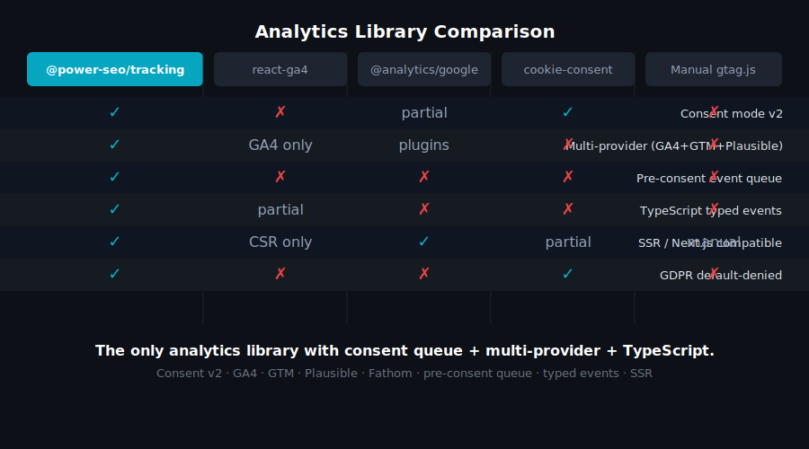
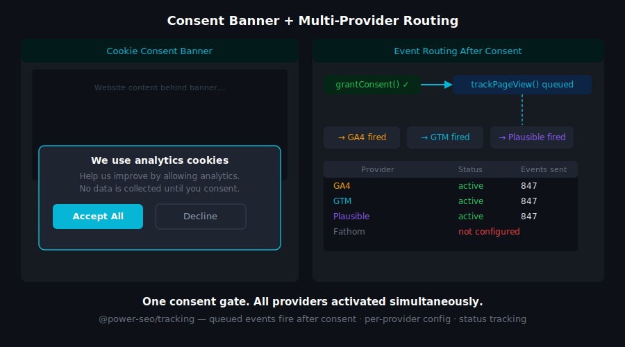
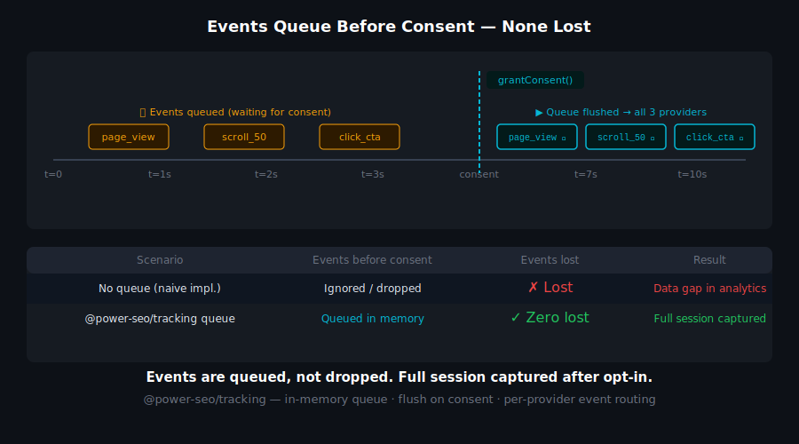
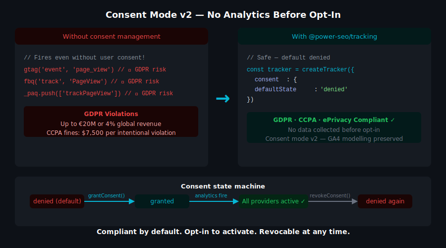

# @power-seo/tracking


Consent-aware analytics script builders and GDPR consent management for TypeScript — GA4, Microsoft Clarity, PostHog, Plausible, and Fathom with a unified `shouldLoad(consentState)` API and React components.

[](https://www.npmjs.com/package/@power-seo/tracking)
[](https://www.npmjs.com/package/@power-seo/tracking)
[](https://socket.dev/npm/package/@power-seo/tracking)
[](https://github.com/CyberCraftBD/power-seo/actions)
[](https://opensource.org/licenses/MIT)
[](https://www.typescriptlang.org/)
[](https://bundlephobia.com/package/@power-seo/tracking)

`@power-seo/tracking` is a consent-aware analytics toolkit for TypeScript. Build typed script configs for five analytics platforms, manage GDPR consent state with a reactive store, and render consent-gated script tags and a cookie banner via drop-in React components. Every `ScriptConfig` exposes `shouldLoad(consentState)` — scripts never load without the correct consent category. The consent manager defaults to `necessary: true` and all other categories to `false`, satisfying GDPR opt-in requirements out of the box. Five typed API clients let you query GA4, Clarity, PostHog, Plausible, and Fathom data server-side for custom reporting and dashboards.

> **Zero runtime dependencies** — pure TypeScript with an optional React 18+ peer dependency for the `<AnalyticsScript>` and `<ConsentBanner>` components.

---

## Why @power-seo/tracking?

| | Without | With |
|---|---|---|
| GDPR consent | ❌ Scripts load unconditionally in `<head>` | ✅ `shouldLoad(consentState)` gates every script |
| Consent manager | ❌ Custom UI state per project | ✅ `createConsentManager()` with typed categories |
| Multi-provider | ❌ Different init code per analytics platform | ✅ One API for GA4, Clarity, PostHog, Plausible, Fathom |
| React integration | ❌ Manual `<script>` injection in layout | ✅ `<AnalyticsScript>` and `<ConsentBanner>` drop-in |
| API data access | ❌ Platform-specific SDK research per provider | ✅ Typed clients for all 5 providers |
| Performance | ❌ Scripts block LCP before user interaction | ✅ Lazy loading strategy prevents render blocking |
| TypeScript | ❌ Loose config objects with no type checking | ✅ Typed `ScriptConfig`, `ConsentState`, `ConsentManager` |




<p align="left">
  <a href="https://www.buymeacoffee.com/ccbd.dev" target="_blank">
    
  </a>
</p>

---

## Features

- **Script builders for 5 platforms** — `buildGA4Script` (2 script tags), `buildClarityScript`, `buildPostHogScript`, `buildPlausibleScript`, `buildFathomScript`
- **Consent-aware loading** — every `ScriptConfig` exposes `shouldLoad(consentState)` — scripts never load without the right consent category
- **Consent manager** — `createConsentManager()` returns a typed store with `grant()`, `revoke()`, `grantAll()`, `revokeAll()`, `getState()`, and `onChange()` subscription
- **GDPR-friendly defaults** — `necessary` consent is always `true` and cannot be revoked; `analytics`, `marketing`, `preferences` default to `false`
- **React components** — `<AnalyticsScript>` renders only consented scripts; `<ConsentBanner>` is a ready-to-use GDPR cookie banner
- **GA4 Data API client** — `createGA4Client()` queries reports, real-time data, and metadata
- **Clarity API client** — `createClarityClient()` fetches projects, session insights, and heatmap data
- **PostHog API client** — `createPostHogClient()` queries events, trends, funnels, and persons
- **Plausible Stats API client** — `createPlausibleClient()` fetches timeseries, breakdowns, and aggregate stats
- **Fathom API client** — `createFathomClient()` fetches sites, pageviews, and referrer data
- **Framework-agnostic** — script builders and consent manager work in Next.js, Remix, Vite, Vanilla JS, and Edge runtimes
- **Full TypeScript support** — typed config interfaces, consent state, and response shapes for every provider
- **Tree-shakeable** — import only the providers you use; zero dead code in your bundle



---

## Comparison

| Feature | @next/third-parties | partytown | cookiebot | @power-seo/tracking |
| -------------------------------- | :-----------------: | :-------: | :-------: | :-----------------: |
| Typed script builders            | ❌ | ❌ | ❌ | ✅ |
| Consent-aware `shouldLoad()`     | ❌ | ❌ | ✅ | ✅ |
| Built-in consent manager         | ❌ | ❌ | ✅ (paid) | ✅ |
| Analytics API clients            | ❌ | ❌ | ❌ | ✅ |
| 5-provider support               | ⚠️ | ⚠️ | ✅ | ✅ |
| Zero runtime dependencies        | ✅ | ✅ | ❌ | ✅ |
| TypeScript-first                 | ❌ | ❌ | ❌ | ✅ |
| React components                 | ⚠️ | ❌ | ✅ | ✅ |



---

## Installation

```bash
npm install @power-seo/tracking
```

```bash
yarn add @power-seo/tracking
```

```bash
pnpm add @power-seo/tracking
```

For React components, React 18+ is required as a peer dependency.

---

## Quick Start

```ts
import { createConsentManager, buildGA4Script, buildPlausibleScript } from '@power-seo/tracking';

// 1. Create consent manager — analytics off by default (GDPR opt-in)
const consent = createConsentManager({
  necessary: true,
  analytics: false,
  marketing: false,
  preferences: false,
});

// 2. Build script configs for your providers
const scripts = [
  ...buildGA4Script({ measurementId: 'G-XXXXXXX' }),
  buildPlausibleScript({ domain: 'example.com' }),
];

// 3. Only load scripts where consent matches
const toLoad = scripts.filter((s) => s.shouldLoad(consent.getState()));
// toLoad → [] until analytics consent is granted

// 4. Grant consent (e.g. after user clicks "Accept All")
consent.grantAll();
const nowToLoad = scripts.filter((s) => s.shouldLoad(consent.getState()));
// nowToLoad → [GA4Script1, GA4Script2, PlausibleScript]
```



---

## Usage

### Script Builders

```ts
import {
  buildGA4Script,
  buildClarityScript,
  buildPostHogScript,
  buildPlausibleScript,
  buildFathomScript,
} from '@power-seo/tracking';

const scripts = [
  ...buildGA4Script({ measurementId: 'G-XXXXXXX' }),   // returns ScriptConfig[]
  buildClarityScript({ projectId: 'abc123' }),
  buildPostHogScript({ apiKey: 'phc_xxx', apiHost: 'https://app.posthog.com' }),
  buildPlausibleScript({ domain: 'example.com' }),
  buildFathomScript({ siteId: 'ABCDEFGH' }),
];
```

### Consent Manager

```ts
import { createConsentManager } from '@power-seo/tracking';

const consent = createConsentManager({ necessary: true, analytics: false });

// Grant/revoke individual categories
consent.grant('analytics');
consent.revoke('marketing');

// Grant or revoke all non-necessary categories
consent.grantAll();
consent.revokeAll();

// Read current state
const state = consent.getState();
// { necessary: true, analytics: true, marketing: false, preferences: false }

// Subscribe to changes — returns unsubscribe function
const unsubscribe = consent.onChange((newState) => {
  console.log('Consent changed:', newState);
});
```

### React — AnalyticsScript

```tsx
'use client';

import { AnalyticsScript } from '@power-seo/tracking/react';
import { buildGA4Script, createConsentManager } from '@power-seo/tracking';

const consent = createConsentManager({ necessary: true, analytics: false });
const scripts = buildGA4Script({ measurementId: 'G-XXXXXXX' });

export default function Layout({ children }: { children: React.ReactNode }) {
  return (
    <html>
      <head>
        <AnalyticsScript scripts={scripts} consent={consent.getState()} />
      </head>
      <body>{children}</body>
    </html>
  );
}
```

### React — ConsentBanner

```tsx
'use client';

import { ConsentBanner } from '@power-seo/tracking/react';
import { createConsentManager } from '@power-seo/tracking';

const consent = createConsentManager({ necessary: true, analytics: false });

export function CookieBanner() {
  return (
    <ConsentBanner
      manager={consent}
      privacyPolicyUrl="/privacy-policy"
    />
  );
}
```

### Analytics API Clients

```ts
import { createGA4Client, createPlausibleClient } from '@power-seo/tracking';

// Query GA4 reports
const ga4 = createGA4Client({
  measurementId: 'G-XXXXXXX',
  apiSecret: process.env.GA4_API_SECRET!,
});

// Query Plausible stats
const plausible = createPlausibleClient({
  domain: 'example.com',
  apiKey: process.env.PLAUSIBLE_API_KEY!,
});

const stats = await plausible.getAggregate({ period: '7d' });
console.log(stats.visitors, stats.pageviews);
```

### Reactive Consent Loading (Next.js App Router)

```tsx
'use client';

import { useEffect, useState } from 'react';
import { createConsentManager, buildGA4Script } from '@power-seo/tracking';

const consent = createConsentManager({ necessary: true, analytics: false });
const scripts = buildGA4Script({ measurementId: 'G-XXXXXXX' });

export function AnalyticsLoader() {
  const [state, setState] = useState(consent.getState());

  useEffect(() => {
    return consent.onChange(setState);
  }, []);

  const toLoad = scripts.filter((s) => s.shouldLoad(state));
  // inject toLoad scripts into document.head
  return null;
}
```

---

## API Reference

### Script Builders

| Function               | Config Props                | Returns          | Description                        |
| ---------------------- | --------------------------- | ---------------- | ---------------------------------- |
| `buildGA4Script`       | `{ measurementId }`         | `ScriptConfig[]` | Google Analytics 4 (2 script tags) |
| `buildClarityScript`   | `{ projectId }`             | `ScriptConfig`   | Microsoft Clarity                  |
| `buildPostHogScript`   | `{ apiKey, apiHost? }`      | `ScriptConfig`   | PostHog                            |
| `buildPlausibleScript` | `{ domain, customDomain? }` | `ScriptConfig`   | Plausible Analytics                |
| `buildFathomScript`    | `{ siteId }`                | `ScriptConfig`   | Fathom Analytics                   |

### `ScriptConfig`

| Prop           | Type                                                          | Description                            |
| -------------- | ------------------------------------------------------------- | -------------------------------------- |
| `src`          | `string \| undefined`                                         | External script URL                    |
| `inlineScript` | `string \| undefined`                                         | Inline JavaScript content              |
| `strategy`     | `'beforeInteractive' \| 'afterInteractive' \| 'lazyOnload'`   | Loading strategy hint                  |
| `shouldLoad`   | `(consent: ConsentState) => boolean`                          | Returns `true` if this script may load |

### `createConsentManager(initialState)`

| Method      | Signature                                   | Description                               |
| ----------- | ------------------------------------------- | ----------------------------------------- |
| `grant`     | `(category: ConsentCategory) => void`       | Grant a consent category                  |
| `revoke`    | `(category: ConsentCategory) => void`       | Revoke a consent category                 |
| `grantAll`  | `() => void`                                | Grant all non-necessary categories        |
| `revokeAll` | `() => void`                                | Revoke all non-necessary categories       |
| `getState`  | `() => ConsentState`                        | Get the current consent snapshot          |
| `onChange`  | `(cb: ConsentChangeCallback) => () => void` | Subscribe to changes; returns unsubscribe |

### API Clients

| Function                | Config Props                       | Returns          |
| ----------------------- | ---------------------------------- | ---------------- |
| `createGA4Client`       | `{ measurementId, apiSecret }`     | `GA4Client`      |
| `createClarityClient`   | `{ projectId, apiKey }`            | `ClarityClient`  |
| `createPostHogClient`   | `{ apiKey, apiHost? }`             | `PostHogClient`  |
| `createPlausibleClient` | `{ domain, apiKey }`               | `PlausibleClient` |
| `createFathomClient`    | `{ apiKey }`                       | `FathomClient`   |

### React Components

| Component           | Props                                                    | Description                                             |
| ------------------- | -------------------------------------------------------- | ------------------------------------------------------- |
| `<AnalyticsScript>` | `{ scripts: ScriptConfig[], consent: ConsentState }`     | Renders `<script>` tags that pass `shouldLoad(consent)` |
| `<ConsentBanner>`   | `{ manager: ConsentManager, privacyPolicyUrl?: string }` | GDPR cookie consent banner with Accept All / Reject All |

### Types

| Type                   | Description                                                              |
| ---------------------- | ------------------------------------------------------------------------ |
| `ConsentCategory`      | `'necessary' \| 'analytics' \| 'marketing' \| 'preferences'`             |
| `ConsentState`         | `{ necessary: boolean, analytics: boolean, marketing: boolean, preferences: boolean }` |
| `ConsentManager`       | Store with grant/revoke/grantAll/revokeAll/getState/onChange             |
| `ConsentChangeCallback` | `(state: ConsentState) => void`                                         |
| `ScriptConfig`         | `{ src?, inlineScript?, strategy, shouldLoad }`                          |
| `GA4Config`            | `{ measurementId: string }`                                              |
| `GA4Client`            | GA4 Data API client instance                                             |
| `ClarityConfig`        | `{ projectId: string }`                                                  |
| `ClarityClient`        | Clarity API client instance                                              |
| `PostHogConfig`        | `{ apiKey: string, apiHost?: string }`                                   |
| `PostHogClient`        | PostHog API client instance                                              |
| `PlausibleConfig`      | `{ domain: string, customDomain?: string }`                              |
| `PlausibleClient`      | Plausible Stats API client instance                                      |
| `FathomConfig`         | `{ siteId: string }`                                                     |
| `FathomClient`         | Fathom API client instance                                               |

---

## Use Cases

- **GDPR-compliant web apps** — load analytics scripts only after the user grants consent
- **SaaS marketing sites** — track user behavior with GA4 while respecting privacy regulations
- **E-commerce stores** — Clarity session recordings for UX optimization with a consent gate
- **Multi-provider analytics** — run GA4 + Plausible + PostHog side-by-side for data validation
- **Privacy-first apps** — Plausible or Fathom as cookieless, GDPR-compliant alternatives to GA4
- **Analytics dashboards** — query GA4, Plausible, or Fathom APIs server-side for custom reporting
- **A/B testing pipelines** — PostHog feature flags and event tracking with consent management
- **Enterprise compliance** — full audit trail of when consent was granted per category

---

## Architecture Overview

- **Pure TypeScript** — no compiled binary, no native modules
- **Consent-first design** — `shouldLoad(consentState)` is evaluated before any script tag is created
- **GDPR defaults** — `necessary: true` always; `analytics`, `marketing`, `preferences` default to `false`
- **SSR-safe builders** — script configs are generated server-side; consent is evaluated client-side
- **Edge-compatible** — script builders and consent manager have no Node.js-specific APIs; runs in Cloudflare Workers, Vercel Edge, Deno
- **Optional React peer** — `<AnalyticsScript>` and `<ConsentBanner>` require React 18+; all other exports are framework-agnostic
- **Dual ESM + CJS** — ships both formats via tsup for any bundler or `require()` usage
- **Zero runtime dependencies** — pure TypeScript; optional React peer dependency only

---

## Supply Chain Security

- No install scripts (`postinstall`, `preinstall`)
- No runtime network access outside of analytics API calls
- No `eval` or dynamic code execution
- npm provenance enabled — every release is signed via Sigstore through GitHub Actions
- CI-signed builds — all releases published via verified `github.com/CyberCraftBD/power-seo` workflow
- Safe for SSR, Edge, and browser environments

---

## The [@power-seo](https://www.npmjs.com/org/power-seo) Ecosystem

All 17 packages are independently installable — use only what you need.

| Package                                                                                    | Install                             | Description                                                             |
| ------------------------------------------------------------------------------------------ | ----------------------------------- | ----------------------------------------------------------------------- |
| [`@power-seo/core`](https://www.npmjs.com/package/@power-seo/core)                         | `npm i @power-seo/core`             | Framework-agnostic utilities, types, validators, and constants          |
| [`@power-seo/react`](https://www.npmjs.com/package/@power-seo/react)                       | `npm i @power-seo/react`            | React SEO components — meta, Open Graph, Twitter Card, breadcrumbs      |
| [`@power-seo/meta`](https://www.npmjs.com/package/@power-seo/meta)                         | `npm i @power-seo/meta`             | SSR meta helpers for Next.js App Router, Remix v2, and generic SSR      |
| [`@power-seo/schema`](https://www.npmjs.com/package/@power-seo/schema)                     | `npm i @power-seo/schema`           | Type-safe JSON-LD structured data — 23 builders + 21 React components   |
| [`@power-seo/content-analysis`](https://www.npmjs.com/package/@power-seo/content-analysis) | `npm i @power-seo/content-analysis` | Yoast-style SEO content scoring engine with React components            |
| [`@power-seo/readability`](https://www.npmjs.com/package/@power-seo/readability)           | `npm i @power-seo/readability`      | Readability scoring — Flesch-Kincaid, Gunning Fog, Coleman-Liau, ARI    |
| [`@power-seo/preview`](https://www.npmjs.com/package/@power-seo/preview)                   | `npm i @power-seo/preview`          | SERP, Open Graph, and Twitter/X Card preview generators                 |
| [`@power-seo/sitemap`](https://www.npmjs.com/package/@power-seo/sitemap)                   | `npm i @power-seo/sitemap`          | XML sitemap generation, streaming, index splitting, and validation      |
| [`@power-seo/redirects`](https://www.npmjs.com/package/@power-seo/redirects)               | `npm i @power-seo/redirects`        | Redirect engine with Next.js, Remix, and Express adapters               |
| [`@power-seo/links`](https://www.npmjs.com/package/@power-seo/links)                       | `npm i @power-seo/links`            | Link graph analysis — orphan detection, suggestions, equity scoring     |
| [`@power-seo/audit`](https://www.npmjs.com/package/@power-seo/audit)                       | `npm i @power-seo/audit`            | Full SEO audit engine — meta, content, structure, performance rules     |
| [`@power-seo/images`](https://www.npmjs.com/package/@power-seo/images)                     | `npm i @power-seo/images`           | Image SEO — alt text, lazy loading, format analysis, image sitemaps     |
| [`@power-seo/ai`](https://www.npmjs.com/package/@power-seo/ai)                             | `npm i @power-seo/ai`               | LLM-agnostic AI prompt templates and parsers for SEO tasks              |
| [`@power-seo/analytics`](https://www.npmjs.com/package/@power-seo/analytics)               | `npm i @power-seo/analytics`        | Merge GSC + audit data, trend analysis, ranking insights, dashboard     |
| [`@power-seo/search-console`](https://www.npmjs.com/package/@power-seo/search-console)     | `npm i @power-seo/search-console`   | Google Search Console API — OAuth2, service account, URL inspection     |
| [`@power-seo/integrations`](https://www.npmjs.com/package/@power-seo/integrations)         | `npm i @power-seo/integrations`     | Semrush and Ahrefs API clients with rate limiting and pagination        |
| [`@power-seo/tracking`](https://www.npmjs.com/package/@power-seo/tracking)                 | `npm i @power-seo/tracking`         | GA4, Clarity, PostHog, Plausible, Fathom — scripts + consent management |

---

## About [CyberCraft Bangladesh](https://ccbd.dev)

**[CyberCraft Bangladesh](https://ccbd.dev)** is a Bangladesh-based enterprise-grade software development and Full Stack SEO service provider company specializing in ERP system development, AI-powered SaaS and business applications, full-stack SEO services, custom website development, and scalable eCommerce platforms. We design and develop intelligent, automation-driven SaaS and enterprise solutions that help startups, SMEs, NGOs, educational institutes, and large organizations streamline operations, enhance digital visibility, and accelerate growth through modern cloud-native technologies.

[](https://ccbd.dev)
[](https://github.com/cybercraftbd)
[](https://www.npmjs.com/org/power-seo)
[](mailto:info@ccbd.dev)

© 2026 [CyberCraft Bangladesh](https://ccbd.dev) · Released under the [MIT License](../../LICENSE)
